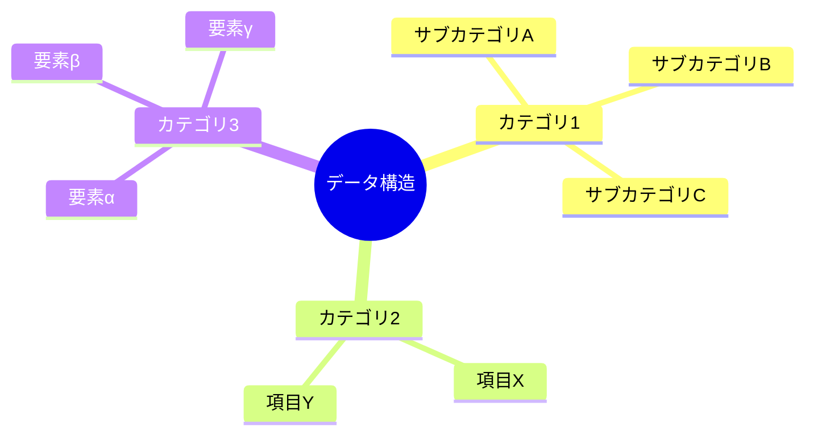

# ExcelAnalyse - Excel分析からMarkdown変換プロジェクト

## 📋 プロジェクト概要

ExcelファイルをZIPとして展開・分析し、各シートの内容を人間が見やすいMarkdown形式に変換する汎用的なプロジェクトです。経歴書、売上データ、在庫管理、プロジェクト管理表など、様々な種類のExcelファイルに対応し、mermaid図表を活用した視覚的で理解しやすいドキュメント生成を実現します。

## 🎯 主要機能

- **Excel内部構造解析**: .xlsxファイルをZIP展開してXML構造を詳細分析
- **汎用データ分析**: 様々な種類のExcelデータ（人材、売上、在庫、プロジェクト等）から意味のある情報を抽出
- **動的視覚化**: Mermaid図表による データ構造、関係性、時系列変化、フロー等の可視化
- **総合レポート生成**: データ種別に応じた戦略的分析を含む包括的なマークダウンレポート作成

## 📂 プロジェクト構成

```
ExcelAnalyse/
├── docs/                                          # ドキュメント・分析結果
│   ├── AI作業指示書_Excel分析からMarkdown変換.md      # 汎用作業手順書
│   ├── result/                                   # 👈 AI生成分析結果（.gitignore対象）
│   │   ├── excel_structure_analysis.md          # Excel構造分析
│   │   ├── [シート名1]_sheet.md                  # 第1シート基本分析
│   │   ├── [シート名2]_sheet.md                  # 第2シート基本分析
│   │   ├── [シート名3]_sheet.md                  # 第3シート基本分析
│   │   ├── [シート名1]_詳細.md                   # 第1シート詳細分析
│   │   ├── [シート名2]_詳細.md                   # 第2シート詳細分析
│   │   ├── [シート名3]_詳細フローチャート.md      # 構成図系シート詳細分析
│   │   └── [Excelファイル名]_総合分析レポート.md  # 総合分析レポート
│   └── サンプル分析結果/                          # 既存の経歴書サンプル分析
├── excel_extracted/                              # 展開されたExcelファイル
│   ├── [Content_Types].xml
│   ├── _rels/
│   ├── docProps/
│   └── xl/
│       ├── worksheets/
│       ├── sharedStrings.xml
│       └── workbook.xml
├── [任意のExcelファイル].xlsx                     # 分析対象Excelファイル
├── [任意のExcelファイル].zip                      # ZIP変換後ファイル
└── README.md                                     # このファイル
```

## 🚀 使用方法

### 1. Excelファイルの準備
分析対象の.xlsxファイルをプロジェクトルートに配置
- 対応ファイル：経歴書、売上データ、在庫管理、プロジェクト管理表など任意のExcelファイル
- ファイル名：日本語・英数字どちらでも対応

### 2. 分析実行
AI作業指示書（`docs/AI作業指示書_Excel分析からMarkdown変換.md`）に従って分析を実行
- Phase 0: Excel解析・展開フェーズ
- Phase 1以降: Markdown変換・分析フェーズ

### 3. 結果確認
`docs/result/`ディレクトリ内の生成されたMarkdownファイルを確認
- 各シートの基本分析・詳細分析
- 総合分析レポート

## 📊 分析対象・成果例

### 対応ファイルタイプ
- **人材・経歴書**: 技術者・営業・管理職等の経歴データ
- **売上・財務データ**: 月次売上、年次決算、予算実績等
- **在庫・物流データ**: 商品在庫、入出庫履歴、配送データ等
- **プロジェクト管理**: ガントチャート、進捗管理、リソース配分等
- **顧客データ**: 顧客情報、購買履歴、満足度調査等

### 生成される主要ドキュメント

#### 📈 データ構造分析（例：技術スキルデータ）


#### 👥 シート間データ比較（例）
| 項目 | シート1データ | シート2データ |
|------|---------------|---------------|
| **分類A** | 値1 | 値2 |
| **分類B** | 値3 | 値4 |
| **分類C** | 値5 | 値6 |

#### 🔄 プロセス・フロー分析
データの関係性、時系列変化、業務フロー等を視覚化

## 🛠️ 技術スタック

- **解析技術**: XML/ZIP ファイル構造解析
- **ドキュメント生成**: Markdown + Mermaid図表
- **可視化**: フローチャート、マインドマップ、ガントチャート、円グラフ
- **分析手法**: 定量分析、定性分析、相関分析、トレンド分析

## 📋 分析プロセス

### Phase 0: Excel解析・展開フェーズ
1. ✅ Excelファイルの拡張子を.zipに変換
2. ✅ ZIPファイル展開とディレクトリ構造分析
3. ✅ XML構造・共有文字列・メタデータ解析
4. ✅ 各シートの基本分析ドキュメント作成

### Phase 1: Markdown変換フェーズ
1. ✅ 人材プロファイルの詳細分析
2. ✅ 技術スキル・経験の構造化
3. ✅ フローチャート・組織図の改善
4. ✅ 総合分析レポートの作成

## 📈 プロジェクト成果

### 定量的成果
- **ドキュメント数**: シート数×2+1個の詳細分析ドキュメント（動的生成）
- **図表数**: 20+ のMermaid図表による視覚化（データに応じて最適化）
- **分析項目**: データ種別に応じた50+ の詳細分析ポイント
- **データ抽出**: Excel内の全文字列から構造化データ生成

### 定性的成果
- データの関係性・パターン発見
- 戦略・投資優先順位の明確化
- 時系列変化・トレンドの可視化
- 業務効率化・改善ポテンシャルの定量化

## 🎯 活用シナリオ

### 人事・組織戦略
- 人材データ分析・配置最適化
- スキル・経験の可視化
- キャリア開発支援
- 組織拡張戦略立案

### 財務・売上分析
- 売上トレンド分析
- 予算実績対比
- 収益性分析
- 投資対効果評価

### 業務改善・効率化
- プロセス分析・最適化
- 在庫管理効率化
- 品質管理体制構築
- 業務フロー改善

### データドリブン経営
- KPI可視化・ダッシュボード化
- 意思決定支援
- リスク分析・対策
- 戦略立案・実行支援

## 🔧 カスタマイズ・拡張

### 汎用Excelファイル対応
- `docs/AI作業指示書_Excel分析からMarkdown変換.md` の手順に従って対応
- シート数（1-10シート）・データ種別に応じた自動調整
- 日本語・英数字ファイル名・シート名の完全対応
- データ種別に応じた分析観点の動的調整

### データ種別別カスタマイズ
- **人材・経歴書**: キャリア分析、スキル比較、成長パターン
- **売上・財務**: トレンド分析、業績比較、予測モデル
- **在庫・物流**: 効率分析、最適化提案、フロー改善
- **プロジェクト管理**: 進捗分析、リソース配分、リスク評価
- **顧客データ**: セグメント分析、行動パターン、満足度評価

### 追加分析項目
- 業界特化トレンド分析
- リスク評価・対策立案
- 競合比較・ベンチマーク
- ROI・コスト効果分析
- 予測モデル・シミュレーション

## 📊 品質基準

### ドキュメント構造
- ✅ 適切なヘッダー階層（H1-H6）
- ✅ 絵文字による視認性向上
- ✅ 表形式での比較データ
- ✅ コードブロックでの技術情報

### Mermaid図表品質
- ✅ スタイリング（fill, stroke, color）
- ✅ 適切な図表タイプ選択
- ✅ 日本語ラベル対応
- ✅ レスポンシブデザイン

### 内容の正確性
- ✅ データの一貫性・整合性
- ✅ 技術用語の正確な表記
- ✅ 時系列データの精度

## 🤝 コントリビューション

プロジェクトの改善・拡張にご協力ください：

1. **Issue報告**: バグ・改善提案
2. **新機能提案**: 追加分析項目・可視化手法
3. **ドキュメント改善**: 手順書・解説の充実
4. **テンプレート作成**: 他業界・用途向けテンプレート

## 📝 ライセンス

このプロジェクトはMITライセンスの下で公開されています。

## 🏷️ バージョン履歴

- **v1.1.0** (2025-09-27): 汎用化対応
  - 任意のExcelファイルに対応する汎用的な分析フレームワーク
  - シート数・データ種別の動的対応
  - `docs/result/`ディレクトリによる出力管理
  - データ種別別分析テンプレート

- **v1.0.0** (2025-09-27): 初回リリース
  - Excel解析・Markdown変換機能
  - 経歴書分析テンプレート（サンプル）
  - Mermaid図表による視覚化
  - 総合分析レポート生成

---

**作成者**: Claude Code
**更新日**: 2025年9月27日
**プロジェクト種別**: 汎用データ分析・ドキュメント生成ツール
