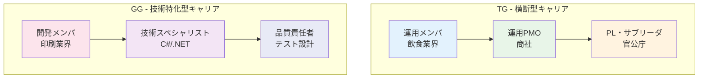
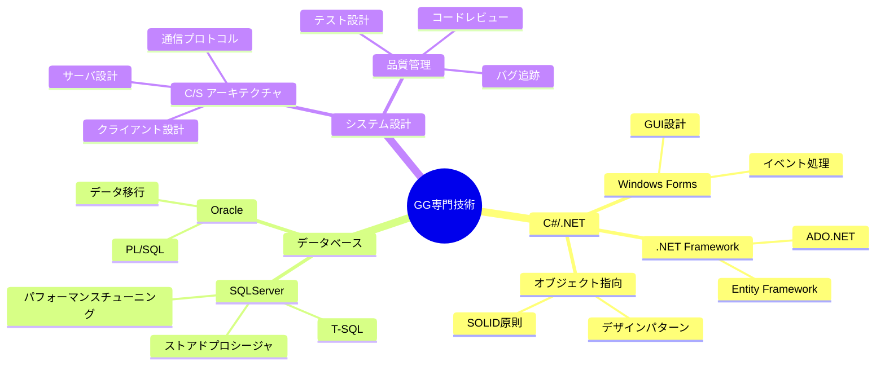
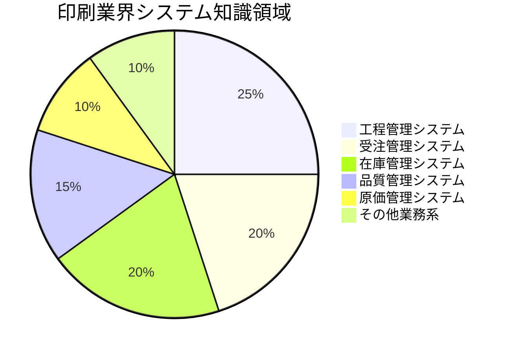
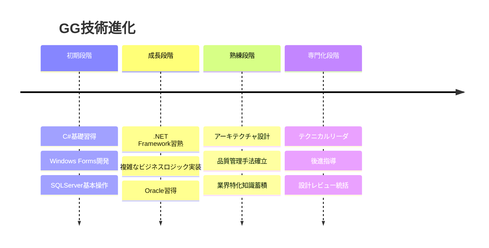
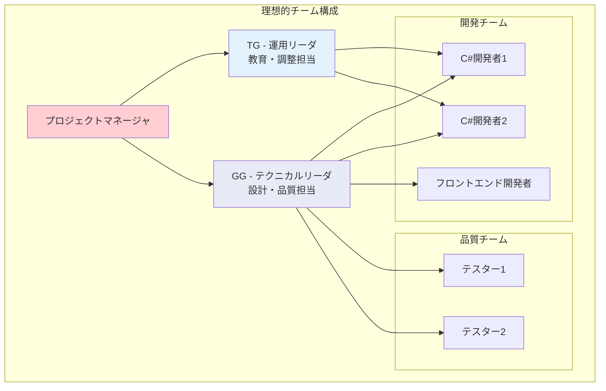

# GG（銀河 次郎）- 経歴書詳細

## 📋 基本情報

| 項目 | 内容 |
|------|------|
| **氏名** | 銀河 次郎（GG） |
| **性別** | 男性 |
| **年齢** | 推定20代後半 |
| **最終学歴** | 大学卒業 |
| **専門分野** | システム開発（C#/.NET特化） |
| **更新日** | 2025年9月27日 |

## 💼 プロジェクト履歴

### 🖨️ プロジェクト1: 印刷業向け社内システム開発（C/S基盤）
**期間**: 詳細期間不明
**業界**: 印刷業
**役割**: 4.メンバ
**形態**: 3.C/S（クライアント/サーバ）

#### システム概要
印刷業界特化の社内統合システム開発プロジェクト。クライアント/サーバアーキテクチャによる基幹業務システムの構築。

#### 作業内容
**設計・開発フェーズ（C,D,E）**:
- **C.内部設計・詳細設計**: システムアーキテクチャの詳細化
- **D.プログラム製造・単体テスト**: C#による機能実装と品質確保
- **E.総合テスト**: 結合テスト、システムテスト、受入テスト

**品質・保守フェーズ**:
- 製造から結合試験、検証まで一貫した品質管理
- 保守フェーズでの継続的システム改善
- マニュアル作成による知識の体系化

#### 使用技術・環境
- **プログラミング言語**: C#
- **OS**: Windows10
- **データベース**: SQLServer、Oracle
- **アーキテクチャ**: クライアント/サーバシステム
- **開発手法**: ウォーターフォール型開発

#### 成果・学び
- 印刷業界の業務プロセス深度理解
- C#/.NETによる大規模システム開発経験
- 設計から保守まで一貫したシステム開発ライフサイクル経験
- 複数データベース（SQLServer/Oracle）での実装経験
- テスト設計・実施による品質管理スキル

### 📊 技術的専門性の詳細分析

#### C#/.NET開発スキル
**技術レベル**: 中級～上級
- **Windows Forms**: デスクトップアプリケーション開発
- **.NET Framework**: 企業システム開発基盤
- **ADO.NET**: データベース連携・ORM活用
- **設計パターン**: オブジェクト指向設計の実践

#### データベース設計・実装
**対応DBMS**: SQLServer（主力）、Oracle（副次）
- **DDL設計**: テーブル設計・インデックス最適化
- **DML実装**: 効率的なクエリ作成・性能チューニング
- **ストアドプロシージャ**: ビジネスロジックのDB実装
- **データ移行**: レガシーシステムからのデータ移行

#### システムアーキテクチャ理解
**C/Sシステム設計**:
- **クライアント層**: UI/UX設計・レスポンス最適化
- **サーバ層**: ビジネスロジック・トランザクション管理
- **データ層**: データ整合性・パフォーマンス確保

## 🔍 TGとの比較分析

### 技術スキル比較表

| 分野 | TG（銀河太郎） | GG（銀河次郎） |
|------|----------------|----------------|
| **主要言語** | VB.NET, C#, Java, VBA | **C#特化** |
| **開発経験** | Web系（Java）、ツール開発（VBA） | **C/S系（C#）、エンタープライズ** |
| **データベース** | Oracle12C | **SQLServer（主）、Oracle（副）** |
| **設計スキル** | 基本設計～詳細設計 | **詳細設計～実装特化** |
| **テスト経験** | 単体～結合テスト | **総合テスト～品質管理** |
| **業界知識** | 飲食・商社・官公庁（横断的） | **印刷業界（深度特化）** |

### 役割・責任レベル比較

### 相補性分析

#### TG + GG チーム構成の強み

1. **技術カバレッジ**:
   - TG: 多言語対応・運用知識
   - GG: C#/.NET深度・品質管理

2. **業界対応力**:
   - TG: 多業界経験による要件理解
   - GG: 特定業界での深い業務知識

3. **プロジェクト役割分担**:
   - TG: プロジェクト管理・教育・調整
   - GG: 技術設計・実装・品質保証

## 📊 キャリア統計

### 技術スキル深度分析

### 印刷業界専門知識

### 技術的成長パターン

## 🚀 今後の展望

### 技術的成長ロードマップ

#### Phase 1: 技術基盤強化（1-2年）
1. **.NET Core/5+ 移行**:
   - モダンな.NET技術への適応
   - クロスプラットフォーム開発
   - マイクロサービスアーキテクチャ

2. **クラウド技術習得**:
   - Azure/.NET統合開発
   - コンテナ化（Docker）
   - CI/CD パイプライン構築

#### Phase 2: アーキテクト化（2-3年）
1. **システムアーキテクト**:
   - エンタープライズアーキテクチャ設計
   - 技術選定・評価責任者
   - 技術戦略立案

2. **チーム技術リーダ**:
   - 技術メンタリング
   - コードレビュー統括
   - 技術標準策定

#### Phase 3: 事業貢献（3-5年）
1. **技術コンサルタント**:
   - 顧客技術課題解決
   - 技術提案・設計
   - 印刷業界エキスパート

2. **イノベーションリーダ**:
   - 新技術導入推進
   - DX推進リーダ
   - 業界技術革新

### キャリア戦略

#### 強み活用戦略
1. **C#/.NET エキスパート**として認知度向上
2. **印刷業界スペシャリスト**としてのブランド確立
3. **品質管理のプロフェッショナル**として信頼獲得

#### スキル拡張戦略
1. **フロントエンド技術**: React、Angular等
2. **API設計**: RESTful、GraphQL
3. **DevOps**: Azure DevOps、GitHub Actions

## 💡 活用提案・プロジェクト適性

### 最適プロジェクトタイプ

#### 1. .NET 新規開発プロジェクト
- **役割**: テクニカルリーダ・設計責任者
- **貢献**: アーキテクチャ設計、実装指導
- **期待成果**: 高品質システムの確実な構築

#### 2. レガシーシステム .NET 移行
- **役割**: 移行設計・実装リーダ
- **貢献**: 既存システム分析、移行戦略立案
- **期待成果**: 安全で効率的なシステム移行

#### 3. 印刷・出版業界システム
- **役割**: 業界エキスパート・技術コンサルタント
- **貢献**: 業界要件理解、最適システム提案
- **期待成果**: 業界特有の課題解決と効率化

#### 4. 品質重視プロジェクト
- **役割**: 品質管理責任者・テストアーキテクト
- **貢献**: テスト戦略立案、品質基準策定
- **期待成果**: 高信頼性システムの実現

### チーム内での最適ポジション

#### テクニカルチーム編成例

### 投資価値・ROI分析

#### 短期ROI（6ヶ月-1年）
- **開発効率**: C#専門知識による高速実装
- **品質向上**: テスト設計スキルによる欠陥削減
- **リスク軽減**: 印刷業界知識による要件ミス防止

#### 中期ROI（1-3年）
- **技術標準化**: .NET技術基盤の組織内確立
- **人材育成**: 後進開発者の技術力向上
- **顧客満足**: 高品質システムによる信頼獲得

#### 長期ROI（3-5年）
- **競争優位**: 印刷業界でのエキスパート地位確立
- **事業拡大**: 技術コンサルティング事業への展開
- **イノベーション**: 新技術導入による事業革新