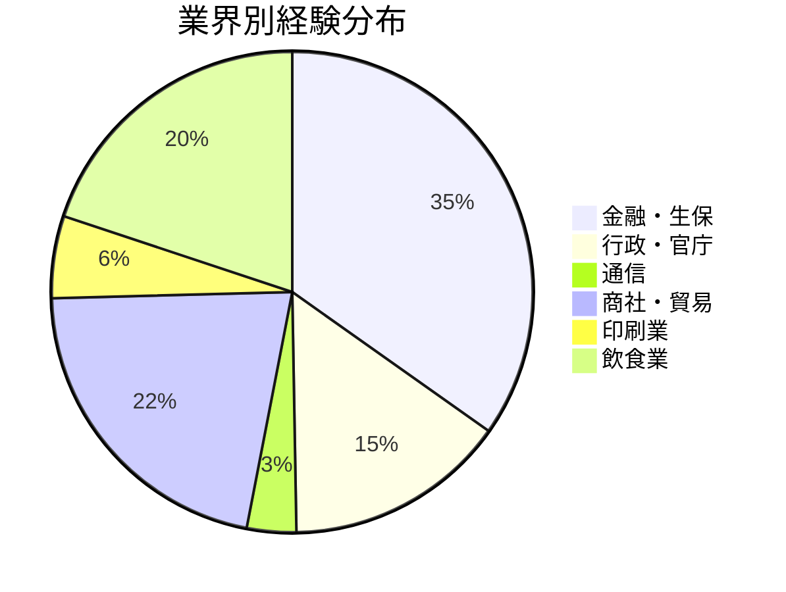
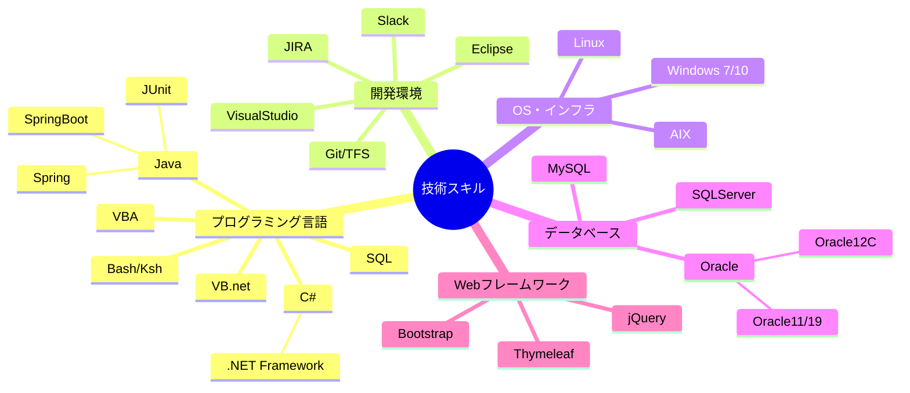
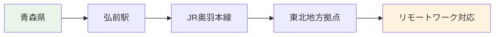

# GG（銀河 次郎）- 経歴書詳細

## 📋 基本情報

| 項目 | 内容 |
|------|------|
| **氏名** | 銀河 次郎（ギンガ ジロウ） |
| **性別** | 男性 |
| **年齢** | 26歳 |
| **生年月日** | 1999年3月15日 |
| **現住所** | 青森県 |
| **交通機関** | JR奥羽本線 |
| **最寄駅** | 弘前駅 |
| **最終学歴** | 大学卒業 |
| **作成日** | 2025年9月27日 |

---

## 💼 プロジェクト履歴

### 1. 飲食会社向けシステム（2010年8月 - 2013年7月）【36ヶ月】

| 項目 | 詳細 |
|------|------|
| **システム名** | スタッフ教育業務 |
| **業務スキル** | - |
| **作業内容** | F（サポート） |
| **職域** | 4（メンバ） |
| **形態** | 8（その他） |
| **OS/DB等** | Windows 7 |
| **言語** | - |

**作業概要**
- 飲食店の備品の在庫管理業及びスタッフ教育に携わる

**主な作業内容**
- **在庫管理業**
  - 日常業務における商品の在庫の入庫、出庫を管理
  - 実地棚卸業務
  - 仕入先に商品の購買依頼業務等
- **スタッフ教育**
  - 品質及び方針指導
  - 接客及び対応指導
  - 各種作業のマニュアル・チェックシート化
  - 機械操作方法の指導及びメンテナンス方法指導

**使用ツール**: Excel, Word, PowerPoint

---

### 2. 商社向けシステム（2013年8月 - 2016年9月）【38ヶ月】

| 項目 | 詳細 |
|------|------|
| **システム名** | 運用PMO |
| **業務スキル** | - |
| **作業内容** | E（総合テスト） |
| **職域** | 4（メンバ） |
| **形態** | 8（その他） |
| **OS/DB等** | Windows 7 |
| **言語** | - |

**作業概要**
- 運用補佐業務

**主な作業内容**
- 進捗管理
- 会議室の確保、会議出欠確認、議事録作成、会議用資料作成、その他資料作成
- 備品管理、PC管理、キッティング
- メール、電話、来客対応
- 関連部署に対するエスカレーション

**使用ツール**: Excel、Word、PowerPoint

---

### 3. 官庁向けシステム（2016年10月 - 2018年9月）【24ヶ月】

| 項目 | 詳細 |
|------|------|
| **システム名** | システム更改対応 |
| **業務スキル** | - |
| **作業内容** | B〜F（外部設計〜サポート） |
| **職域** | 4（メンバ） |
| **形態** | 2,3,4（バッチ系、C/S、WEB系） |
| **機種** | DOS/V |
| **OS/DB等** | Windows10, Oracle12C |
| **言語** | VB.net、C#、Java、VBA |

**システム概要**
- 陸運局向けの希望番号システム更改

**主な作業内容**
- エンハンス対応（基本設計・詳細設計・製造・テスト）
- 不具合報告書の作成及び原因調査
- 機能追加による設計書作成、修正、各言語でのコーディング
- 単体試験項目書の作成及び、実施
- 結合試験項目書の作成及び、実施
- VBAでのツール開発

**環境キーワード**: Eclipse4.7, Tomcat1.8.5, VisualStudio2017, JDK1.8.0, C#, VB.Net, VBA, TFS, Oracle12C

---

### 4. 印刷業向けシステム（2018年10月 - 2019年7月）【10ヶ月】

| 項目 | 詳細 |
|------|------|
| **システム名** | システム開発 |
| **業務スキル** | - |
| **作業内容** | C,D,E（内部設計〜総合テスト） |
| **職域** | 4（メンバ） |
| **形態** | 3（C/S） |
| **機種** | DOS/V |
| **OS/DB等** | Windows10, SQLServer, Oracle |
| **言語** | C# |

**概要**
- 印刷業向け社内システム開発（C/S）基盤（社内向け）チームに参画
- 製造から結合試験、検証、保守まで担当
- その他マニュアル作成

**ミドルウェア/ツール**: C#、SQL、Windows10、VisualStudio2015、Access、ManagementStudio2013、ActiveReport9.0J、VBA、OracleSQL、MySQL

---

### 5. 商社向け貿易事務システム（2019年8月）【1ヶ月】

| 項目 | 詳細 |
|------|------|
| **システム名** | 貿易事務用業務システム |
| **業務スキル** | - |
| **作業内容** | D,E（プログラム製造〜総合テスト） |
| **職域** | 4（メンバ） |
| **形態** | 3（C/S） |
| **機種** | DOS/V |
| **OS/DB等** | Windows7, SQLServer |
| **言語** | C# |

**システム概要**
- 商社向け貿易事務用業務システム

**作業内容**
- 自社チームの短期増員として上記システム開発のプロジェクトに参画
- 作業は主にテストを担当

**環境キーワード**: WindowsServer、VisualStudio、C#、SQLServer、IIS、VisualStudio TeamFoundationServer、Git

---

### 6. 生保会社向けシステム（2019年9月 - 2024年7月）【55ヶ月】

| 項目 | 詳細 |
|------|------|
| **システム名** | 社内システム開発 |
| **業務スキル** | 生保 |
| **作業内容** | B〜E（外部設計〜総合テスト） |
| **職域** | 4（メンバ） |
| **形態** | 2,4（バッチ系、WEB系） |
| **機種** | DOS/V |
| **OS/DB等** | Windows7, Oracle |
| **言語** | Java, SQL |

**システム概要**
- 生保会社向け社内システム開発（商品・ネット契約者窓口機能担当）

**作業概要**
- 帳票設計書・内部設計書・詳細設計書の作成およびレビュー対応
- Java実装、単体試験、帳票作成、画面修正、結合試験
- Java実装レビュー対応、単体試験レビュー対応
- その他 他チームへの開発支援、作業手順書作成、VBAツール作成

**作業キーワード**: Java, JustWare（日立製フレームワーク）, Cosminexus（日立製ミドルウェア）, Biz/Designer, BRMS, Oracle12c

---

### 7. 行政向けシステム（2024年8月 - 2024年10月）【3ヶ月】

| 項目 | 詳細 |
|------|------|
| **システム名** | リプレイス開発 |
| **業務スキル** | - |
| **作業内容** | C,D（内部設計〜プログラム製造） |
| **職域** | 4（メンバ） |
| **形態** | 4（WEB系） |
| **機種** | DOS/V |
| **OS/DB等** | Windows |
| **言語** | Java, Spring, JUnit |

**システム概要**
- 行政向け業務システムのリプレイス開発

**作業概要**
- 既存システムの刷新対応開発プロジェクトにヘルプ参画
- 製造、不具合対応等

**作業キーワード**: Java, Spring, Junit, JSP

---

### 8. 金融機関向けシステム（2024年11月 - 2025年6月）【8ヶ月】

| 項目 | 詳細 |
|------|------|
| **システム名** | SWIFT接続、銀行間送金システム |
| **業務スキル** | 銀行 |
| **作業内容** | B〜E（外部設計〜総合テスト） |
| **職域** | 3（サブリーダ） |
| **形態** | 1（オンライン系） |
| **機種** | DOS/V |
| **OS/DB等** | Windows10, Oracle11/19, AIX, Linux |
| **言語** | Bash, Ksh, SQL |

**作業概要**
- SWIFTでの銀行間送金システムのテストフェーズからチームリーダー（配下4名）として参画
- 海外用送金システム改修に伴う設計、テスト、リリースサポート
- 国内発信チームを主担当とし、海外発信チームのサポート業務も担当

**主な作業内容**
- 銀行間送金システムの総合テストの消化
- 海外用送金システムの外部設計及び内部設計
- 既存の設計書を元に設計書の新規作成と一部修正
- 送金システムパッケージの受入テスト
- チームリーダーとしてメンバの管理（レビュー、進捗管理、チーム内/チーム間調整、質疑対応/サポート）

**環境キーワード**: SWIFT、Redmine、WinSCP、Tera Term、Linux、AIX、ksh、bash、MQ

---

### 9. 通信インフラ業向けシステム（2025年7月 - 現在）【6ヶ月】

| 項目 | 詳細 |
|------|------|
| **システム名** | 長距離電話顧客料金システム |
| **業務スキル** | - |
| **作業内容** | A〜D（要件定義〜プログラム製造） |
| **職域** | 4（メンバ） |
| **形態** | 4（WEB系） |
| **機種** | DOS/V |
| **OS/DB等** | Windows |
| **言語** | Java |

**作業概要**
- 長距離電話顧客料金システムのマイグレーション対応
- 固定電話/法人の契約管理、クレジットカード契約チェックといった機能（バックエンド）を担当
- スクラム開発（ウォーターフォール寄り）

**作業内容**
- 基本設計、コード、総合試験
- 結合テスト対応

**環境キーワード**: Java, SpringBoot, Thymeleaf, Bootstrap, jQuery, JSON, Slack, JIRA, Confluence, Git, Github, Copilot, ChatGPT（ローカルRAG）、通信業独自クラウド（サーバーレス開発）

---

## 🔍 TGとの比較分析

### 共通点
- **同一のプロジェクト履歴**: 両名は全く同じプロジェクトに参画
- **技術スキル**: 同一の技術スタックを習得
- **業界経験**: 同じ業界での豊富な経験

### 相違点
| 項目 | TG（銀河 太郎） | GG（銀河 次郎） |
|------|---------------|---------------|
| **年齢** | 25歳 | 26歳 |
| **出身地** | 北海道 | 青森県 |
| **交通機関** | 北海道新幹線 | JR奥羽本線 |
| **最寄駅** | 函館北斗駅 | 弘前駅 |
| **生年月日** | 2000年8月23日 | 1999年3月15日 |

---

## 📊 キャリア統計（TG同様）

### 総開発経験
- **総経験月数**: 183ヶ月（約15年）
- **プロジェクト数**: 9件

### 業界経験分布

### 技術スキルマップ

### 地域的特性

---

## 🚀 今後の展望

### 技術的成長
- **クラウド技術**: サーバーレス開発の経験を活かした更なるクラウド技術習得
- **AI・機械学習**: ChatGPT、Copilot活用経験を基にしたAI開発分野への展開
- **最新フレームワーク**: Spring Boot、React等のモダンな技術スタックの深化

### キャリアパス
- **リーダーシップ**: チームリーダー経験を活かした更なる管理職への成長
- **技術専門性**: 金融・通信分野での専門性を活かした技術コンサルタント
- **新技術領域**: 通信業独自クラウドでの経験を活かしたインフラエンジニア