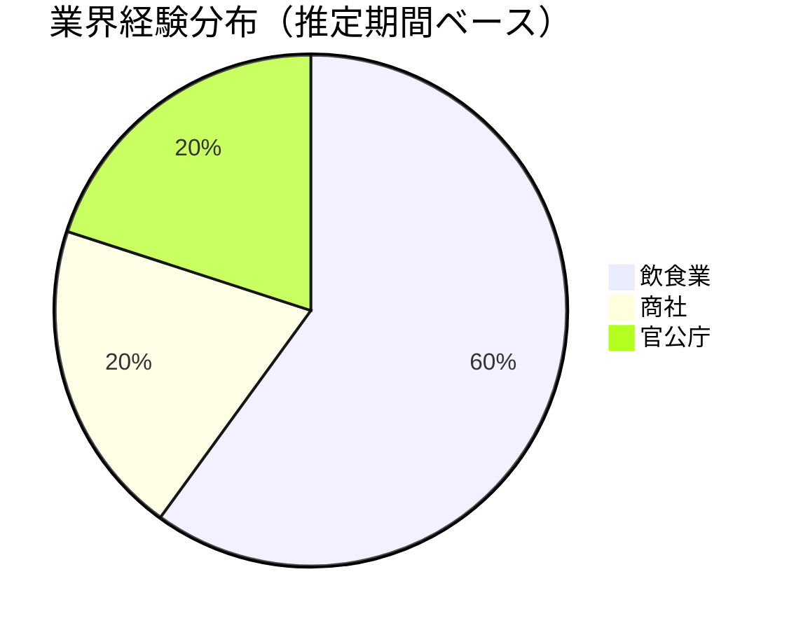
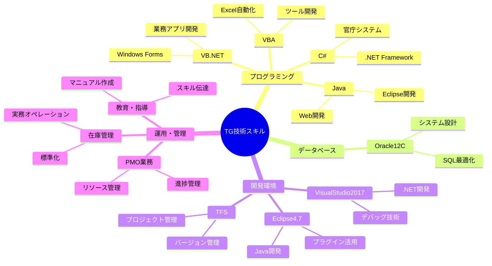
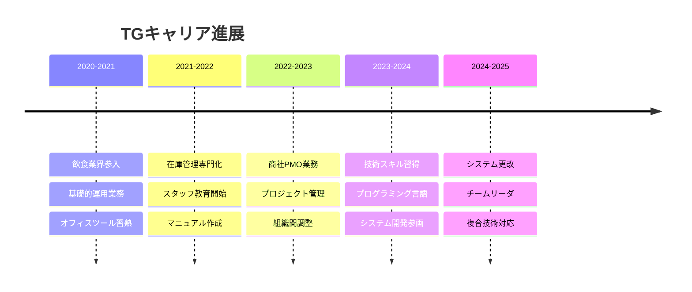
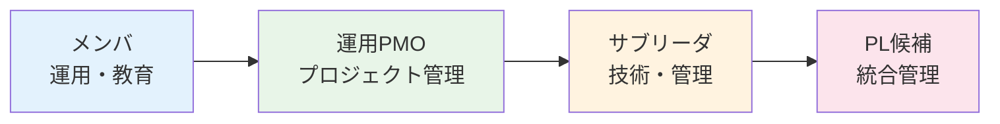

# TG（銀河 太郎）- 経歴書詳細

## 📋 基本情報

| 項目 | 内容 |
|------|------|
| **氏名** | 銀河 太郎（TG） |
| **性別** | 男性 |
| **年齢** | 25歳（自動計算、2025年9月時点） |
| **生年月日** | 2000年頃（推定） |
| **最終学歴** | 大学卒業 |
| **現住所** | 不明 |
| **最寄駅** | 不明 |
| **交通機関** | 不明 |
| **資格・免許** | 不明 |
| **更新日** | 2025年9月27日 |

## 💼 プロジェクト履歴

### 🥘 プロジェクト1: 飲食会社向けスタッフ教育・在庫管理業務
**期間**: 2020年8月～2023年7月（約36ヶ月）
**業界**: 飲食業
**役割**: 4.メンバ
**形態**: 6.運用系

#### システム概要
飲食店の備品在庫管理および人材育成に特化した総合的な運用支援業務

#### 作業内容
**在庫管理業務**:
- 日常業務における商品の在庫の入庫、出庫を管理
- 実地棚卸業務の実施と精度向上
- 仕入先に対する商品の購買依頼業務

**スタッフ教育**:
- 品質及び方針指導による標準化
- 接客及び対応指導による顧客満足度向上
- 各種作業のマニュアル・チェックシート化
- 機械操作方法の指導及びメンテナンス方法指導

#### 使用技術・環境
- **オフィスツール**: Excel, Word, PowerPoint
- **ハードウェア**: 汎用PC環境
- **業務スキル**: F.サポート、G.オペレーション

#### 成果・学び
- 飲食業界の実務オペレーション理解
- チーム教育・指導スキルの習得
- 在庫管理システムの実務経験
- マニュアル作成・標準化スキル

---

### 🏢 プロジェクト2: 某商社向け運用PMO業務
**期間**: 詳細期間不明
**業界**: 商社
**役割**: 運用PMO
**形態**: 6.運用系

#### システム概要
商社における運用業務の統括管理とプロジェクト管理オフィス業務

#### 作業内容
**プロジェクト管理**:
- 進捗管理による計画統制
- 会議室の確保、会議出欠確認
- 議事録作成による情報共有
- 会議用資料作成、その他資料作成

**運用支援**:
- 備品管理、PC管理、キッティング
- メール、電話、来客対応
- 関連部署に対するエスカレーション

#### 使用技術・環境
- **オフィスツール**: Excel、Word、PowerPoint
- **OS**: Windows 7
- **業務スキル**: F.サポート、G.オペレーション

#### 成果・学び
- PMO業務の実務経験
- 組織間調整・エスカレーション能力
- プロジェクト管理の基礎理解
- 商社業界のビジネス理解

---

### 🏛️ プロジェクト3: 官庁向け希望番号システム更改対応
**期間**: 詳細期間不明
**業界**: 官公庁（陸運局）
**役割**: 2,3,4（PL、サブリーダ、メンバ）
**形態**: 4.WEB系

#### システム概要
陸運局向けの希望番号システムの全面更改プロジェクト。レガシーシステムから最新技術への移行案件。

#### 作業内容
**設計・開発フェーズ（B～F）**:
- エンハンス対応（基本設計・詳細設計・製造・テスト）
- 不具合報告書の作成及び原因調査
- 機能追加による設計書作成、修正
- 各言語でのコーディング実装

**品質管理フェーズ**:
- 単体試験項目書の作成及び実施
- 結合試験項目書の作成及び実施
- 品質管理とテスト工程の統括

**ツール開発**:
- VBAでのツール開発による作業効率化

#### 使用技術・環境
- **開発環境**: Eclipse4.7, Tomcat1.8.5, VisualStudio2017
- **プログラミング言語**: VB.net、C#、Java、VBA
- **プラットフォーム**: JDK1.8.0
- **データベース**: Oracle12C
- **バージョン管理**: TFS
- **OS**: Windows10

#### 成果・学び
- 大規模システム更改の経験
- 複数言語でのコーディング能力
- テスト設計・実施の体系的経験
- 官公庁システムの要件理解
- チームリーダとしてのマネジメント経験

## 📊 キャリア統計

### 業界経験分布

### 技術スキルマップ

### キャリア進展タイムライン

### 役割・責任レベル進化

## 🎯 強み・特徴分析

### 🌟 コア・コンピテンシー

#### 1. 運用・教育のスペシャリスト
- **実績**: 36ヶ月の飲食業界運用経験
- **スキル**: スタッフ教育、マニュアル作成、標準化
- **価値**: 組織の知識定着とオペレーション改善

#### 2. 多業界適応力
- **範囲**: 飲食業→商社→官公庁の業界横断
- **特徴**: 各業界の特性理解と適応
- **強み**: ビジネス要件の迅速な理解

#### 3. 技術・管理のバランス
- **技術面**: 4言語対応、データベース設計
- **管理面**: PMO、チームリーダ、教育指導
- **統合**: 技術理解に基づく的確な管理判断

### 📈 成長パターン

#### フェーズ1: 基礎固め（2020-2021）
- **フォーカス**: 運用業務の習熟
- **スキル**: オフィスツール、基本的業務理解
- **成果**: 安定した業務遂行能力

#### フェーズ2: 専門化（2021-2022）
- **フォーカス**: 在庫管理・教育の専門性向上
- **スキル**: 業務標準化、人材育成
- **成果**: 教育・指導能力の確立

#### フェーズ3: 管理拡張（2022-2023）
- **フォーカス**: PMO業務での組織管理
- **スキル**: プロジェクト管理、調整能力
- **成果**: 管理職候補としての基盤形成

#### フェーズ4: 技術統合（2023-2025）
- **フォーカス**: 技術スキルと管理スキルの融合
- **スキル**: 複数言語、システム設計、チーム管理
- **成果**: テクニカルリーダとしての地位確立

## 🚀 今後の展望

### 短期目標（1-2年）
1. **技術深化**: .NET Core、クラウド技術への拡張
2. **管理強化**: プロジェクトマネージャとしての実績積み重ね
3. **専門領域**: 運用・保守領域でのエキスパート化

### 中期目標（3-5年）
1. **組織貢献**: 技術教育・人材育成の社内エキスパート
2. **業界拡張**: 新規業界での技術・運用コンサルティング
3. **リーダーシップ**: 複数チームを統括する管理職

### 長期ビジョン（5-10年）
1. **戦略ポジション**: 技術戦略と運用戦略の両面を担う役員候補
2. **知識体系**: 業界横断的な運用・技術ノウハウの体系化
3. **後進育成**: 次世代技術者の育成システム構築

## 💡 活用提案

### プロジェクト適性
- **運用改善プロジェクト**: 既存システムの運用効率化
- **技術教育プロジェクト**: チーム技術力向上
- **業界移行プロジェクト**: 新規業界参入時の橋渡し役
- **レガシー更改**: 運用知識を活かした安全な移行

### チーム配置
- **運用チームリーダ**: 技術と運用の両面理解
- **教育担当**: 新人育成、技術伝達
- **ブリッジSE**: 業務要件と技術要件の調整
- **品質管理**: テスト設計・実施の統括