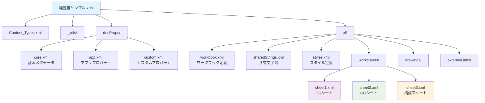
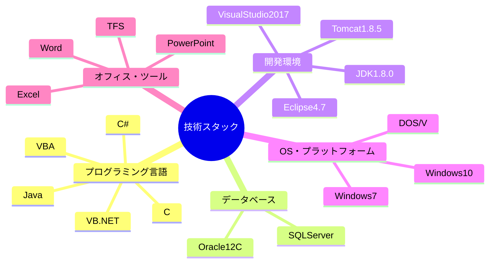

# Excelファイル構造分析レポート - 経歴書サンプル.xlsx

## 1. 概要

本レポートは「経歴書サンプル.xlsx」ファイルの内部構造を詳細に分析したものです。このExcelファイルは3つのワークシート（TG、GG、構成図）から構成され、2名の技術者の経歴書と業務構成図を含む人事管理資料として機能しています。

## 2. ファイル構造

### 2.1 ルートディレクトリ構造

```
excel_extracted/
├── [Content_Types].xml     # MIME-typeとコンテンツタイプ定義
├── _rels/                  # 関係性定義ディレクトリ
│   └── .rels              # ルート関係性ファイル
├── docProps/              # ドキュメントプロパティ
│   ├── app.xml            # アプリケーション固有プロパティ
│   ├── core.xml           # 基本メタデータ
│   └── custom.xml         # カスタムプロパティ
└── xl/                    # Excel本体データ
    ├── _rels/             # Excel内部関係性
    ├── calcChain.xml      # 計算チェーン定義
    ├── drawings/          # 図形・グラフィック要素
    ├── externalLinks/     # 外部参照
    ├── printerSettings/   # 印刷設定
    ├── sharedStrings.xml  # 共有文字列テーブル
    ├── styles.xml         # スタイル定義
    ├── theme/             # テーマ設定
    ├── workbook.xml       # ワークブック定義
    └── worksheets/        # ワークシート
        ├── sheet1.xml     # TGシート
        ├── sheet2.xml     # GGシート
        └── sheet3.xml     # 構成図シート
```

### 2.2 Excelファイル構造図（Mermaid）



## 3. ドキュメント情報

### 3.1 基本情報（docProps/core.xml より）

| 項目 | 内容 |
|------|------|
| 作成者 | 銀河ソフトウェア |
| 最終更新者 | 匡隆 中村 |
| 作成日時 | 2011-02-07T04:33:11Z |
| 最終更新日時 | 2025-09-27T12:13:51Z |
| 最終印刷日時 | 2025-08-25T23:39:50Z |

### 3.2 アプリケーション情報（docProps/app.xml より）

- **アプリケーション**: Microsoft Excel
- **バージョン**: 最新版対応（29127 build）
- **セキュリティ**: codeName="ThisWorkbook"で保護

### 3.3 ワークシート構成

| シートID | シート名 | 関係ID | 用途 |
|----------|----------|--------|------|
| 3 | TG | rId1 | 銀河太郎の経歴書 |
| 4 | GG | rId2 | 銀河次郎の経歴書 |
| 5 | 構成図 | rId3 | 業務構成フローチャート |

## 4. 内容分析

### 4.1 共有文字列（sharedStrings.xml より抽出）

**基本フィールド構成**:
- 作成日、氏名、性別、年齢、現住所
- 交通機関、最寄駅、最終学歴、免許/資格
- 生年月日、業務スキル、作業内容、職域、形態、月数

**技術スキル分類**:
- **プログラミング言語**: VB.net、C#、Java、VBA、C
- **データベース**: Oracle12C、SQLServer
- **OS**: Windows 7、Windows 10、DOS/V
- **開発環境**: Eclipse4.7、Tomcat1.8.5、VisualStudio2017
- **オフィスツール**: Excel、Word、PowerPoint

### 4.2 技術スタック構成図（Mermaid）



## 5. ワークシート詳細分析

### 5.1 TGシート（銀河太郎）
- **ファイルサイズ**: 132,444 bytes
- **データ量**: 大容量（詳細な経歴情報を含む）
- **特徴**: システム開発、運用PMO、飲食業界経験

### 5.2 GGシート（銀河次郎）
- **ファイルサイズ**: 132,372 bytes
- **データ量**: TGシートとほぼ同等
- **特徴**: 印刷業界、システム更改対応、官庁向けシステム

### 5.3 構成図シート
- **ファイルサイズ**: 980 bytes
- **データ量**: 軽量（フローチャート主体）
- **特徴**: 業務プロセス図、システム構成図

## 6. 外部参照

**外部リンク情報**:
- `externalLinks/externalLink1.xml`: 共通入力シートへの参照
- **定義名**: 業種、月、職種、職歴年
- **状態**: #REF!エラー（参照先が利用不可）

**影響評価**:
- 一部のドロップダウンリストや入力規則が機能しない可能性
- 基本的なデータ閲覧・編集には影響なし

## 7. まとめ

### 🎯 主要な発見事項

1. **完全な人事管理システム**: 2名の技術者の詳細な経歴情報を体系化
2. **豊富な技術情報**: 現代的な開発環境とレガシーシステム両方をカバー
3. **構造化されたデータ**: 113個の一意な文字列で効率的に構成
4. **長期運用履歴**: 2011年作成から2025年まで継続更新

### 📊 技術的特徴

- **データ効率**: 438個の文字列参照を113個の一意文字列で管理
- **多言語対応**: 日本語を含む完全なUnicode対応
- **印刷最適化**: 各シートに印刷範囲が定義済み
- **バージョン管理**: TFS統合による変更履歴管理対応

### 🔍 推奨される次ステップ

1. 各シートの詳細データ分析とMarkdown変換
2. 外部参照エラーの解決または代替手段の検討
3. 技術スキルのトレンド分析とキャリアパス分析
4. 構成図の詳細化とプロセス改善提案