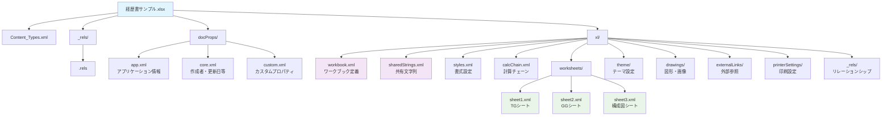
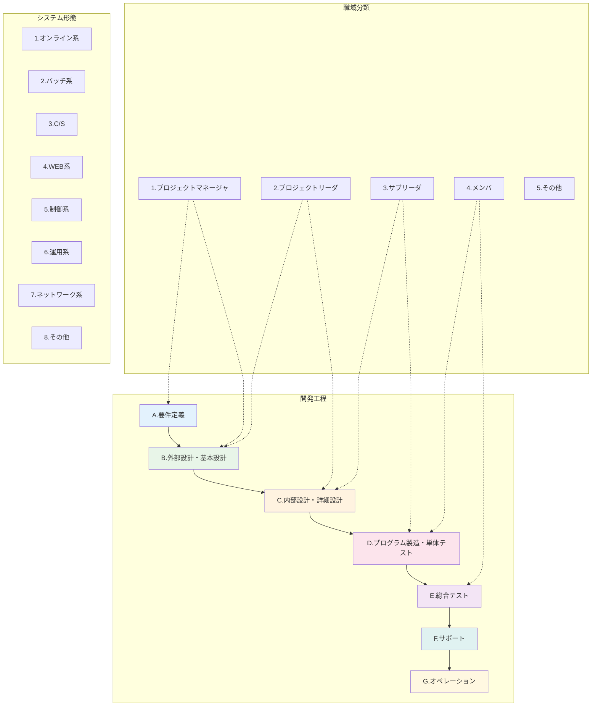
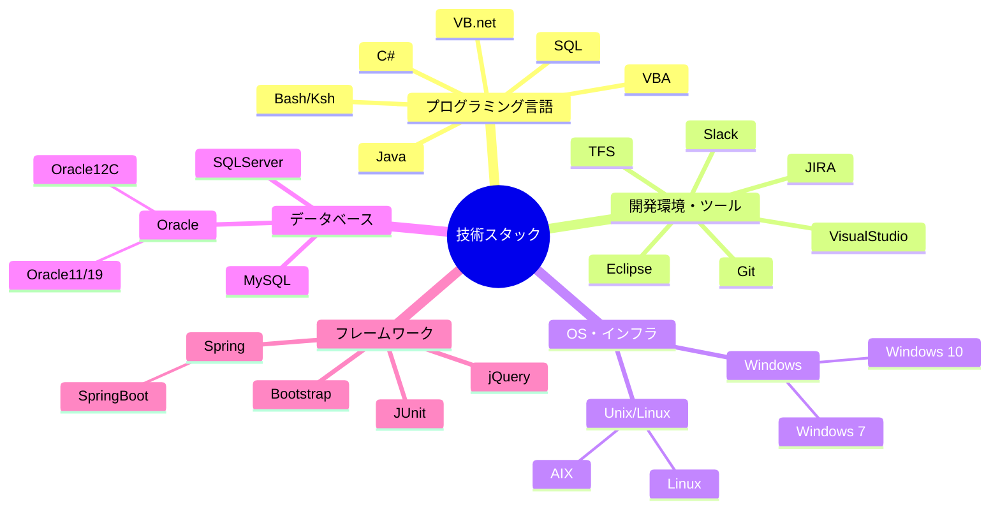

# Excelファイル構造分析レポート - 経歴書サンプル.xlsx

## 1. 概要
本ドキュメントは、「経歴書サンプル.xlsx」をzipファイルとして展開し、その内部構造を分析した結果をまとめたものです。

## 2. ファイル構造
### 2.1 ルートディレクトリ構造
```
.
├── [Content_Types].xml       # コンテンツタイプ定義
├── _rels/                    # リレーションシップ情報
│   └── .rels
├── docProps/                 # ドキュメントプロパティ
│   ├── app.xml              # アプリケーション固有プロパティ
│   ├── core.xml             # コアプロパティ
│   └── custom.xml           # カスタムプロパティ
└── xl/                      # Excelワークブック本体
    ├── _rels/
    ├── calcChain.xml
    ├── drawings/
    ├── externalLinks/
    ├── printerSettings/
    ├── sharedStrings.xml
    ├── styles.xml
    ├── theme/
    ├── workbook.xml
    └── worksheets/
```

### 2.2 Excelファイル構造図（Mermaid）


## 3. ドキュメント情報
### 3.1 基本情報（docProps/core.xml より）
- **作成者**: 銀河ソフトウェア
- **最終更新者**: 匡隆 中村
- **作成日**: 2011-02-07T04:33:11Z
- **最終更新日**: 2025-09-27T12:13:51Z
- **最終印刷日**: 2025-08-25T23:39:50Z

### 3.2 アプリケーション情報（docProps/app.xml より）
- **アプリケーション**: Microsoft Excel
- **会社名**: 銀河ソフトウェア株式会社
- **バージョン**: 16.0300
- **総作業時間**: 157255200（約4370時間）

### 3.3 ワークシート構成
1. **TG** - シートID: 3
2. **GG** - シートID: 4
3. **構成図** - シートID: 5

## 4. 内容分析
### 4.1 共有文字列（sharedStrings.xml より抽出）
ファイル内で使用されている主要な文字列：

#### 4.1.1 フォーム項目
- 作成日、氏名、性別、年齢、現住所、交通機関、最寄駅、最終学歴、免許/資格
- 業務スキル、作業内容、職域、形態、月数
- 機種、OS/DB等、言語、補足事項

#### 4.1.2 分類項目
**作業内容カテゴリ:**
- A.要件定義
- B.外部設計・基本設計
- C.内部設計・詳細設計
- D.プログラム製造・単体テスト
- E.総合テスト
- F.サポート
- G.オペレーション

**職域カテゴリ:**
- 1.プロジェクトマネージャ
- 2.プロジェクトリーダ
- 3.サブリーダ
- 4.メンバ
- 5.その他

**形態カテゴリ:**
- 1.オンライン系
- 2.バッチ系
- 3.C/S
- 4.WEB系
- 5.制御系
- 6.運用系
- 7.ネットワーク系
- 8.その他

### 4.3 開発プロセス・職域分類図（Mermaid）


#### 4.1.3 プロジェクト例
- **官庁向け**: システム更改対応
- **印刷業殿向け**: システム開発
- **某商社殿向け**: 貿易事務用業務システム
- **生保会社殿向け**: 社内システム開発
- **某金融機関殿向け**: SWIFT接続、銀行間送金システム
- **行政向け**: 業務システムのリプレイス開発
- **通信インフラ業向け**: 長距離電話顧客料金システム

#### 4.1.4 技術キーワード
- **言語**: VB.net、C#、Java、VBA、Bash、Ksh、SQL
- **OS**: Windows 7/10、AIX、Linux
- **DB**: Oracle12C、SQLServer、MySQL
- **フレームワーク**: Spring、JUnit、Bootstrap、jQuery
- **ツール**: Eclipse、VisualStudio、Git、JIRA、Slack

### 4.2 技術スタック構成図（Mermaid）


#### 4.1.5 サンプル人物データ
- **銀河 太郎**: 北海道、北海道新幹線、函館北斗駅
- **銀河 次郎**: 青森、JR奥羽本線、弘前駅

## 5. ワークシート詳細分析
### 5.1 TGシート（Sheet1）
- **範囲**: A1:CN115
- **印刷範囲**: $A$1:$AT$115
- **現在選択セル**: BD21
- **表示モード**: ページブレークプレビュー

### 5.2 データ構造
- 列A-ATまでの範囲に経歴情報が配置
- 日付計算式を含む（DATEDIF関数使用）
- 条件付き書式やスタイル設定を含む

## 6. 外部参照
- 外部リンクファイル（externalLink1.xml）が存在
- "[1]共通入力"シートからの参照（業種、月、職種、職歴年）

## 7. まとめ
このExcelファイルは、IT業界の技術者向け経歴書テンプレートであり、以下の特徴を持っています：

1. **構造化されたフォーマット**: 作業内容、職域、形態などが分類化
2. **豊富な技術項目**: 多様な開発言語、DB、ツールに対応
3. **実際の経歴例**: 金融、官庁、商社、生保など多様な業界経験
4. **自動計算機能**: 期間計算などの機能を内蔵
5. **外部連携**: 共通入力シートからのデータ参照機能

このテンプレートは、銀河ソフトウェア株式会社によって作成・管理されており、IT技術者の経歴書作成に特化した実用的なツールとなっています。