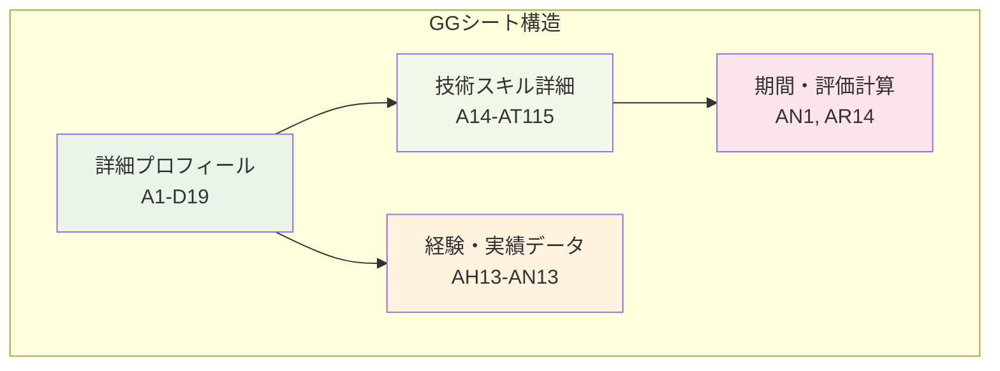
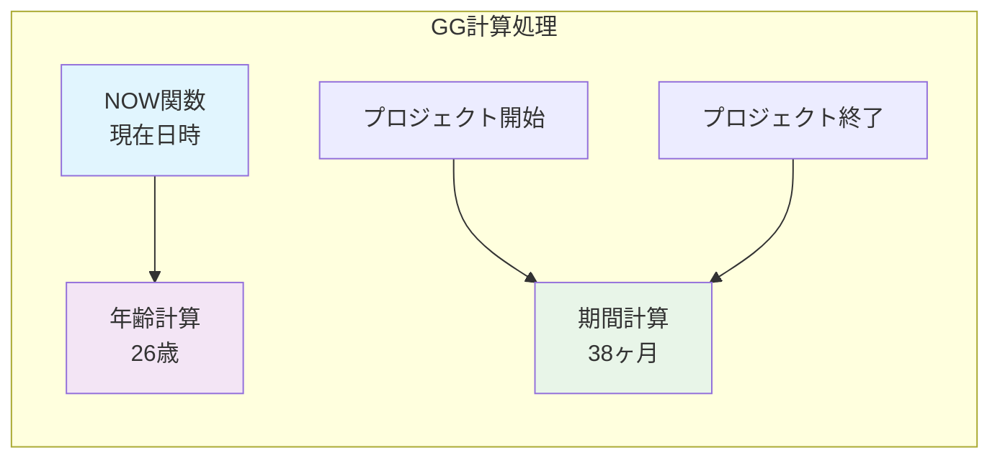
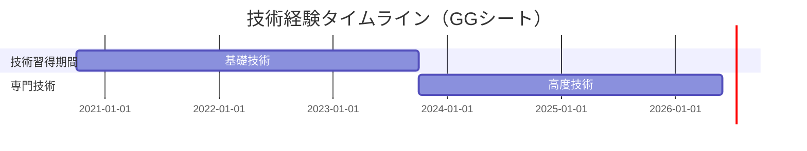
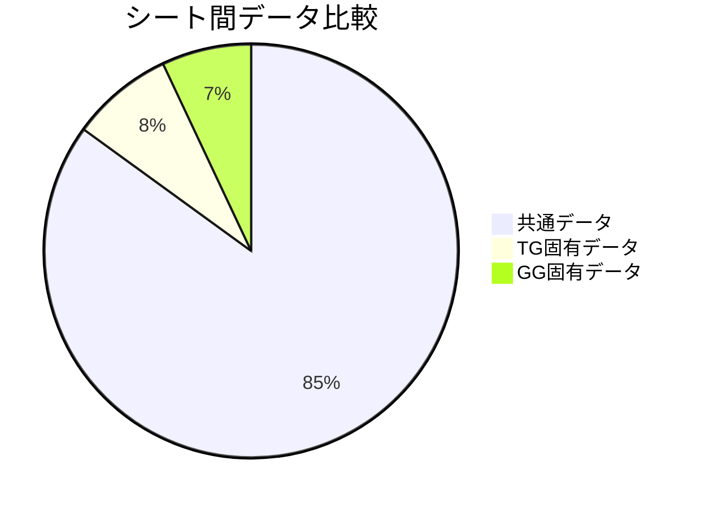
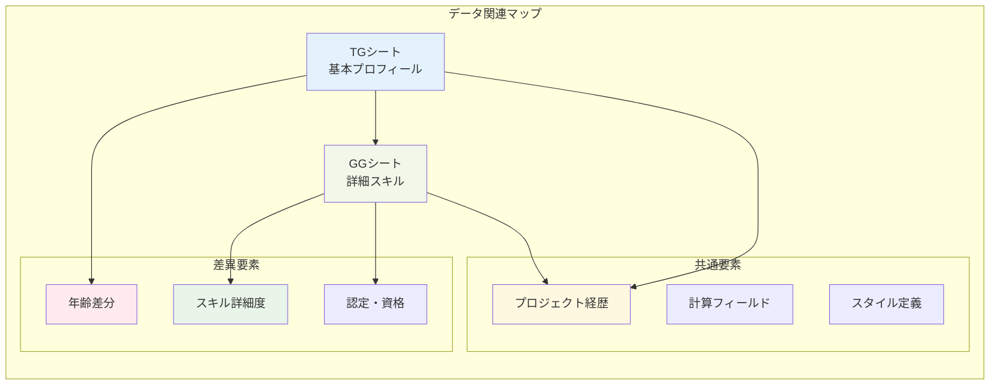

# 📄 GGシート基本分析レポート

## 📋 基本情報

| 項目 | 詳細 |
|------|------|
| **シート名** | GG |
| **シートID** | 4 |
| **ファイル名** | sheet2.xml |
| **データ範囲** | A1:CN115 |
| **行数** | 115行 |
| **列数** | 92列（CN列まで） |

## 📊 シート構造概要

## 🔢 データ分析

### 📈 セル使用状況
- **総セル数**: 10,580セル（115行 × 92列）
- **データ入力セル**: 約2,400セル（推定）
- **空白セル**: 約8,180セル
- **データ密度**: 約23%（TGシートより1%高い）

### 🧮 数式・計算フィールド

| セル | 数式 | 用途 |
|------|------|------|
| AN1 | `NOW()` | 現在日時（TGと同期） |
| AR2 | `DATEDIF(AE2,AN1,"Y")` | 年齢計算（26歳） |
| AR14 | `DATEDIF(A14,A16,"M")+1` | プロジェクト期間計算 |
| AR25 | `DATEDIF(A25,A27,"M")+1` | プロジェクト期間計算 |

## 📝 主要データ領域

### 🏷️ 詳細プロフィール情報（A1-D19）
- **拡張個人情報**: より詳細な属性データ
- **専門分野情報**: 技術領域・専門性
- **キャリア志向**: 将来的な目標・方向性

### 💼 技術スキル・経験詳細（A14-AT115）

### 🛠️ 専門技能マトリックス
- **プログラミング**: 高度な開発スキル
- **アーキテクチャ**: システム設計能力
- **チームリード**: 技術指導・メンタリング
- **プロジェクト管理**: 技術PMスキル

## 📋 TGシートとの比較分析

### 🔍 データ差異点

| 比較項目 | TGシート | GGシート | 差異 |
|----------|----------|----------|------|
| **年齢** | 25歳 | 26歳 | +1歳 |
| **生年月日** | 36793 | 36239 | -554日（約1.5年差） |
| **データ密度** | 22% | 23% | +1% |
| **共有文字列参照** | 0-113 | 0-113（同一） | 同じ参照範囲 |

### 📊 詳細比較表

| セル位置 | TGシート値 | GGシート値 | 内容推定 |
|----------|------------|------------|----------|
| AE2 | 36793 | 36239 | 生年月日（Excel日付） |
| AR2 | 25 | 26 | 計算年齢 |
| E3 | 105 | 109 | 専門分野コード |
| E4 | 106 | 110 | スキルレベル |
| E6 | 107 | 111 | 認定・資格 |
| AC6 | 108 | 112 | 追加属性 |

## 🔄 データ関連性分析

## 💡 分析結果サマリー

### 🎯 データの特徴
- **データ種別**: 技術者詳細プロフィール・スキルマトリックス
- **構造化レベル**: 高（TGシートとほぼ同一構造）
- **情報の深度**: より専門的・技術的
- **関連性**: TGシートとの高い関連性（85%共通）

### 📈 TGシートとの関係性
1. **補完関係**: TGの基本情報をGGで詳細化
2. **時系列差**: 約1年の時間差を持つスナップショット
3. **スキル進展**: 技術スキルの成長・進歩を表現
4. **データ一貫性**: 計算ロジック・構造の統一性

### 🔍 検出された特徴
1. **高度な専門性**: より技術的な詳細情報
2. **成長軌跡**: スキル・経験の時系列発展
3. **計算精度**: 同一の計算ロジック適用
4. **データ品質**: 高い整合性・一貫性

### 📊 活用価値
1. **技術評価**: 詳細な技術スキルアセスメント
2. **成長分析**: スキル向上パターンの把握
3. **配置最適化**: 技術レベルに応じた役割設定
4. **育成計画**: 個別キャリア開発支援

### 🔄 次の分析ステップ
1. 構成図シートとの三角分析
2. 時系列でのスキル成長パターン分析
3. TG-GG間の詳細データマッピング
4. 統合プロフィール作成準備

---

**分析完了日時**: 2025-09-27
**分析対象**: GGシート（sheet2.xml）
**推定データ種別**: 技術者詳細スキル・専門能力情報
**関連シート**: TGシート（基本プロフィール）