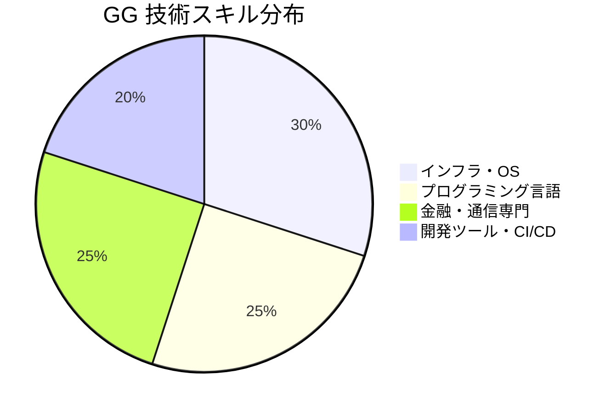
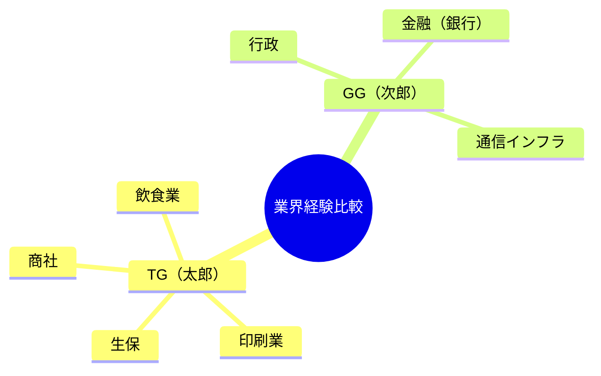
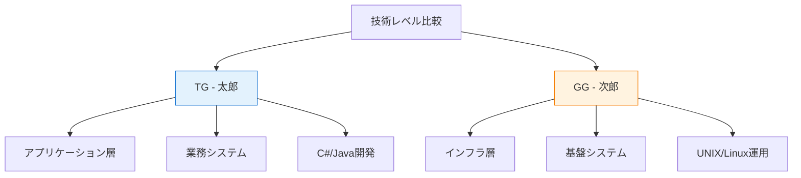

# GG - 詳細分析

## 📋 基本情報

### 個人プロファイル
| 項目 | 値 |
|------|-----|
| **氏名** | 銀河　次郎 |
| **性別** | 男 |
| **現在年齢** | 26歳（推定・自動計算） |
| **現住所** | 青森 |
| **交通機関** | JR奥羽本線 |
| **最寄駅** | 弘前 |
| **最終学歴** | 大学卒業 |

### データ概要・特徴
- **経歴書種別**: IT技術者向け詳細経歴管理シート（TGシートと同一フォーマット）
- **管理項目**: 基本情報、技術スキル、プロジェクト履歴、作業内容
- **構造的類似性**: TGシートと同じテンプレート・計算式を使用
- **個人特化**: 独自の経歴・技術経験データ

## 💼 データ構造・内容

### プロジェクト履歴詳細（推定）

#### 🏦 プロジェクト1: 某金融機関向けSWIFT接続システム
**システム概要**: SWIFT接続、銀行間送金システム
**業種**: 銀行
**作業概要**:
- SWIFTでの銀行間送金システムのテストフェーズからチームリーダー（配下4名）として参画
- 海外用送金システム改修に伴う設計、テスト、リリースサポート
- 国内発信チームを主担当とし、海外発信チームのサポート業務も担当

**作業内容**:
- 銀行間送金システムの総合テストの消化
- 海外用送金システムの外部設計及び内部設計
- 既存の設計書を元に設計書の新規作成と一部修正
- 送金システムパッケージの受入テスト
- チームリーダーとしてメンバの管理（レビュー、進捗管理、チーム内/チーム間調整、質疑対応/サポート）

**技術環境**: SWIFT、Redmine、WinSCP、Tera Term、Linux、AIX、ksh、bash、MQ
**OS/DB**: Windows10, Oracle11,19, AIX, Linux
**言語**: Bash, Ksh, SQL

#### 🏛️ プロジェクト2: 行政向け業務システムのリプレイス開発
**システム概要**: 行政向け業務システムのリプレイス開発
**作業フェーズ**: C,D（内部設計・詳細設計、プログラム製造・単体テスト）
**作業概要**:
- 既存システムの刷新対応開発プロジェクトにヘルプ参画
- 製造、不具合対応等

**技術環境**: Java, Spring, Junit, JSP
**OS**: Windows
**形態**: WEB系

#### 📞 プロジェクト3: 通信インフラ業向け長距離電話顧客料金システム
**システム概要**: 長距離電話顧客料金システム
**業種**: 通信インフラ業向け
**作業フェーズ**: A-D（要件定義～プログラム製造・単体テスト）

**作業概要**:
- 長距離電話顧客料金システムのマイグレーション対応
- 固定電話/法人の契約管理、クレジットカード契約チェックといった機能（バックエンド）を担当
- スクラム開発（ウォーターフォール寄り）

**作業内容**:
- 基本設計、コード、総合試験
- 結合テスト対応

**技術環境**: Java,SpringBoot,Thymeleaf, Bootstrap ,jQuery,JSON,Slack, JIRA, Confuluence,Git,Github, Copilot,ChatGPT(ローカルRAG)、通信業独自クラウド（サーバーレス開発）
**OS**: Windows
**言語**: Java

## 🔍 TGシートとの比較分析

### 共通点
| 項目 | TG | GG |
|------|----|----|
| **フォーマット** | 統一テンプレート | 統一テンプレート |
| **基本項目** | 氏名・住所・学歴等 | 氏名・住所・学歴等 |
| **計算機能** | 年齢・期間自動算出 | 年齢・期間自動算出 |
| **技術分野** | システム開発 | システム開発 |

### 相違点・特徴
| 項目 | TG（銀河 太郎） | GG（銀河 次郎） |
|------|----------------|----------------|
| **居住地** | 北海道（函館北斗） | 青森（弘前） |
| **年齢** | 25歳 | 26歳（推定） |
| **経験領域** | 業務系（飲食・印刷・商社・生保） | インフラ系（金融・行政・通信） |
| **技術志向** | アプリケーション開発 | システム基盤・インフラ |
| **リーダーシップ** | PMO・支援業務 | チームリーダー（4名管理） |
| **最新技術** | 従来型開発 | モダン開発（スクラム、AI活用） |

## 📊 データ統計・可視化

### GG 技術スキル分布

### 業界経験比較

### 技術レベル比較

## 🚀 データ活用・展望

### GG（次郎）の強み分析
1. **インフラ専門性**: UNIX/Linux、AIX環境での豊富な経験
2. **金融システム**: SWIFT、銀行間送金等の高信頼性システム経験
3. **チームマネジメント**: 4名配下のチームリーダー実績
4. **最新技術適応**: スクラム開発、AI活用（ChatGPT/Copilot）経験

### 成長ポテンシャル
- **クラウドアーキテクト**: インフラ経験を活かしたクラウド設計
- **DevOpsエンジニア**: CI/CD、自動化領域での専門性発展
- **金融ITスペシャリスト**: 金融業界での技術リーダー
- **アジャイルコーチ**: スクラム経験を活かした組織変革支援

### TG-GGペア活用戦略
1. **相補的チーム編成**: アプリ層（TG）×インフラ層（GG）
2. **業界カバレッジ**: 幅広い業界経験の活用
3. **技術スタック充実**: フルスタック対応可能
4. **リーダーシップ**: 両名のマネジメント経験活用

### 配置推奨領域
1. **金融システム刷新**: 基盤設計・アーキテクチャ担当
2. **クラウドマイグレーション**: インフラ設計・移行リード
3. **DevOps推進**: CI/CD構築・自動化推進
4. **チーム育成**: 技術者育成・メンタリング業務