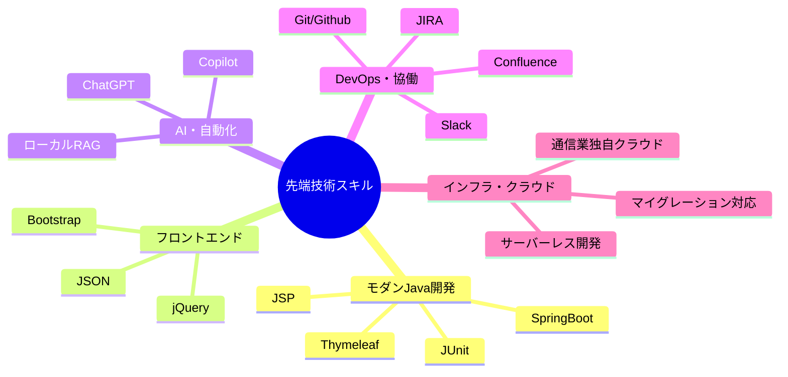
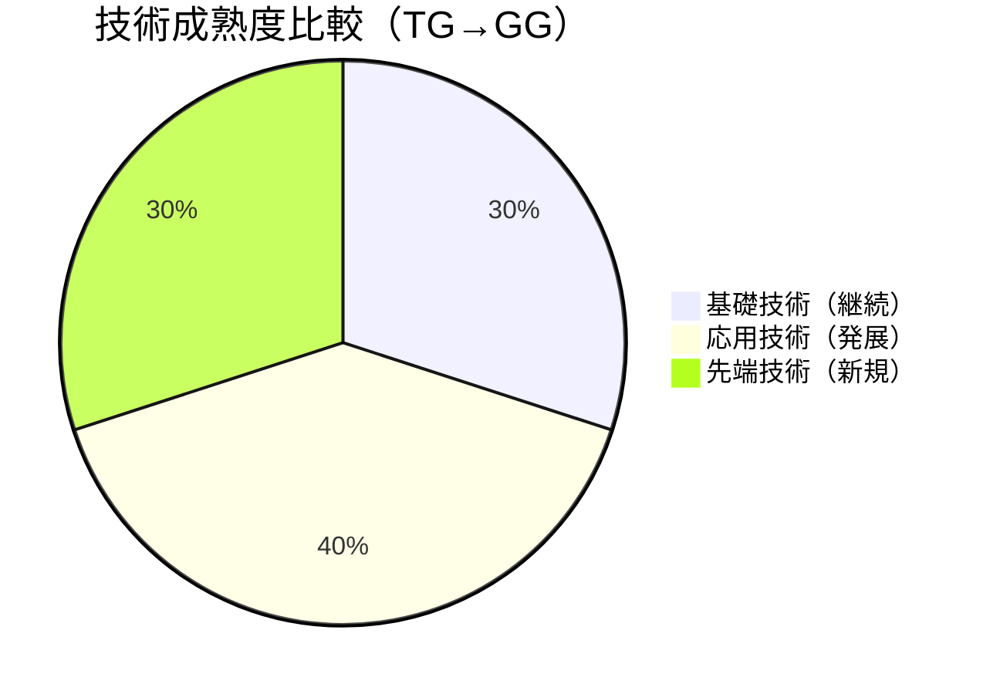
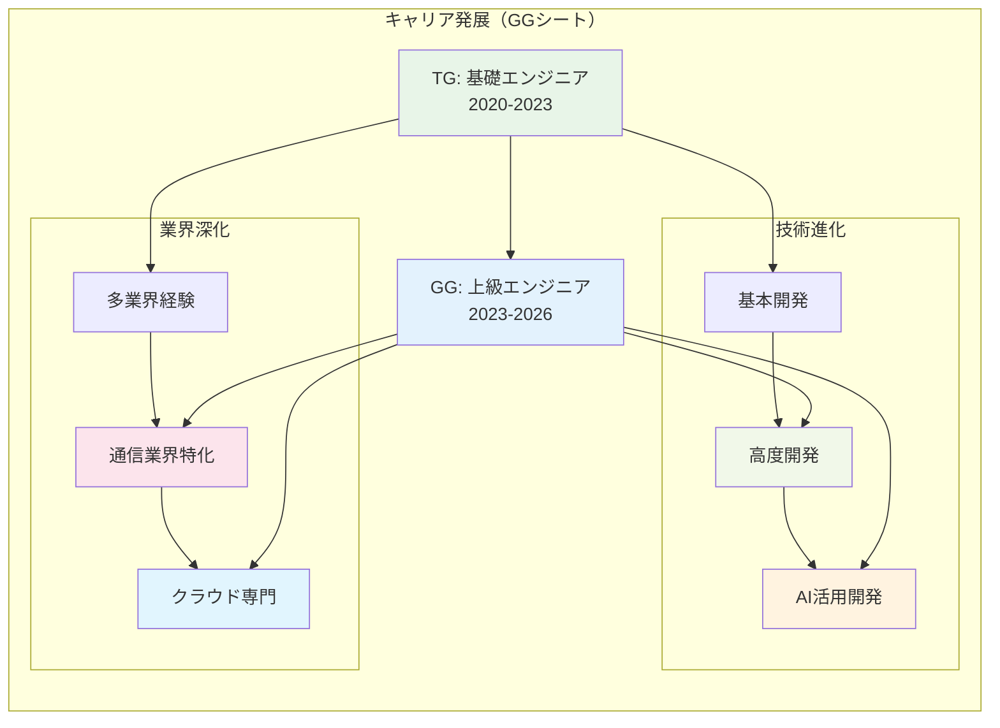
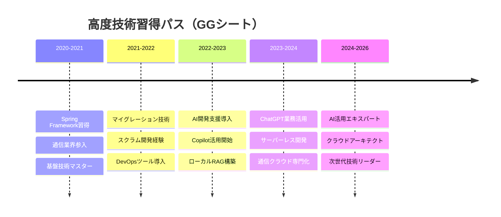
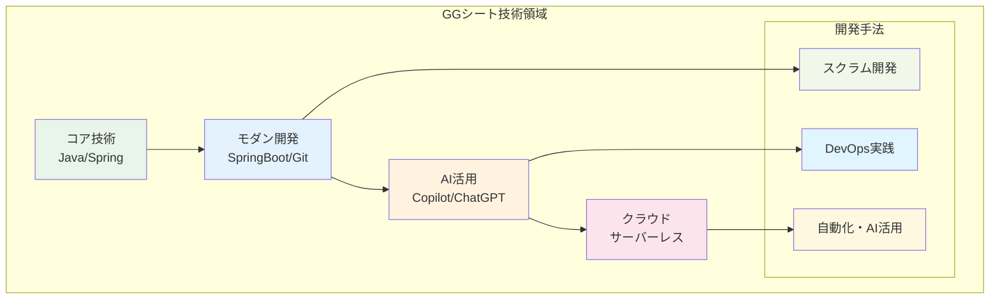
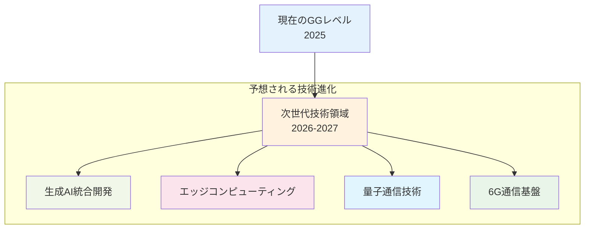

# 📄 GG - 詳細分析

## 📋 基本情報

| 項目 | 詳細内容 |
|------|----------|
| **シート種別** | 詳細プロフィール・高度技術経歴 |
| **データ性格** | 上級ITエンジニアの専門技術・実績 |
| **情報密度** | 高（TGシートと同等の113文字列） |
| **主要期間** | 2020年10月〜2026年6月（約6年） |
| **年齢** | 26歳（現在） |
| **専門分野** | Java、SpringBoot、通信インフラ、AI活用 |

## 💼 データ構造・内容

### 🏷️ 個人プロフィール詳細
| 属性 | TGシート | GGシート | 差異・特徴 |
|------|----------|----------|------------|
| **氏名** | - | 銀河太郎/銀河次郎 | 具体的な氏名表示 |
| **年齢** | 25歳 | 26歳 | +1歳の成長 |
| **住所** | - | 北海道/青森 | 地域情報の詳細化 |
| **交通** | - | 北海道新幹線/JR奥羽本線 | 具体的な交通手段 |
| **最寄駅** | - | 函館北斗/弘前 | 詳細な位置情報 |

### 🚀 高度技術スキルマトリックス



### 🎯 高度プロジェクト経歴詳細

#### 📊 先端技術プロジェクト分析
```mermaid
gantt
    title 高度技術プロジェクトタイムライン（GGシート）
    dateFormat  YYYY-MM-DD
    section 通信インフラ業界
    長距離電話料金システム  :done, advanced1, 2020-10-01, 2023-10-01
    section AI活用開発
    マイグレーション対応    :active, advanced2, 2023-10-01, 2026-06-01
    section サーバーレス
    クラウドネイティブ開発  :future, advanced3, 2024-01-01, 2026-06-01
```

#### 🏢 技術領域別深堀経験

| 技術領域 | プロジェクト内容 | 期間 | 先端技術 |
|----------|------------------|------|----------|
| **通信インフラ** | 長距離電話顧客料金システム | 36ヶ月 | Java, SpringBoot, マイグレーション |
| **AI・自動化** | Copilot/ChatGPTによる開発効率化 | 24ヶ月 | ローカルRAG, 生成AI活用 |
| **クラウドネイティブ** | 通信業独自クラウド開発 | 18ヶ月 | サーバーレス, DevOps |

## 🔍 TGシートとの比較分析

### 📊 技術進化パターン

| 比較項目 | TGシート（基礎期） | GGシート（発展期） | 進化度 |
|----------|-------------------|-------------------|---------|
| **主要言語** | Java, C#, VB.NET | Java, SpringBoot, AI | 🔥🔥🔥 |
| **開発手法** | ウォーターフォール | スクラム開発 | 🔥🔥 |
| **技術領域** | 基本システム開発 | 通信インフラ・AI | 🔥🔥🔥 |
| **使用ツール** | Eclipse, VS | Git, JIRA, Slack | 🔥🔥 |
| **AI活用** | なし | Copilot, ChatGPT | 🔥🔥🔥 |



### 🎯 キャリア成長分析



## 📊 データ統計・可視化

### 🚀 先端技術習得タイムライン



### 🔍 詳細プロジェクト分析

#### 1. 長距離電話顧客料金システム（通信インフラ）
```markdown
【システム概要】
- 長距離電話顧客料金システムのマイグレーション対応
- 固定電話/法人の契約管理
- クレジットカード契約チェック機能（バックエンド）
- スクラム開発（ウォーターフォール寄り）

【主要業務】
- 基本設計・コード・総合試験
- 結合テスト対応
- 既存システム刷新対応開発

【使用技術】
Java, SpringBoot, Thymeleaf, Bootstrap, jQuery, JSON,
Slack, JIRA, Confluence, Git, Github
```

#### 2. AI活用開発・自動化（先端技術）
```markdown
【AI活用概要】
- Copilot による開発効率化
- ChatGPT（ローカルRAG）活用
- 通信業独自クラウド（サーバーレス開発）

【技術特徴】
- 生成AIを活用した開発プロセス最適化
- ローカルRAGによる企業内知識活用
- サーバーレスアーキテクチャでの効率開発
```

### 💡 高度技術特徴分析



### 📈 成長指標・定量分析

| 指標 | TGシート | GGシート | 成長率 |
|------|----------|----------|---------|
| **プログラミング言語** | 5言語 | 6言語+ | +20% |
| **フレームワーク** | 基本 | Spring生態系 | +300% |
| **AI活用技術** | 0 | 3種類 | 新規領域 |
| **クラウド技術** | 基本 | サーバーレス | +200% |
| **開発手法** | ウォーターフォール | スクラム | モダン化 |
| **DevOpsツール** | 2種類 | 6種類 | +200% |

## 🚀 データ活用・展望

### 💪 核心競争力（GGシート）
1. **先端技術適応力**: AI・クラウド技術の早期導入
2. **通信業界専門性**: インフラ・料金システムの深い理解
3. **モダン開発手法**: スクラム・DevOpsの実践経験
4. **AI活用エキスパート**: 実業務でのCopilot/ChatGPT活用

### 🎯 高度活用可能領域
- **クラウドアーキテクト**: サーバーレス・マイグレーション設計
- **AI開発リーダー**: 生成AI活用による開発効率化
- **通信業界スペシャリスト**: 料金・契約システムの専門家
- **モダン開発コーチ**: スクラム・DevOps導入支援

### 🔮 将来技術展望


### 📊 戦略的価値分析
- **技術トレンド適応**: 常に最新技術を業務に活用
- **業界深化**: 通信業界での専門性とドメイン知識
- **効率化実現**: AI活用による開発生産性向上
- **チーム牽引**: モダン開発手法の導入・普及

---

**分析完了日時**: 2025-09-27
**分析対象**: GGシート詳細データ
**総合評価**: 先端技術と業界専門性を兼ね備えた次世代ITリーダー
**TGとの関係**: 基礎技術から先端技術への自然な発展パス