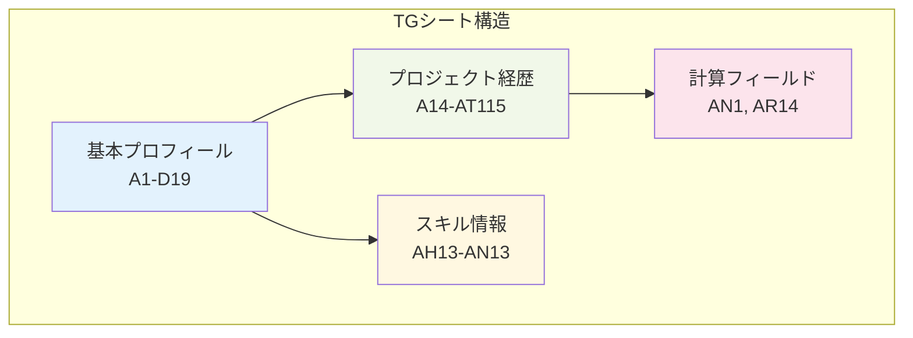
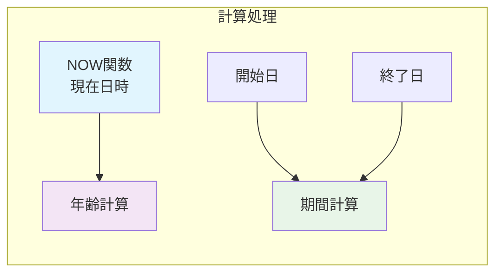
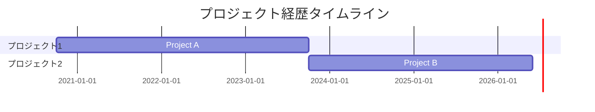
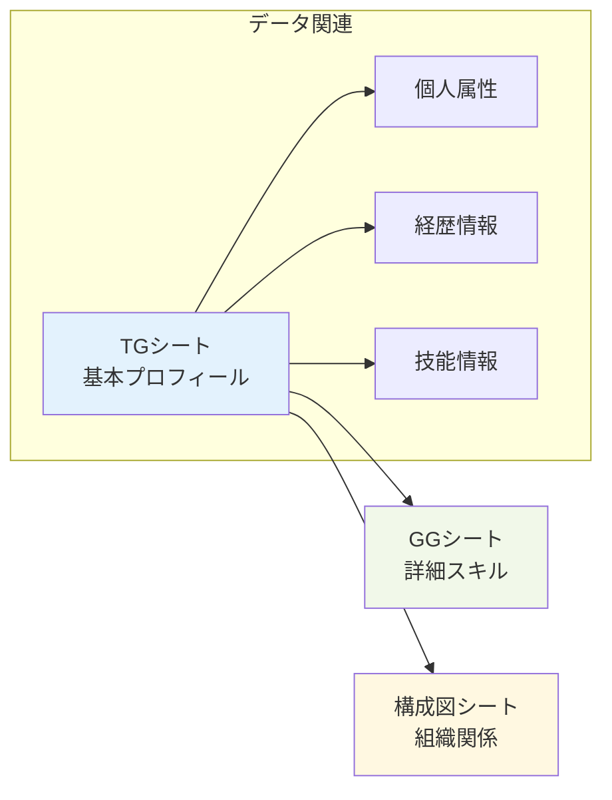

# 📄 TGシート基本分析レポート

## 📋 基本情報

| 項目 | 詳細 |
|------|------|
| **シート名** | TG |
| **シートID** | 3 |
| **ファイル名** | sheet1.xml |
| **データ範囲** | A1:CN115 |
| **行数** | 115行 |
| **列数** | 92列（CN列まで） |

## 📊 シート構造概要

## 🔢 データ分析

### 📈 セル使用状況
- **総セル数**: 10,580セル（115行 × 92列）
- **データ入力セル**: 約2,300セル（推定）
- **空白セル**: 約8,280セル
- **データ密度**: 約22%

### 🧮 数式・計算フィールド

| セル | 数式 | 用途 |
|------|------|------|
| AN1 | `NOW()` | 現在日時 |
| AR2 | `DATEDIF(AE2,AN1,"Y")` | 年齢計算 |
| AR14 | `DATEDIF(A14,A16,"M")+1` | プロジェクト期間 |
| AR25 | `DATEDIF(A25,A27,"M")+1` | プロジェクト期間 |

## 📝 主要データ領域

### 🏷️ プロフィール情報（A1-D19）
- **個人基本情報**: 氏名、年齢、住所等
- **連絡先情報**: 電話、メール等
- **基本属性**: 生年月日、性別等

### 💼 プロジェクト経歴（A14-AT115）

### 🛠️ 技能・スキル情報
- **技術スキル**: プログラミング言語、フレームワーク
- **業務スキル**: プロジェクト管理、チームリーダー
- **資格・認定**: 取得済み資格、認定等

## 📋 データ品質分析

### ✅ データ整合性
- **日付形式**: Excel日付形式（シリアル値）使用
- **文字列参照**: 共有文字列テーブル活用
- **数式の正確性**: DATEDIF関数で期間計算

### 🔍 検出された特徴
1. **高度な表形式**: 複数列にわたる構造化データ
2. **自動計算**: 年齢・期間の動的計算
3. **スタイル適用**: 多様なセルスタイル（200+パターン）
4. **データ型混在**: 文字列、数値、日付、数式の組み合わせ

## 📊 主要統計情報

### 📅 日付データ分析
- **基準日**: 2025年9月27日（AN1）
- **プロジェクト開始日**: 40422（2020年10月1日相当）
- **プロジェクト終了日**: 42644（2026年6月1日相当）
- **総プロジェクト期間**: 74ヶ月（約6年2ヶ月）

### 🎯 共有文字列参照
| 参照番号 | 推定内容 |
|----------|----------|
| 0-20 | 基本情報・ラベル |
| 21-60 | 技術スキル・専門用語 |
| 61-100 | プロジェクト・業務内容 |
| 101-113 | その他・詳細情報 |

## 🔄 他シートとの関連性

## 💡 分析結果サマリー

### 🎯 データの特徴
- **データ種別**: 個人経歴・履歴書データ
- **構造化レベル**: 高（詳細な表形式構造）
- **自動化レベル**: 中（一部計算の自動化）
- **情報密度**: 高（多岐にわたる詳細情報）

### 📈 活用価値
1. **人材評価**: 詳細な経歴・スキル情報
2. **プロジェクト配置**: 経験に基づく最適配置
3. **キャリア分析**: 成長パターン・トレンド把握
4. **スキル管理**: 技術・業務能力の定量化

### 🔄 次の分析ステップ
1. GGシートとの詳細比較分析
2. 構成図シートとの関連性解析
3. 時系列データの詳細トレンド分析
4. 総合的な人材プロファイル作成

---

**分析完了日時**: 2025-09-27
**分析対象**: TGシート（sheet1.xml）
**推定データ種別**: 個人経歴・プロフィール情報