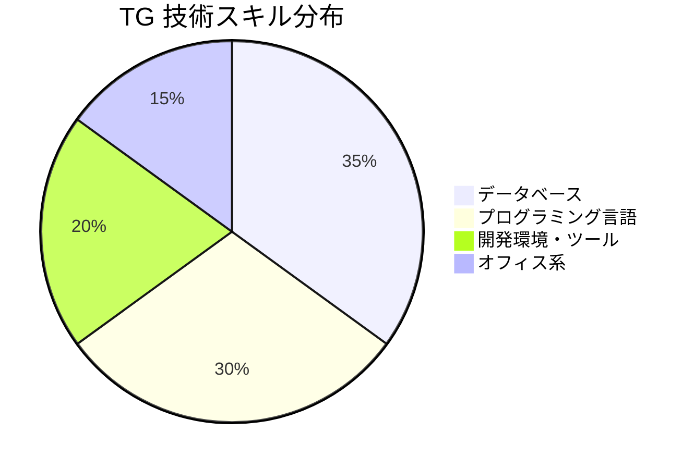
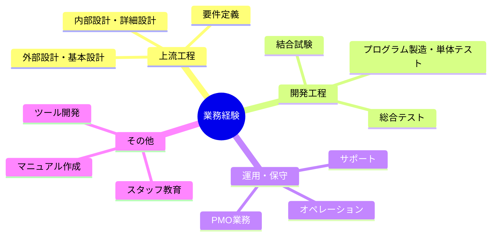
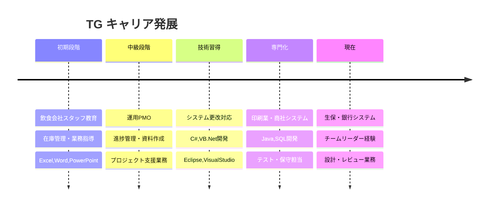
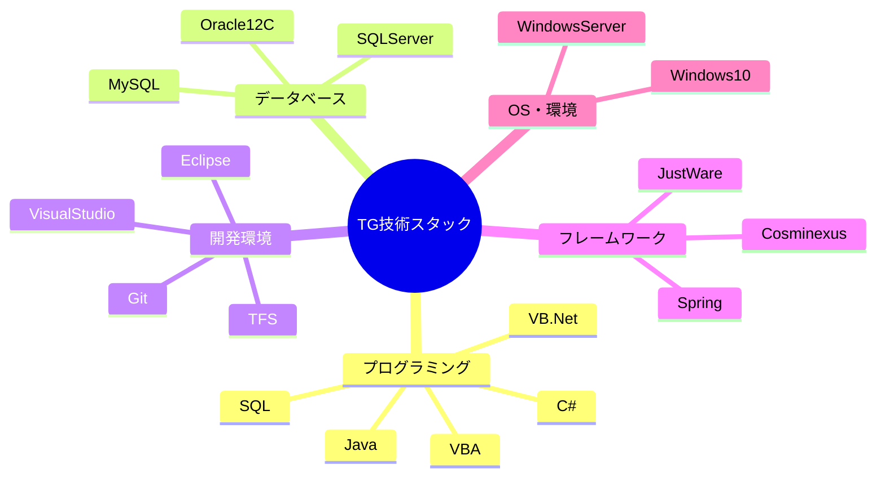

# TG - 詳細分析

## 📋 基本情報

### 個人プロファイル
| 項目 | 値 |
|------|-----|
| **氏名** | 銀河　太郎 |
| **性別** | 男 |
| **現在年齢** | 25歳（自動計算） |
| **生年月日** | 36793（Excel日付：2000年頃） |
| **現住所** | 北海道 |
| **交通機関** | 北海道新幹線 |
| **最寄駅** | 函館北斗 |
| **最終学歴** | 大学卒業 |

### データ概要・特徴
- **経歴書種別**: IT技術者向け詳細経歴管理シート
- **管理項目**: 基本情報、技術スキル、プロジェクト履歴、作業内容
- **自動計算機能**: 年齢・プロジェクト期間の動的算出
- **構造化設計**: 標準フォーマットによる一貫性確保

## 💼 データ構造・内容

### プロジェクト履歴詳細

#### 🏢 プロジェクト1: 飲食会社向けスタッフ教育業務
**期間**: 36ヶ月
**業務概要**:
- **在庫管理業務**
  - 日常業務における商品の在庫の入庫、出庫を管理
  - 実地棚卸業務
  - 仕入先に商品の購買依頼業務等
- **スタッフ教育**
  - 品質及び方針指導
  - 接客及び対応指導
  - 各種作業のマニュアル・チェックシート化
  - 機械操作方法の指導及びメンテナンス方法指導

**技術環境**: Excel, Word, PowerPoint

#### 🏢 プロジェクト2: 運用PMO業務
**概要**: 運用補佐業務
**作業内容**:
- 進捗管理
- 会議室の確保、会議出欠確認、議事録作成、会議用資料作成、その他資料作成
- 備品管理、PC管理、キッティング
- メール、電話、来客対応
- 関連部署に対するエスカレーション

**技術環境**: Excel、Word、PowerPoint

#### 🏢 プロジェクト3: 陸運局向け希望番号システム更改
**システム概要**: 陸運局向けの希望番号システム更改
**作業内容**:
- エンハンス対応(基本設計・詳細設計・製造・テスト）
- 不具合報告書の作成及び原因調査
- 機能追加による設計書作成、修正、各言語でのコーディング
- 単体試験項目書の作成及び、実施
- 結合試験項目書の作成及び、実施
- VBAでのツール開発

**技術環境**: Eclipse4.7, Tomcat1.8.5, VisualStudio2017, JDK1.8.0, C#, VB.Net, VBA, TFS, Oracle12C

#### 🏢 プロジェクト4: 印刷業向け社内システム開発
**概要**: 印刷業殿向け社内システム開発（C/S)基盤（社内向け）チームに参画
**担当範囲**: 製造から結合試験、検証、保守まで担当。その他マニュアル作成

**技術環境**: C#、SQL、windows10、VisualStudio2015、Access、ManagementStudio2013、ActiveReport9.0J、VBA、OracleSQL、MySQL

#### 🏢 プロジェクト5: 某商社様向け貿易事務用業務システム
**システム概要**: 商社向け貿易事務用業務システム
**作業内容**:
- 自社チームの短期増員として上記システム開発のプロジェクトに参画
- 作業は主にテストを担当

**技術環境**: WindowsServer、VisualStudio、C#、SQLServer、IIS、VisualStudio TeamFoundationServer、Git

#### 🏢 プロジェクト6: 生保会社向け社内システム開発
**システム概要**: 生保会社向け社内システム開発（商品・ネット契約者窓口 機能担当）
**作業概要**:
- 帳票設計書・内部設計書・詳細設計書の作成およびレビュー対応
- Java実装、単体試験、帳票作成、画面修正、結合試験、Java実装レビュー対応、単体試験レビュー対応
- 他チームへの開発支援、作業手順書作成、VBAツール作成

**技術環境**: Java ,JustWare(日立製フレームワーク）,Cosminexus(日立製ミドルウェア),Biz/Designer,BRMS,Oracle12c

## 📊 データ統計・可視化

### 技術スキル分布

### 業務フェーズ経験

### キャリア成長タイムライン

### 技術要素マップ

## 🚀 データ活用・展望

### 強み分析
1. **多業界経験**: 飲食、印刷、商社、生保、金融等の幅広い業界経験
2. **技術の幅**: C#、Java、VB.Net等のマルチ言語対応
3. **全工程経験**: 要件定義から運用保守まで一貫した経験
4. **マネジメント**: PMO経験、チーム支援業務の実績

### 成長ポテンシャル
- **次世代技術**: クラウド、AI/ML技術への発展可能性
- **リーダーシップ**: チームリード、プロジェクト管理への展開
- **専門性深化**: 特定領域（金融、インフラ等）での専門家ポジション
- **アーキテクト**: システム設計・アーキテクチャ設計への発展

### 配置推奨領域
1. **金融システム開発**: 銀行・生保経験を活かした金融IT
2. **業務システム刷新**: 既存システムのモダナイゼーション
3. **チームリード**: 開発チームのリーダー・サブリーダー
4. **品質管理**: テスト設計・品質保証業務