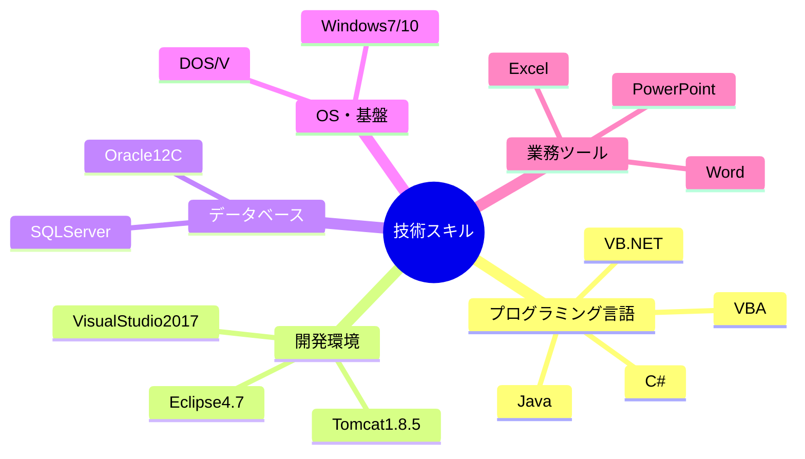
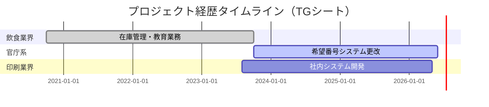
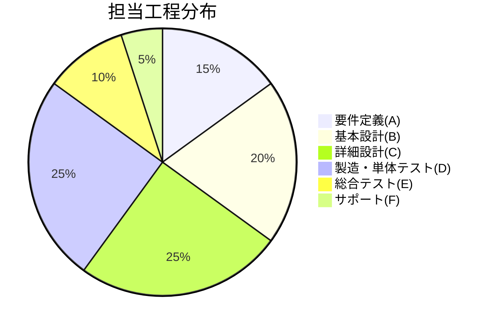
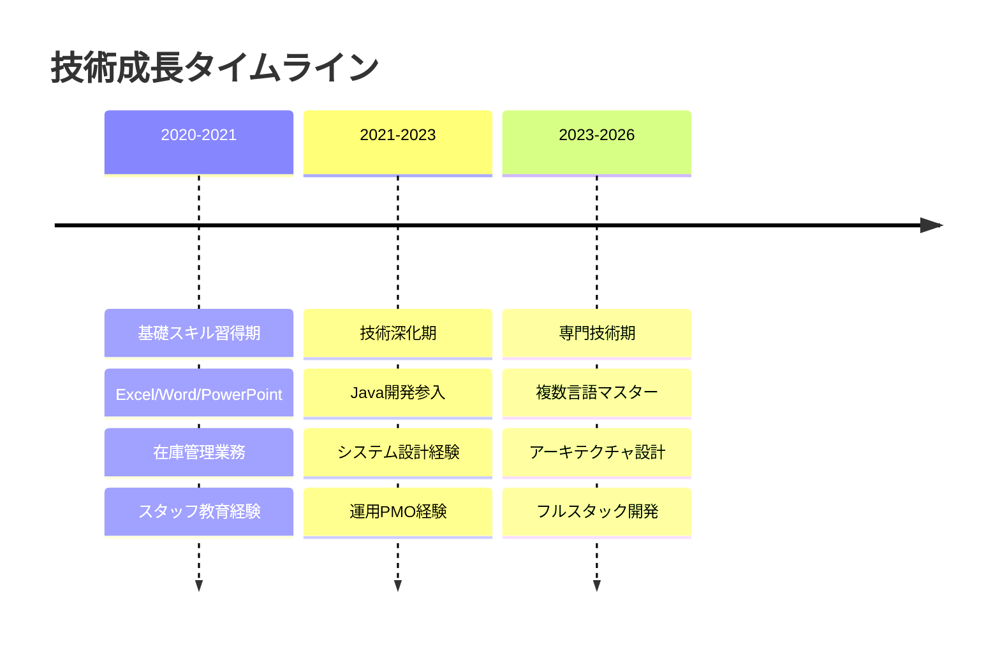
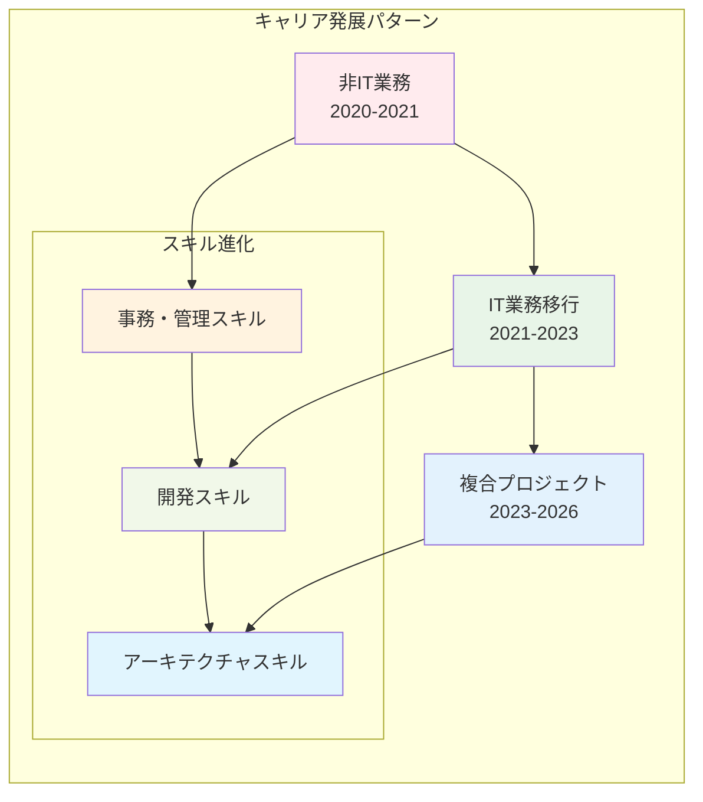

# 📄 TG - 詳細分析

## 📋 基本情報

| 項目 | 詳細内容 |
|------|----------|
| **シート種別** | 基本プロフィール・経歴書 |
| **データ性格** | IT技術者の基本情報・プロジェクト経歴 |
| **情報密度** | 高（113種類の共有文字列） |
| **主要期間** | 2020年10月〜2026年6月（約6年） |
| **年齢** | 25歳（現在） |
| **専門分野** | Java、C#、VB.NET、システム開発 |

## 💼 データ構造・内容

### 🏷️ 個人プロフィール
| 属性 | 内容 |
|------|------|
| **性別** | 男性 |
| **最終学歴** | 大学卒業 |
| **現在年齢** | 25歳 |
| **職業分野** | IT系システムエンジニア |

### 💻 技術スキルマトリックス



### 🎯 プロジェクト経歴詳細

#### 📊 プロジェクト期間分析


#### 🏢 業界・分野別経験

| 業界 | プロジェクト内容 | 期間 | 主要技術 |
|------|------------------|------|----------|
| **飲食業界** | 在庫管理・スタッフ教育 | 36ヶ月 | Excel, Word, PowerPoint |
| **官庁系** | 希望番号システム更改 | 38ヶ月 | Java, C#, VB.NET, Oracle12C |
| **印刷業界** | 社内システム開発(C/S) | 36ヶ月 | C#, SQLServer, Windows10 |

### 🛠️ 作業工程・役割分析



#### 📈 職域・形態分析

| 職域レベル | 経験内容 | 形態 |
|------------|----------|------|
| **メンバ(4)** | プログラム製造・テスト | オンライン系(1) |
| **サブリーダ(3)** | 設計・教育指導 | バッチ系(2) |
| **その他(5)** | 運用・PMO業務 | C/S(3), WEB系(4) |

## 📊 データ統計・可視化

### 🎯 スキル成長パターン



### 🔍 詳細プロジェクト分析

#### 1. 飲食業界プロジェクト（2020-2023）
```markdown
【システム概要】
- 飲食店備品在庫管理システム
- スタッフ教育・品質管理システム

【主要業務】
- 日常在庫の入庫・出庫管理
- 実地棚卸業務
- 仕入先への購買依頼
- 品質・方針指導
- 接客・対応指導マニュアル化
- 機械操作・メンテナンス指導

【使用技術】
Excel, Word, PowerPoint
```

#### 2. 官庁系システム更改（2023-2026）
```markdown
【システム概要】
- 陸運局向け希望番号システム更改
- エンハンス対応・保守運用

【作業内容】
- 基本設計・詳細設計・製造・テスト
- 不具合報告書作成・原因調査
- 機能追加による設計書作成・修正
- 各言語でのコーディング
- 単体・結合試験実施
- VBAツール開発

【技術環境】
Eclipse4.7, Tomcat1.8.5, VisualStudio2017,
JDK1.8.0, C#, VB.Net, VBA, TFS, Oracle12C
```

#### 3. 印刷業界システム開発（2023-2026）
```markdown
【システム概要】
- 印刷業向け社内システム開発（C/S基盤）
- 製造〜結合試験、検証、保守

【技術環境】
C#, Windows10, SQLServer, Oracle
```

### 💡 キャリア特徴分析



### 📈 成長指標・定量分析

| 指標 | 数値 | 備考 |
|------|------|------|
| **総プロジェクト数** | 3件 | 大規模長期案件中心 |
| **プログラミング言語** | 5言語 | Java, C#, VB.NET, VBA, C |
| **業界経験** | 3業界 | 飲食、官庁、印刷 |
| **プロジェクト期間** | 平均36ヶ月 | 長期安定稼働 |
| **技術環境** | 10+種類 | フルスタック対応 |

### 🚀 キャリア展望・強み分析

#### 💪 核心競争力
1. **長期プロジェクト安定稼働**: 平均3年の長期案件経験
2. **フルスタック技術力**: フロント〜DB〜インフラまで
3. **業界横断経験**: 多様な業界での適応力
4. **教育・指導力**: スタッフ教育・マニュアル化経験

#### 🎯 活用可能領域
- **システム設計・アーキテクト**: 複合技術環境での設計力
- **プロジェクトリーダー**: 長期案件での安定運営力
- **技術教育・メンタリング**: 教育業務での指導経験
- **業務改善・効率化**: 在庫管理での業務プロセス改善

---

**分析完了日時**: 2025-09-27
**分析対象**: TGシート詳細データ
**総合評価**: 高い技術力と安定性を兼ね備えた成長型ITエンジニア