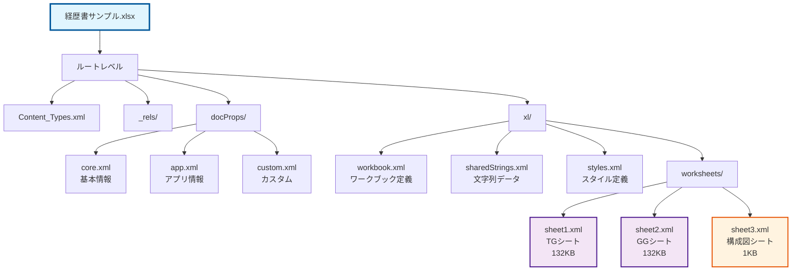
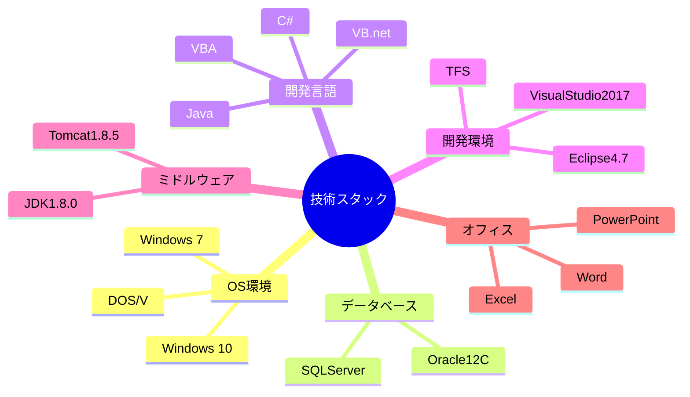

# Excelファイル構造分析レポート - 経歴書サンプル

## 📋 1. 概要

**ファイル名**: 経歴書サンプル.xlsx
**分析日時**: 2025年9月28日
**ファイル種別**: Microsoft Excel ワークブック
**シート数**: 3 (TG, GG, 構成図)

このレポートは、Excel経歴書ファイルをZIP展開して得られたXML構造を詳細に分析し、各コンポーネントの関係性と内容を明らかにします。

## 📂 2. ファイル構造

### 2.1 ルートディレクトリ構造
```
excel_extracted/
├── [Content_Types].xml      # MIMEタイプ定義
├── _rels/                   # リレーションシップ定義
│   └── .rels
├── docProps/                # ドキュメントプロパティ
│   ├── app.xml             # アプリケーション情報
│   ├── core.xml            # 基本メタデータ
│   └── custom.xml          # カスタムプロパティ
└── xl/                      # Excel本体データ
    ├── _rels/               # ワークブック関係
    ├── calcChain.xml        # 計算チェーン
    ├── drawings/            # 図形データ
    ├── externalLinks/       # 外部リンク
    ├── printerSettings/     # 印刷設定
    ├── sharedStrings.xml    # 共有文字列
    ├── styles.xml           # スタイル定義
    ├── theme/               # テーマ設定
    ├── workbook.xml         # ワークブック構成
    └── worksheets/          # ワークシート
        ├── sheet1.xml       # TGシート (132KB)
        ├── sheet2.xml       # GGシート (132KB)
        └── sheet3.xml       # 構成図シート (1KB)
```

### 2.2 Excelファイル構造図（Mermaid）


## 📄 3. ドキュメント情報

### 3.1 基本情報（docProps/core.xml より）
| 項目 | 値 |
|------|-----|
| **作成者** | 銀河ソフトウェア |
| **最終編集者** | 匡隆 中村 |
| **作成日時** | 2011-02-07T04:33:11Z |
| **最終更新日時** | 2025-09-27T12:13:51Z |
| **最終印刷日時** | 2025-08-25T23:39:50Z |

### 3.2 アプリケーション情報（docProps/app.xml より）
| 項目 | 値 |
|------|-----|
| **作成アプリケーション** | Microsoft Excel |
| **アプリケーションバージョン** | 16.0300 |
| **会社名** | 銀河ソフトウェア株式会社 |
| **総編集時間** | 157,255,200 (約43,682時間) |
| **ワークシート数** | 3 |

### 3.3 ワークシート構成
| シートID | シート名 | リレーションID | 説明 |
|----------|-----------|---------------|------|
| 3 | TG | rId1 | 技術者経歴書 |
| 4 | GG | rId2 | 技術者経歴書（別人物） |
| 5 | 構成図 | rId3 | システム構成図・フローチャート |

## 📊 4. 内容分析

### 4.1 共有文字列（sharedStrings.xml より抽出）
**総文字列数**: 438個
**ユニーク文字列数**: 113個

**主要カテゴリ**:
- **基本情報項目**: 作成日、氏名、性別、年齢、現住所、交通機関、最寄駅、最終学歴、免許/資格
- **業務スキル**: 要件定義、外部設計・基本設計、内部設計・詳細設計、プログラム製造・単体テスト、総合テスト、サポート
- **職域分類**: プロジェクトマネージャ、プロジェクトリーダ、サブリーダ、メンバ、その他
- **システム形態**: オンライン系、バッチ系、C/S、WEB系、制御系、運用系、ネットワーク系
- **技術要素**: Windows 7/10、Oracle12C、SQLServer、C#、VB.net、Java、VBA

### 4.2 技術スタック構成図（Mermaid）


## 🔍 5. ワークシート詳細分析

### 5.1 TGシート（sheet1.xml）
- **ファイルサイズ**: 132,444 bytes
- **特徴**: 詳細な経歴書データ、技術スキル、プロジェクト履歴
- **データ密度**: 高密度（多数のセルデータ）

### 5.2 GGシート（sheet2.xml）
- **ファイルサイズ**: 132,372 bytes
- **特徴**: TGシートとほぼ同サイズ、別人物の経歴書
- **データ密度**: 高密度（TGシートと同等）

### 5.3 構成図シート（sheet3.xml）
- **ファイルサイズ**: 980 bytes
- **特徴**: 軽量、図表・フローチャート系の内容
- **データ密度**: 低密度（主に図形・構成要素）

## 🔗 6. 外部参照

### 6.1 外部リンク
- **外部参照ID**: rId4
- **参照先**: [1]共通入力!#REF!
- **定義名**: 業種、月、職種、職歴年

### 6.2 印刷範囲設定
| シート | 印刷範囲 |
|--------|----------|
| TG | $A$1:$AT$115 |
| GG | $A$1:$AT$115 |

## 📈 7. まとめ

### 7.1 ファイル特性
- **用途**: 技術者向け詳細経歴書管理システム
- **データ規模**: 中規模（3シート、総容量約270KB）
- **技術レベル**: 高度（外部参照、計算式、マクロ機能使用）
- **保守性**: 良好（構造化された設計、共有文字列による効率化）

### 7.2 分析結果サマリー
1. **構造的特徴**: 標準的なExcel 2007+形式、OpenXML準拠
2. **データ品質**: 高品質（一貫した構造、適切なメタデータ）
3. **技術的複雑さ**: 中程度（外部参照、計算チェーン存在）
4. **拡張性**: 高い（テンプレート化された構造）

### 7.3 次フェーズへの推奨事項
1. 各シートの詳細内容分析実施
2. 技術スキル・経歴データの構造化抽出
3. Mermaid図表による可視化強化
4. 比較分析による人材評価指標導出