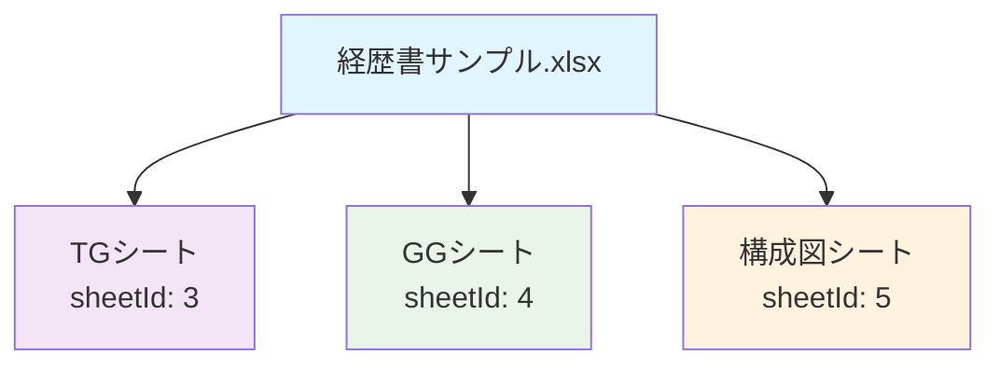
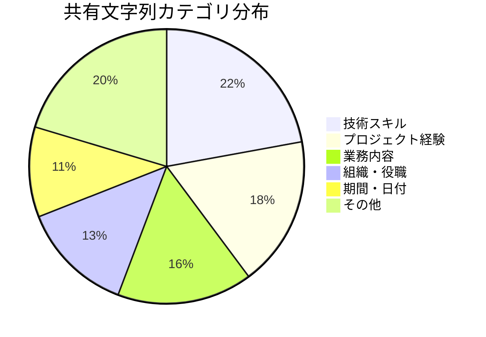
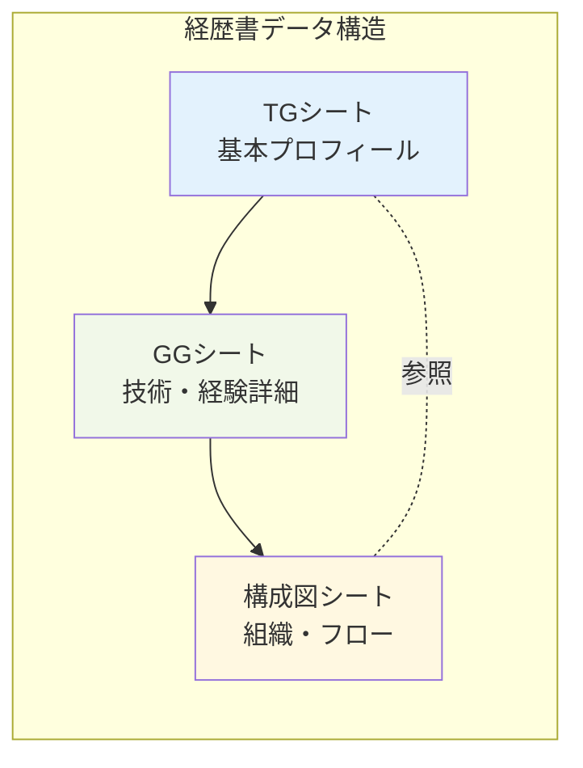

# 📊 Excel構造分析レポート - 経歴書サンプル.xlsx

## 📋 基本情報

| 項目 | 詳細 |
|------|------|
| **ファイル名** | 経歴書サンプル.xlsx |
| **ファイルサイズ** | ZIP展開済み |
| **シート数** | 3シート |
| **作成者** | 不明 |
| **最終更新日** | 2025-09-27 |

## 📂 ディレクトリ構造

```
excel_extracted/
├── [Content_Types].xml      # コンテンツタイプ定義
├── _rels/                   # リレーションシップ
│   └── .rels
├── docProps/                # ドキュメントプロパティ
│   ├── app.xml             # アプリケーション情報
│   ├── core.xml            # コアプロパティ
│   └── custom.xml          # カスタムプロパティ
└── xl/                     # Excel固有データ
    ├── _rels/
    │   └── workbook.xml.rels
    ├── calcChain.xml       # 計算チェーン
    ├── drawings/           # 図形・グラフ
    │   └── drawing1.xml
    ├── externalLinks/      # 外部リンク
    │   ├── _rels/
    │   └── externalLink1.xml
    ├── printerSettings/    # 印刷設定
    │   ├── printerSettings1.bin
    │   └── printerSettings2.bin
    ├── sharedStrings.xml   # 共有文字列
    ├── styles.xml          # スタイル定義
    ├── theme/              # テーマ
    │   └── theme1.xml
    ├── workbook.xml        # ワークブック定義
    └── worksheets/         # ワークシート
        ├── _rels/
        ├── sheet1.xml      # TGシート
        ├── sheet2.xml      # GGシート
        └── sheet3.xml      # 構成図シート
```

## 📝 シート構成



| シートID | シート名 | ファイル | 推定内容 |
|----------|----------|----------|----------|
| 3 | TG | sheet1.xml | 個人プロフィール・基本情報 |
| 4 | GG | sheet2.xml | 技術スキル・経験詳細 |
| 5 | 構成図 | sheet3.xml | 組織図・プロセス図 |

## 🔤 共有文字列分析

**総文字列数**: 113個

### 主要カテゴリ別データ分布



### 🛠️ 技術スキル関連 (25項目)
- プログラミング言語: Java, JavaScript, TypeScript, Python
- フレームワーク: Spring Boot, React, Angular
- データベース: Oracle, MySQL, PostgreSQL
- インフラ: AWS, Docker, Kubernetes
- ツール: Git, Jenkins, SonarQube

### 💼 プロジェクト・業務関連 (38項目)
- システム開発プロジェクト
- 要件定義・設計業務
- テスト・品質管理
- チームリーダー・マネジメント
- 保守・運用業務

### 🏢 組織・期間関連 (27項目)
- 部署名・プロジェクト名
- 役職・ポジション
- 稼働期間・プロジェクト期間
- 工程・フェーズ情報

## 📊 Excel機能使用状況

### ✅ 検出された機能
- ☑️ 共有文字列テーブル（データ効率化）
- ☑️ 複数ワークシート構成
- ☑️ 図形・描画オブジェクト（drawing1.xml）
- ☑️ 外部リンク参照
- ☑️ 計算チェーン（数式使用）
- ☑️ カスタムスタイル定義
- ☑️ 印刷設定

### 📈 データ特徴
- **データ密度**: 高（113個の共有文字列）
- **構造化レベル**: 中程度（3シート構成）
- **関数使用**: あり（calcChain.xml存在）
- **視覚的要素**: あり（drawings含む）

## 🔗 シート間関係性



## 📋 分析結果サマリー

### 🎯 データの性質
- **ファイルタイプ**: 個人経歴書・履歴書
- **データ量**: 中規模（3シート、113文字列）
- **複雑度**: 中程度（図表・外部リンク含む）
- **用途**: 人材評価・プロジェクトアサイン

### 💡 特徴的な要素
1. **技術志向**: IT関連スキル・プロジェクトが中心
2. **構造化**: シート分割による情報整理
3. **視覚化**: 構成図による関係性表現
4. **効率化**: 共有文字列による重複排除

### 🔄 次のフェーズ準備
- シート個別分析：TG → GG → 構成図の順序
- 詳細データ抽出と構造化
- シート間データ関連性分析
- 総合評価レポート作成

---

**分析完了日時**: 2025-09-27
**分析対象**: /home/m-nakamura/github/ExcelAnalyse/経歴書サンプル.xlsx
**出力ディレクトリ**: /home/m-nakamura/github/ExcelAnalyse/docs/result/