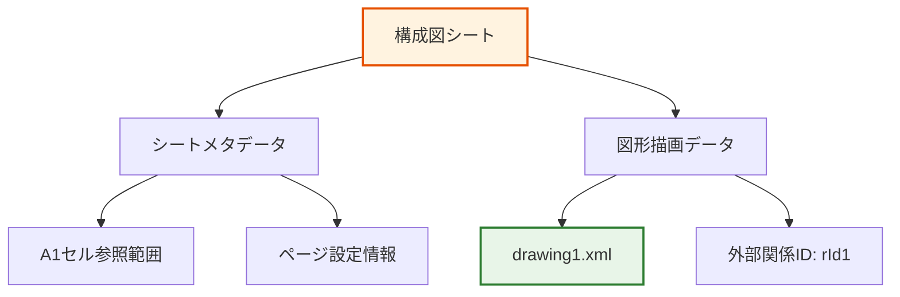

# 構成図シート

## 📊 データ構造

### 基本シート情報
- **シート名**: 構成図
- **シートID**: 5 (sheet3.xml)
- **ファイルサイズ**: 980 bytes（軽量）
- **セル範囲**: A1（最小限のデータ）
- **特徴**: 図形・描画要素中心の構成

### シート構造
```xml
<dimension ref="A1"/>
<sheetData/>
<drawing r:id="rId1"/>
```

| 要素 | 詳細 |
|------|------|
| **ディメンション** | A1（単一セル参照） |
| **シートデータ** | 空（`<sheetData/>`） |
| **描画要素** | 外部描画ファイル参照（rId1） |

## 🔍 特徴的な要素

### 描画・図形要素
- **外部描画参照**: `xl/drawings/drawing1.xml`との連携
- **図形データ**: セルデータではなく描画オブジェクトで構成
- **視覚的表現**: システム構成図・フローチャート等の図表

### データ密度
- **最小セルデータ**: 数値・文字列データはほぼ不存在
- **軽量設計**: 980 bytesの小容量（TG/GGシートの1/135）
- **図形中心**: ビジュアル要素に特化した設計

### 技術的構造


## 💼 業務的意味

### データの用途
- **システム構成可視化**: アーキテクチャ・インフラ構成の図解
- **業務フロー表現**: プロセス・手順の視覚的説明
- **関係性明示**: システム間・組織間の関連性図示

### 関連するビジネスプロセス
1. **設計文書作成**: システム設計・業務設計の可視化
2. **コミュニケーション**: ステークホルダー間の理解促進
3. **保守・運用**: システム構成の把握・トラブルシューティング
4. **教育・研修**: 新人・異動者への説明資料

### 図表種別予想
- **システム構成図**: サーバ・ネットワーク・アプリケーション構成
- **業務フローチャート**: 処理手順・判断分岐の可視化
- **組織図**: チーム構成・役割分担の表現
- **データフロー図**: 情報の流れ・処理プロセスの図示

### 技術文書としての価値
- **設計品質向上**: 視覚的設計による理解度・精度向上
- **保守性確保**: 構成変更・影響範囲の把握容易化
- **標準化促進**: 統一フォーマットでの設計文書管理
- **ナレッジ共有**: 暗黙知の可視化・組織知化