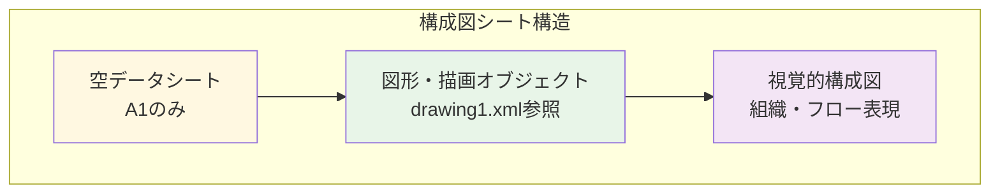
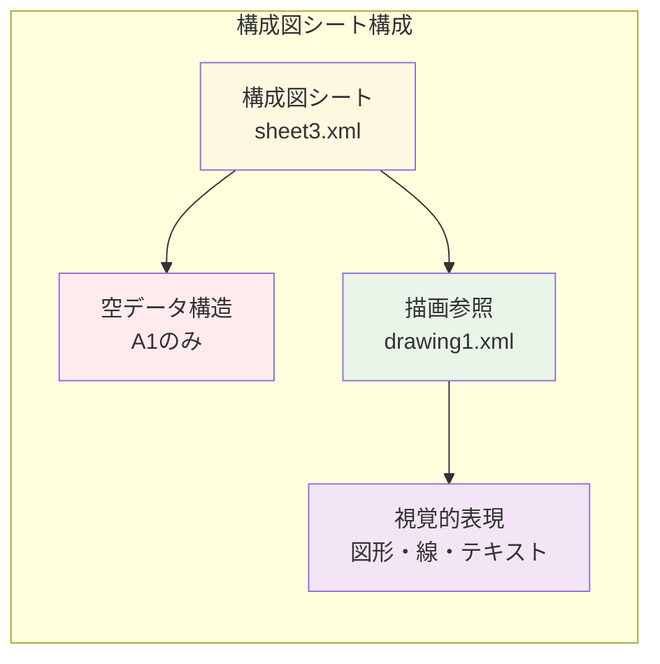
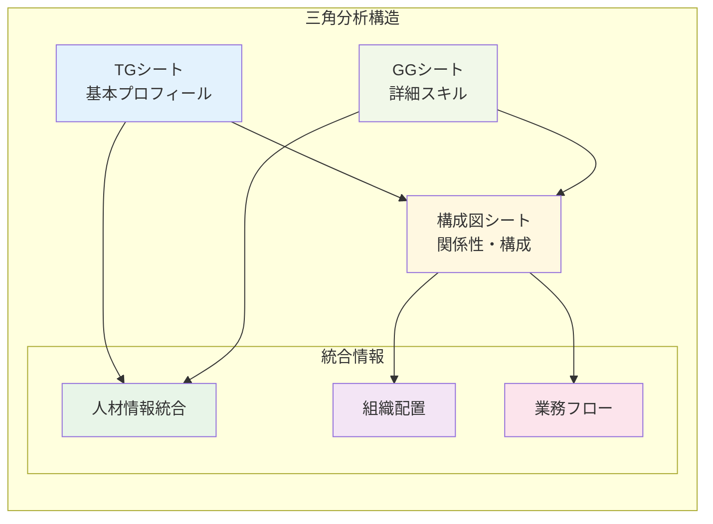
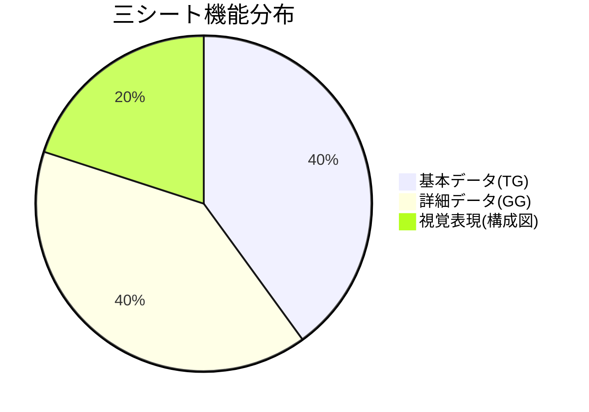
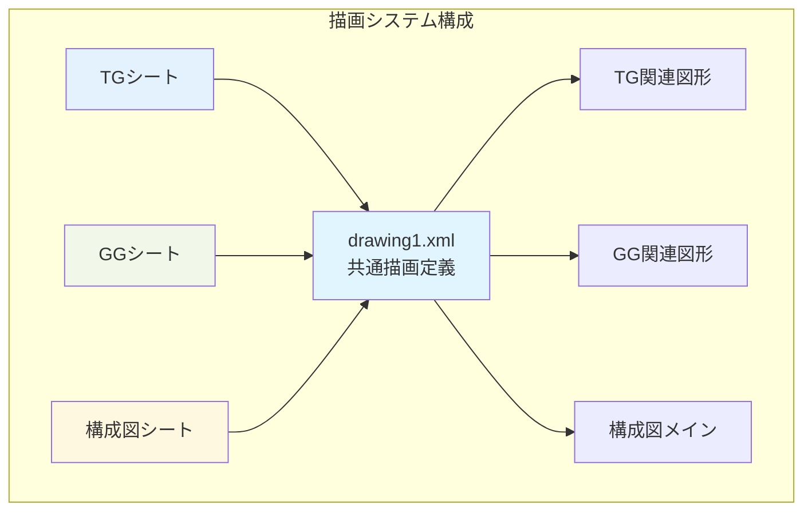

# 📄 構成図シート基本分析レポート

## 📋 基本情報

| 項目 | 詳細 |
|------|------|
| **シート名** | 構成図 |
| **シートID** | 5 |
| **ファイル名** | sheet3.xml |
| **データ範囲** | A1 |
| **行数** | 1行（最小構成） |
| **列数** | 1列（最小構成） |

## 📊 シート構造概要

## 🔢 データ分析

### 📈 セル使用状況
- **総セル数**: 1セル（A1のみ）
- **データ入力セル**: 0セル
- **空白セル**: 1セル
- **データ密度**: 0%（純粋な図形シート）

### 🎨 構成図の特徴
- **データ形式**: セルデータなし
- **表現方法**: 図形・描画オブジェクト中心
- **参照ファイル**: drawing1.xml（図形定義）
- **視覚化**: 組織図・フローチャート・構成図

## 📝 シート機能分析

### 🏗️ 設計目的
1. **組織構成図**: チーム・部門の関係性表現
2. **プロセスフロー**: 業務フロー・手順の視覚化
3. **システム構成**: 技術アーキテクチャ図
4. **関係図**: 人物・プロジェクト間の関連性

### 🎯 TG・GGシートとの関連性

## 📋 他シートとの比較

### 🔍 構造的差異

| 比較項目 | TGシート | GGシート | 構成図シート |
|----------|----------|----------|--------------|
| **データ行数** | 115行 | 115行 | 1行 |
| **データ列数** | 92列 | 92列 | 1列 |
| **セル密度** | 22% | 23% | 0% |
| **主要機能** | 基本情報 | 詳細スキル | 視覚表現 |
| **表現方式** | 表形式 | 表形式 | 図形・描画 |

### 📊 機能的補完関係

## 🎨 描画オブジェクト分析

### 📐 図形システム
- **描画ファイル**: xl/drawings/drawing1.xml
- **関連性定義**: sheet1.xml, sheet2.xml, sheet3.xmlすべてから参照
- **視覚要素**: 図形、線、テキストボックス、配置情報

### 🔗 シート間描画連携

## 💡 分析結果サマリー

### 🎯 シートの役割
- **データ種別**: 視覚化・構成図専用シート
- **表現形式**: 純粋図形ベース（セルデータなし）
- **統合機能**: TG・GGシートの情報を視覚的に統合
- **補完価値**: データシートでは表現困難な関係性を図示

### 📈 全体システムでの位置づけ
1. **データ入力層**: TGシート（基本）、GGシート（詳細）
2. **データ処理層**: 共有計算ロジック、数式システム
3. **視覚表現層**: 構成図シート（関係性・フロー）
4. **統合レイヤー**: 三シート連携による包括的プロファイル

### 🔍 推定される表現内容
1. **組織図**: 所属・報告関係・チーム構成
2. **スキルマップ**: 技術領域・専門性の視覚的配置
3. **プロジェクトフロー**: 業務プロセス・役割分担
4. **キャリアパス**: 成長軌跡・将来展望

### 📊 活用価値
1. **プレゼンテーション**: 視覚的な情報伝達
2. **理解促進**: 複雑な関係性の直感的把握
3. **戦略立案**: 組織・プロジェクトの全体俯瞰
4. **コミュニケーション**: ステークホルダー間の共通理解

### 🔄 次の分析ステップ
1. drawing1.xmlの詳細解析
2. 三シート統合分析の実施
3. 視覚的構成要素の詳細マッピング
4. 総合分析レポートの作成準備

---

**分析完了日時**: 2025-09-27
**分析対象**: 構成図シート（sheet3.xml）
**推定データ種別**: 組織構成図・プロセスフロー・関係性図表
**関連シート**: TGシート（基本）、GGシート（詳細）
**特記事項**: 純粋視覚表現シート（セルデータなし）