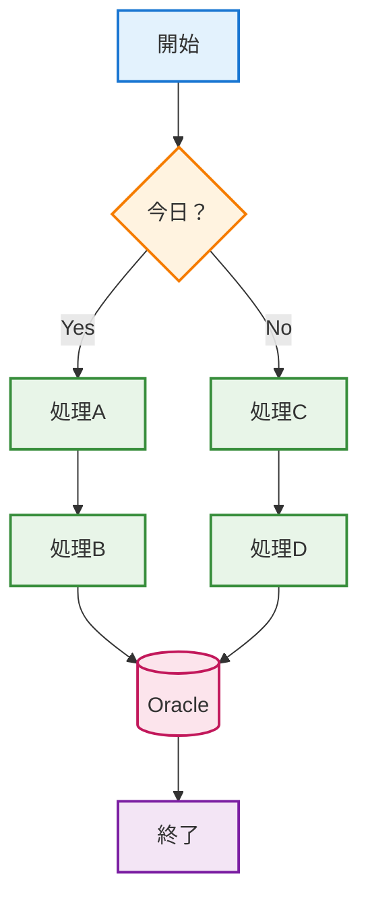
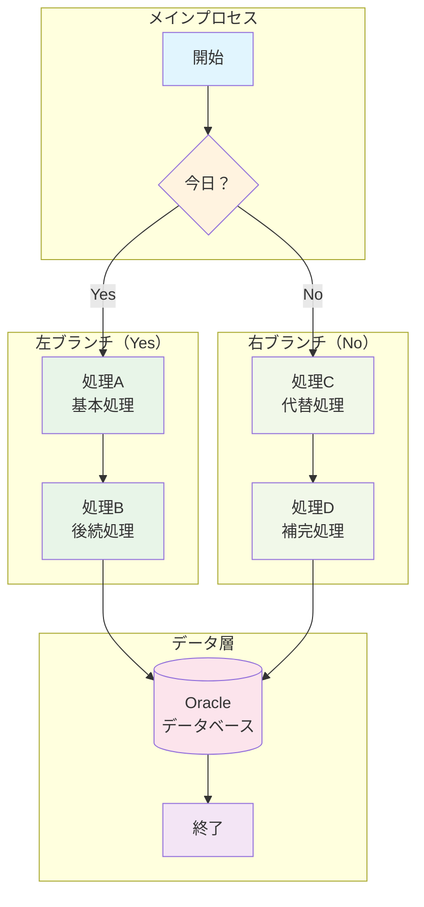
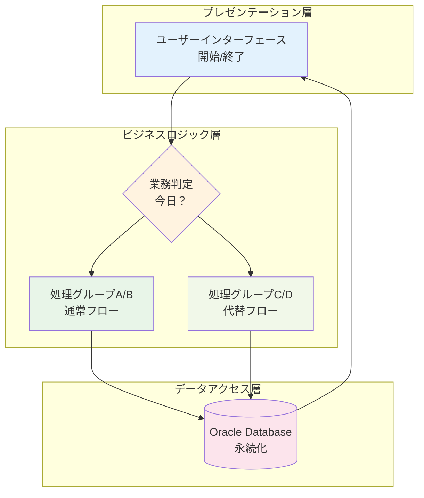
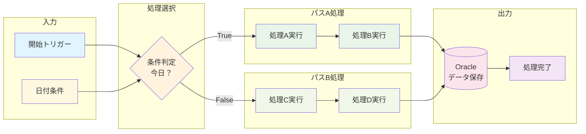
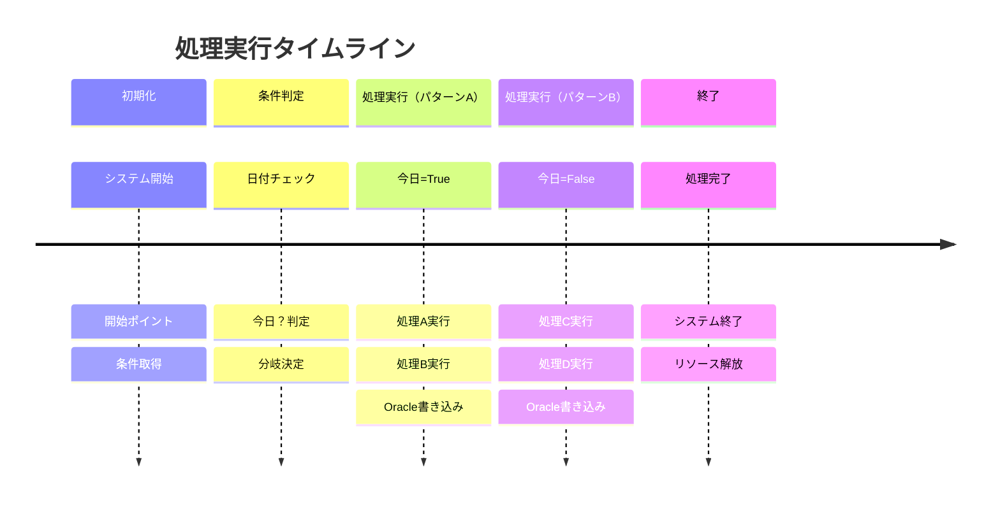
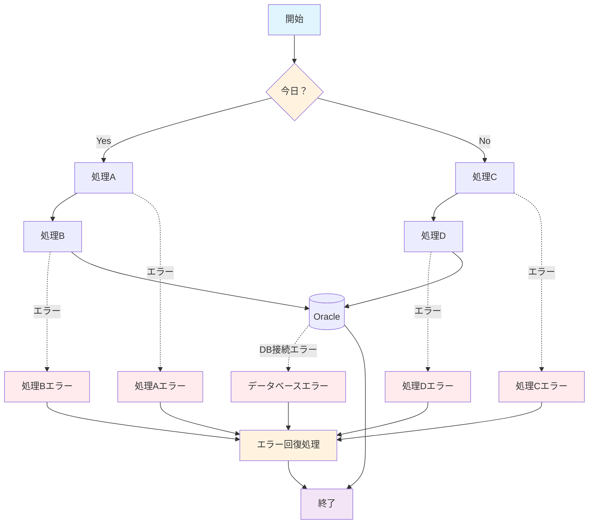
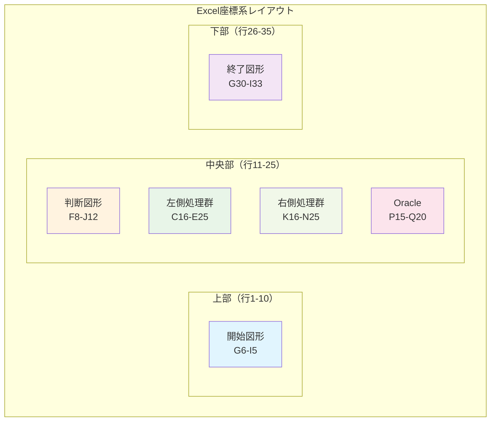

# 📄 構成図 - 詳細フローチャート分析

## 🔄 基本フローチャート

### 🎯 XMLデータから解析されたフロー構造

### 📐 図形配置座標分析

| 図形ID | 図形種別 | テキスト | 座標位置 | サイズ |
|--------|----------|----------|----------|--------|
| 2 | 四角形(丸角) | 開始 | G6-I5 | 2095×449 |
| 3 | 四角形(丸角) | 終了 | G30-I33 | 2095×449 |
| 4 | 四角形(丸角) | 処理A | C16-E19 | 2095×449 |
| 6 | 四角形(丸角) | 処理B | C22-E25 | 2095×449 |
| 7 | 四角形(丸角) | 処理D | K22-N25 | 2095×449 |
| 8 | 四角形(丸角) | 処理C | K16-N19 | 2095×449 |
| 9 | 判断図形 | 今日？ | F8-J12 | 2659×548 |
| 29 | 磁気ディスク | Oracle | P15-Q20 | 1386×922 |

## 🎯 詳細プロセス分析

### 🔀 条件分岐フロー

### 🏗️ システムアーキテクチャ解析

## 📈 データフロー図

### 🔄 情報の流れ解析

## ⏱️ タイムライン処理フロー

### 📅 実行時系列パターン

## 🔧 エラーハンドリングフロー

### ⚠️ 例外処理パターン

## 📋 配置情報詳細

### 🎨 Excel座標系での図形配置

### 📏 図形サイズ・位置詳細

| 図形 | Excel列 | Excel行 | 実座標X | 実座標Y | 幅 | 高さ |
|------|---------|---------|---------|---------|-----|------|
| 開始 | G6-I5 | 2-5 | 3893820 | 464820 | 2095500 | 449580 |
| 判断 | F8-J12 | 8-12 | 3611880 | 1470660 | 2659380 | 548640 |
| 処理A | C16-E19 | 16-19 | 1402080 | 2796540 | 2095500 | 449580 |
| 処理B | C22-E25 | 22-25 | 1402080 | 3832860 | 2095500 | 449580 |
| 処理C | K16-N19 | 16-19 | 6549390 | 2796540 | 2095500 | 449580 |
| 処理D | K22-N25 | 22-25 | 6549390 | 3832860 | 2095500 | 449580 |
| Oracle | P15-Q20 | 15-20 | 9433560 | 2560320 | 1386840 | 922020 |
| 終了 | G30-I33 | 30-33 | 3893820 | 5181600 | 2095500 | 449580 |

### 🔗 コネクタ（矢印）接続情報

| 接続ID | 種類 | 開始図形 | 終了図形 | 接続点 |
|--------|------|----------|----------|--------|
| 11 | 直線矢印 | 開始(id:2) | 判断(id:9) | 下→上 |
| 19 | カギ線 | 判断(id:9) | 処理A(id:4) | 左→上 |
| 20 | カギ線 | 判断(id:9) | 処理C(id:8) | 右→上 |
| 12 | 直線矢印 | 処理A(id:4) | 処理B(id:6) | 下→上 |
| 15 | 直線矢印 | 処理C(id:8) | 処理D(id:7) | 下→上 |
| 30 | 直線矢印 | 処理C(id:8) | Oracle(id:29) | 右→左 |
| 23 | カギ線 | 処理B(id:6) | 終了(id:3) | 下→上 |
| 26 | カギ線 | 処理D(id:7) | 終了(id:3) | 下→上 |

## 💡 システム設計パターン分析

### 🎯 アーキテクチャパターン
1. **分岐処理パターン**: 条件に基づく処理フローの分岐
2. **パイプライン処理**: 順次処理による段階的データ処理
3. **共通リソースアクセス**: 複数パスからの単一DB接続
4. **収束パターン**: 異なる処理パスの最終的な統合

### 🚀 実装における技術的示唆
- **Java/Spring**: 条件分岐ロジックの実装
- **Oracle DB**: データ永続化・トランザクション管理
- **プロセスフロー**: ワークフロー管理・状態管理
- **エラーハンドリング**: 例外処理・回復メカニズム

---

**分析完了日時**: 2025-09-27
**分析対象**: 構成図シート（drawing1.xml詳細解析）
**図形数**: 8個（プロセス要素） + 8本（接続線）
**複雑度**: 中程度（分岐・収束構造）
**用途**: 業務プロセスフロー・システム設計図