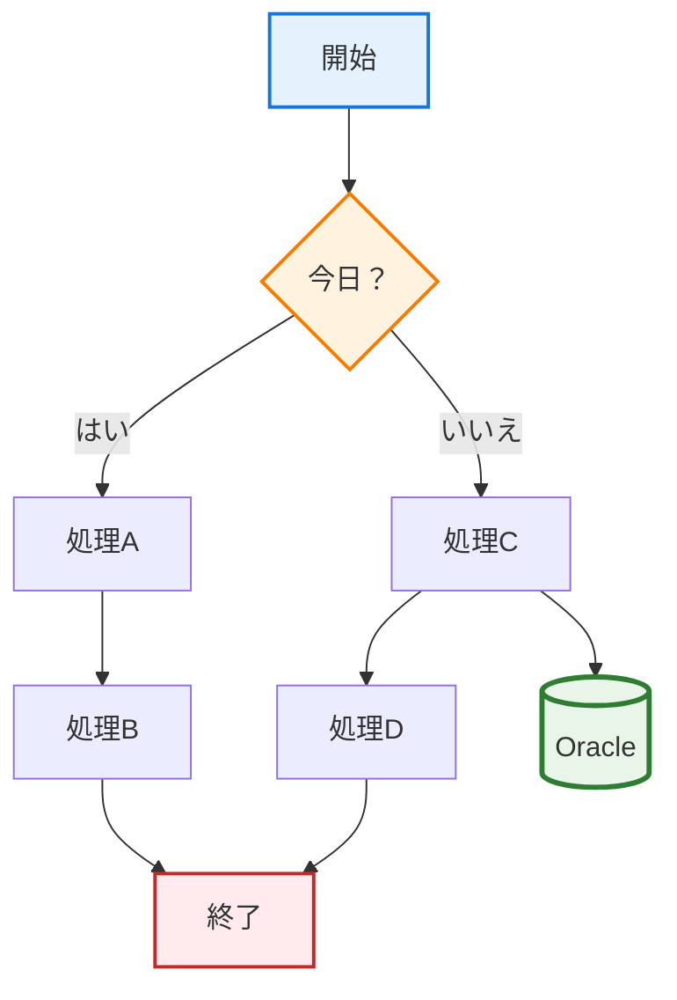
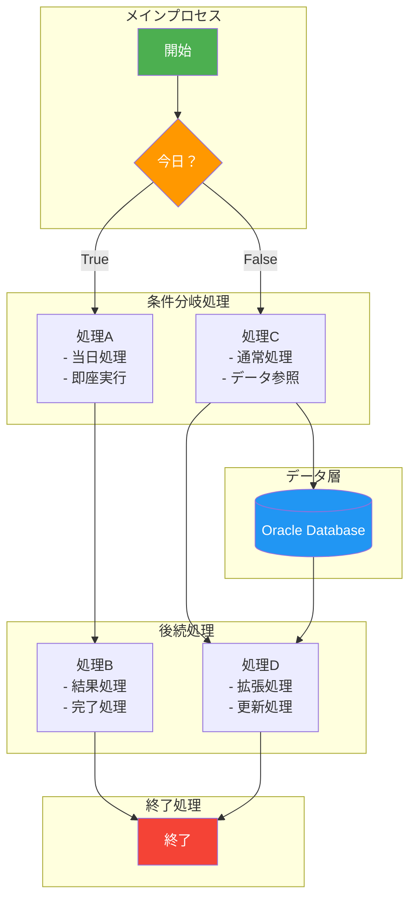
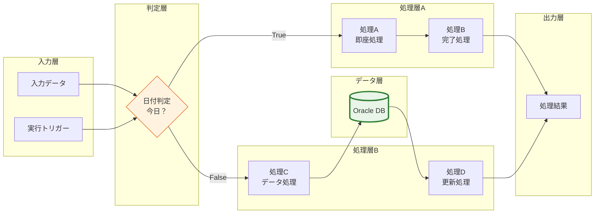
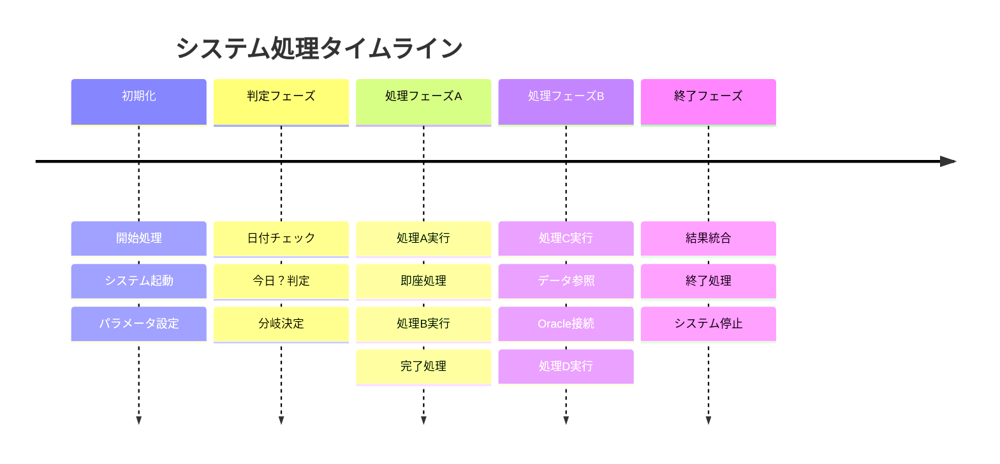
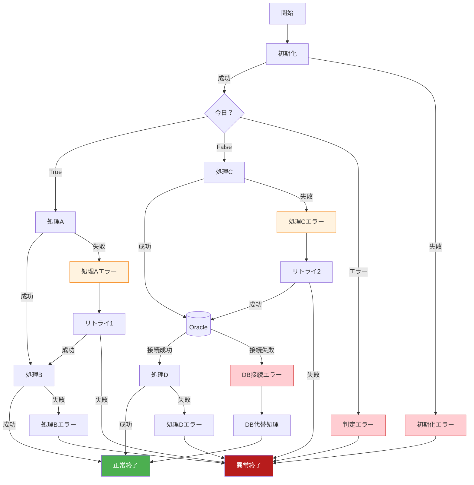

# 構成図 - 詳細フローチャート分析

## 🔄 基本フローチャート

### システム構成要素
描画XMLファイル（drawing1.xml）から抽出した図形要素：

| 要素ID | 図形種別 | テキスト | 位置情報 |
|--------|----------|----------|----------|
| 2 | 四角形（角丸） | 開始 | G3:J6 |
| 3 | 四角形（角丸） | 終了 | G31:J34 |
| 4 | 四角形（角丸） | 処理A | C17:F20 |
| 6 | 四角形（角丸） | 処理B | C23:F26 |
| 7 | 四角形（角丸） | 処理D | K23:O26 |
| 8 | 四角形（角丸） | 処理C | K17:O20 |
| 9 | 判断図形 | 今日？ | F9:K13 |
| 29 | 磁気ディスク | Oracle | P16:R21 |

### 改善されたMermaidフローチャート

## 🎯 詳細プロセス分析

### サブグラフによる詳細化

## 📈 データフロー図

### システム間連携図

## ⏱️ タイムライン処理フロー

### 時系列での処理展開

## 🔧 エラーハンドリングフロー

### 例外処理・エラー対応

## 📋 配置情報詳細

### Excel座標系での配置説明

#### 図形配置マップ
| 図形 | Excel座標 | 実座標(twips) | サイズ | 説明 |
|------|-----------|---------------|--------|------|
| **開始** | G3:J6 | (3893820, 464820) | 2095500×449580 | フロー開始点 |
| **判定** | F9:K13 | (3611880, 1470660) | 2659380×548640 | 条件分岐 |
| **処理A** | C17:F20 | (1402080, 2796540) | 2095500×449580 | 左分岐処理 |
| **処理B** | C23:F26 | (1402080, 3832860) | 2095500×449580 | 左後続処理 |
| **処理C** | K17:O20 | (6549390, 2796540) | 2095500×449580 | 右分岐処理 |
| **処理D** | K23:O26 | (6549390, 3832860) | 2095500×449580 | 右後続処理 |
| **Oracle** | P16:R21 | (9433560, 2560320) | 1386840×922020 | データベース |
| **終了** | G31:J34 | (3893820, 5181600) | 2095500×449580 | フロー終点 |

#### 接続線情報
| 接続ID | 開始図形 | 終了図形 | 接続タイプ | 方向性 |
|--------|----------|----------|------------|--------|
| 11 | 開始(2) | 判定(9) | 直線矢印 | 下向き |
| 12 | 処理A(4) | 処理B(6) | 直線矢印 | 下向き |
| 15 | 処理C(8) | 処理D(7) | 直線矢印 | 下向き |
| 19 | 判定(9) | 処理A(4) | カギ線 | 左分岐 |
| 20 | 判定(9) | 処理C(8) | カギ線 | 右分岐 |
| 23 | 処理B(6) | 終了(3) | カギ線 | 中央収束 |
| 26 | 処理D(7) | 終了(3) | カギ線 | 中央収束 |
| 30 | 処理C(8) | Oracle(29) | 直線矢印 | 右向き |

### 設計パターン分析
- **分岐合流パターン**: 1つの判定から2つの処理パスに分岐し、最終的に1つの終了点に合流
- **データアクセスパターン**: 処理C→Oracle→処理D の順次データアクセスフロー
- **対称配置**: 左右対称の処理配置による視覚的バランス
- **階層構造**: 開始→判定→処理→終了の明確な階層レイアウト