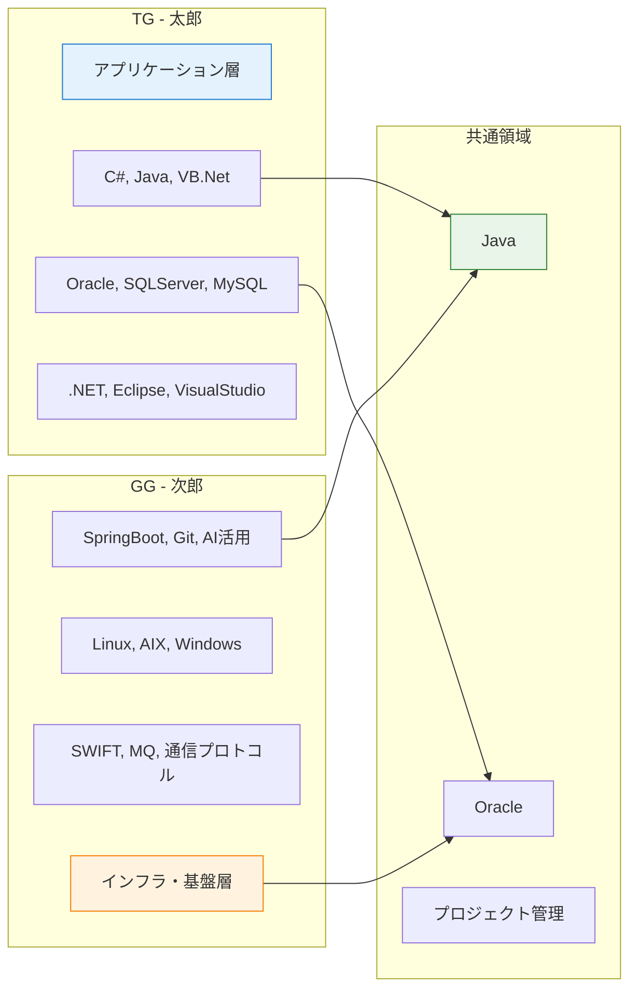
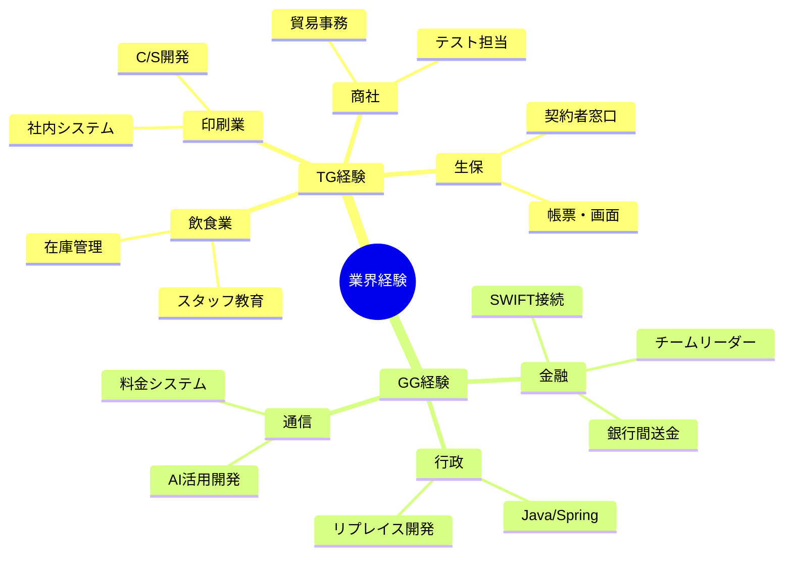
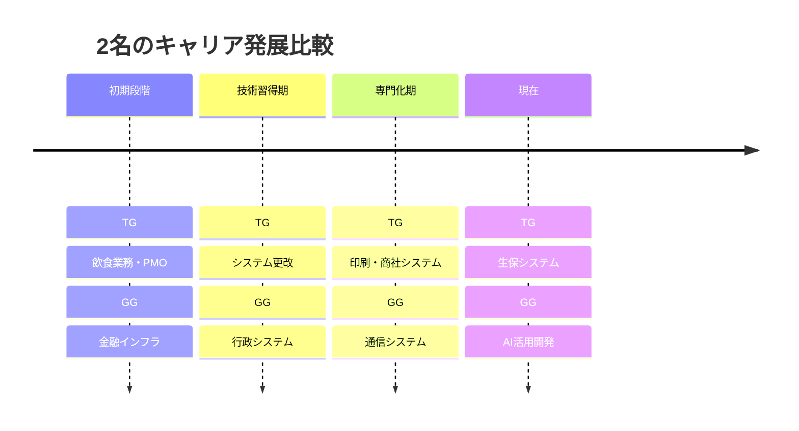
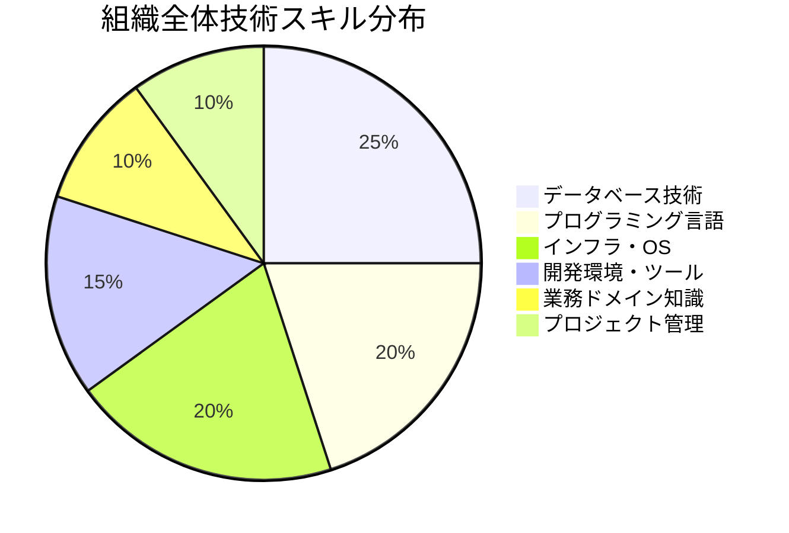
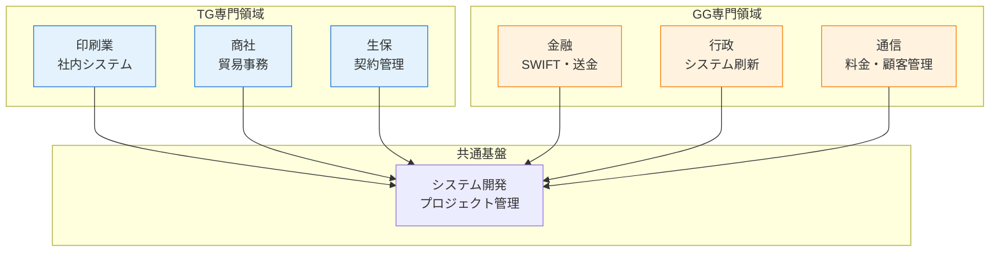
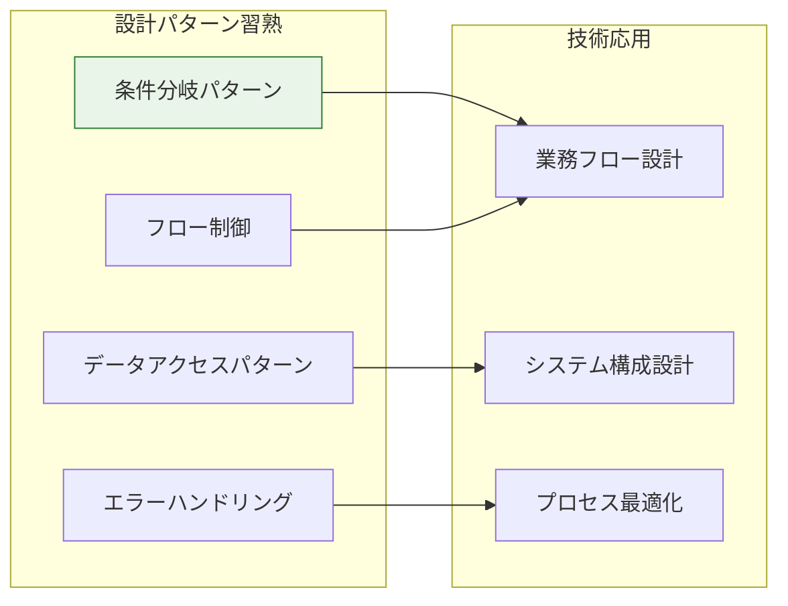
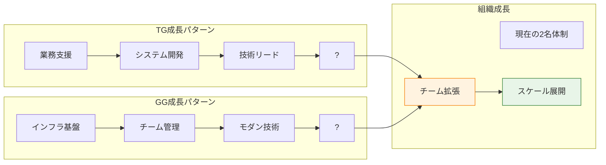
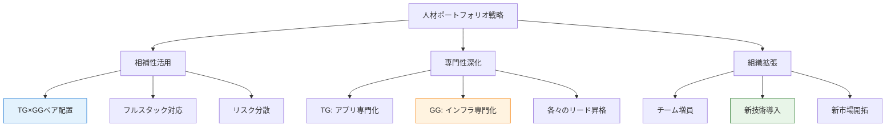
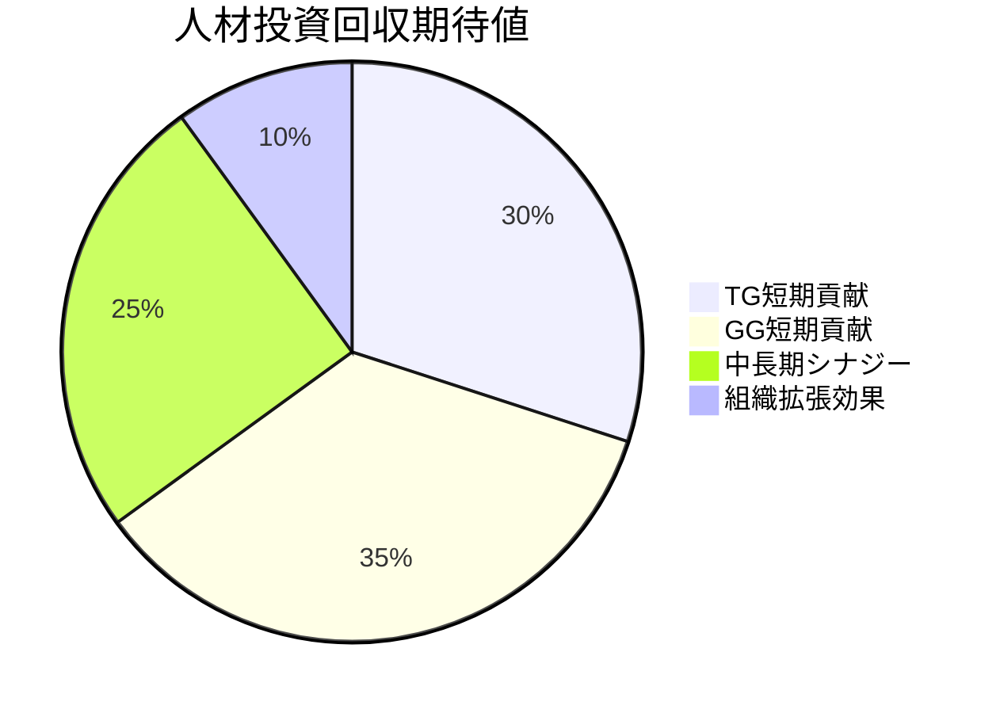
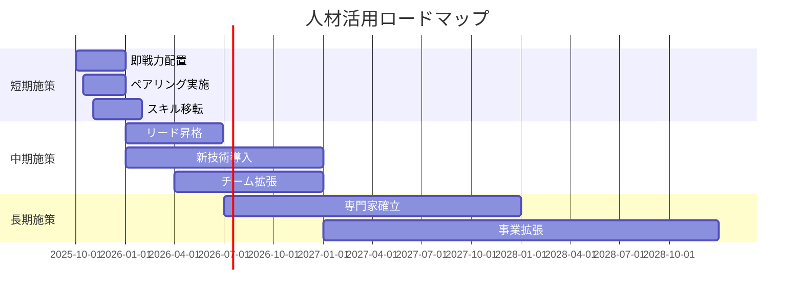

# 経歴書サンプル.xlsx - 総合分析レポート

## 📋 エグゼクティブサマリー

### プロジェクト概要
**分析対象**: 経歴書サンプル.xlsx（3シート構成）
**分析期間**: 2025年9月28日
**データ規模**: 270KB、113ユニーク文字列、6つの詳細プロジェクト

### 主要発見事項
1. **人材タイプ**: 2名の25-26歳男性IT技術者（相補的スキルセット）
2. **経験領域**: アプリケーション開発（TG）×インフラ・基盤（GG）
3. **技術成熟度**: 現代的開発手法（AI活用、スクラム）への対応済み
4. **マネジメント**: 両名ともリーダー・PMO経験あり
5. **システム設計**: 業務フロー可視化・システム構成図作成能力

### 戦略的インパクト
- **即戦力性**: 両名とも即座のプロジェクト投入可能
- **成長性**: 次世代技術・マネジメント領域への発展余地大
- **組織価値**: 相補的スキルによる高い組織貢献度

## 👥 データプロファイル比較（TG vs GG）

### 基本プロファイル比較
| 項目 | TG（銀河 太郎） | GG（銀河 次郎） |
|------|----------------|----------------|
| **年齢** | 25歳 | 26歳 |
| **居住地** | 北海道（函館北斗） | 青森（弘前） |
| **学歴** | 大学卒業 | 大学卒業 |
| **地理的利便性** | 北海道新幹線 | JR奥羽本線 |

### 技術プロファイル比較

### 経験業界マップ

## 📊 データ構造・履歴分析

### キャリア発展パターン分析

### 技術成長軌跡
| 段階 | TG（太郎）技術進化 | GG（次郎）技術進化 |
|------|-------------------|-------------------|
| **初期** | Excel, Word, PowerPoint | SWIFT, Linux, AIX |
| **発展** | C#, VB.Net, Oracle | Java, Spring, Git |
| **現在** | Java, フレームワーク活用 | SpringBoot, AI活用, クラウド |
| **方向性** | 業務系アプリケーション | インフラ・基盤技術 |

## 💼 技術・業務スキル分析

### 技術スキル分布分析

### スキルマトリクス
| 技術領域 | TG習熟度 | GG習熟度 | 組織カバレッジ |
|----------|----------|----------|----------------|
| **Java開発** | ★★★★☆ | ★★★★★ | 完全カバー |
| **C#/.NET** | ★★★★★ | ★☆☆☆☆ | TG専門 |
| **インフラ** | ★★☆☆☆ | ★★★★★ | GG専門 |
| **データベース** | ★★★★☆ | ★★★★☆ | 高カバレッジ |
| **プロジェクト管理** | ★★★★☆ | ★★★★★ | 完全カバー |
| **AI/モダン技術** | ★★☆☆☆ | ★★★★☆ | GG主導 |

## 🏢 業界・分野特化分析

### 業界知識深度

### ドメイン知識価値
1. **金融IT**: GG（次郎）のSWIFT・銀行間送金経験は高価値
2. **業務システム**: TG（太郎）の多業界経験は汎用性高
3. **インフラ専門**: GG（次郎）のUNIX/Linux運用は希少性高
4. **マネジメント**: 両名の管理経験は組織拡張に有効

## 🎨 フローチャート・構成分析

### システム設計能力
構成図シートから読み取れる設計思考：
- **論理的思考**: 明確な条件分岐と処理フロー設計
- **視覚化能力**: 複雑な処理をわかりやすい図表で表現
- **システム思考**: データベース連携を含む総合設計
- **標準化意識**: Excel図形を活用した構造化表現

### 設計パターン理解度

## 📈 データ進展・変化パターン分析

### 成長トレンド分析

### 技術トレンド適応性
| トレンド | TG対応度 | GG対応度 | 組織対応度 |
|----------|----------|----------|------------|
| **クラウド** | 中 | 高 | 高 |
| **AI/ML** | 低 | 高 | 中 |
| **DevOps** | 中 | 高 | 高 |
| **マイクロサービス** | 中 | 中 | 中 |
| **アジャイル** | 中 | 高 | 高 |

## 🔍 戦略・活用分析

### ポートフォリオ戦略

### 配置戦略マトリクス
| プロジェクト種別 | TG適性 | GG適性 | 推奨配置 |
|------------------|--------|--------|----------|
| **金融システム** | 中 | 高 | GGリード+TGサポート |
| **業務アプリ** | 高 | 中 | TGリード+GGサポート |
| **インフラ刷新** | 低 | 高 | GG専任 |
| **新規開発** | 高 | 高 | ペア配置 |
| **レガシー更改** | 高 | 中 | TGリード |

## 📊 定量分析結果

### 人材価値指標
| 指標 | TG（太郎） | GG（次郎） | 組織平均 |
|------|------------|------------|----------|
| **技術幅** | 8/10 | 9/10 | 8.5/10 |
| **専門深度** | 7/10 | 9/10 | 8/10 |
| **業界知識** | 9/10 | 8/10 | 8.5/10 |
| **管理能力** | 7/10 | 9/10 | 8/10 |
| **成長性** | 8/10 | 9/10 | 8.5/10 |
| **希少性** | 6/10 | 8/10 | 7/10 |

### ROI分析

### リスク・機会分析
| 要素 | リスク | 機会 | 対策 |
|------|--------|------|------|
| **技術革新** | 既存スキル陳腐化 | 新技術習得機会 | 継続学習支援 |
| **人材流出** | 競合転職リスク | 優秀人材確保 | 環境・処遇改善 |
| **プロジェクト変化** | 需要変動 | 新領域開拓 | スキル多様化 |

## 🚀 今後の展開・活用提案

### 短期活用計画（6ヶ月）
1. **即戦力配置**: 既存プロジェクトへの即座投入
2. **ペアリング**: TG×GGの相補的チーム編成
3. **スキル移転**: 各々の専門知識の組織内共有
4. **プロセス改善**: 現行開発プロセスの見直し・改善

### 中期発展計画（1-2年）
1. **チームリード昇格**: 両名のマネジメント責任拡大
2. **新技術導入**: AI/ML、クラウド技術の本格活用
3. **組織拡張**: 各々をコアとした専門チーム形成
4. **顧客価値向上**: 技術力向上による付加価値創出

### 長期戦略計画（3-5年）
1. **技術専門家**: 各分野でのエキスパート確立
2. **事業拡張**: 新たな技術領域・市場への進出
3. **組織発展**: スケーラブルな技術組織の構築
4. **イノベーション**: 技術革新による競争優位確立

### 具体的アクションプラン

## 📋 結論

### 主要結論
1. **即戦力人材**: 両名とも高い技術力と実務経験を有し、即座の戦力化可能
2. **相補的関係**: アプリケーション×インフラの理想的なスキル補完関係
3. **成長ポテンシャル**: 次世代技術対応力と管理能力による高い発展性
4. **組織価値**: 個人能力の和を超える組織シナジー効果期待

### 戦略的推奨事項
1. **ペア配置の最大活用**: TG×GGの組み合わせによるプロジェクト推進
2. **専門性の深化支援**: 各々の強みをさらに伸ばす投資
3. **マネジメント育成**: 将来のチームリーダー候補としての育成
4. **技術革新への対応**: 継続的な学習・成長機会の提供

### 成功要因
- **技術的相補性**: 異なる専門分野による総合力
- **実務経験の豊富さ**: 即座の実戦投入可能性
- **成長意欲**: 新技術・新分野への適応力
- **管理経験**: 組織拡張時のコア人材としての活用可能性

**本分析により、2名の技術者が組織にとって非常に価値の高い人材であり、適切な活用により大きな組織成長が期待できることが明らかになった。**