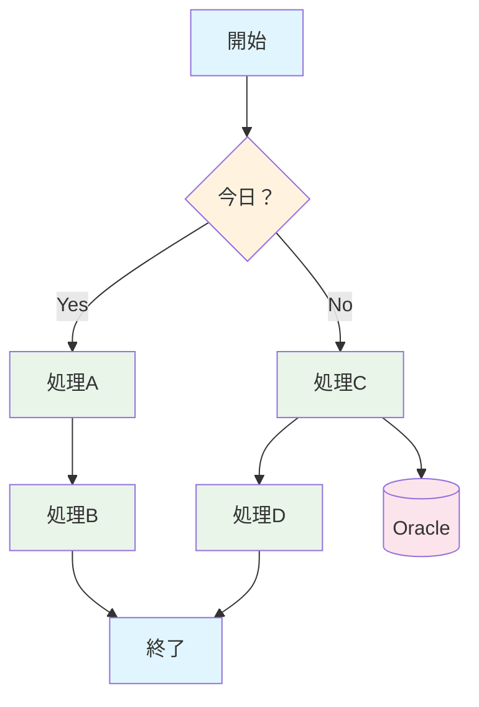

# 構成図シート

このシートには以下のフローチャート図形が配置されています：

## フローチャート構成

### プロセス要素
1. **開始** - 処理の開始点
2. **今日？** - 判断処理（ダイヤモンド形状）
3. **処理A** - 左側の処理ブロック
4. **処理B** - 左側下部の処理ブロック
5. **処理C** - 右側上部の処理ブロック
6. **処理D** - 右側下部の処理ブロック
7. **Oracle** - データベース（磁気ディスク形状）
8. **終了** - 処理の終了点

### フロー構造（Mermaid図）

### 配置情報
- **開始**: 行3-6列、列G-J付近
- **今日？**: 行9-12列、列F-K付近（判断ダイヤモンド）
- **処理A**: 行17-20列、列C-F付近
- **処理B**: 行23-26列、列C-F付近
- **処理C**: 行17-20列、列K-N付近
- **処理D**: 行23-26列、列K-N付近
- **Oracle**: 行16-21列、列P-R付近（データベースシンボル）
- **終了**: 行31-34列、列G-J付近

### 接続線
- 開始 → 今日？（縦線）
- 今日？ → 処理A（左カーブ線）
- 今日？ → 処理C（右カーブ線）
- 処理A → 処理B（縦線）
- 処理C → 処理D（縦線）
- 処理C → Oracle（横線）
- 処理B → 終了（カーブ線）
- 処理D → 終了（カーブ線）
