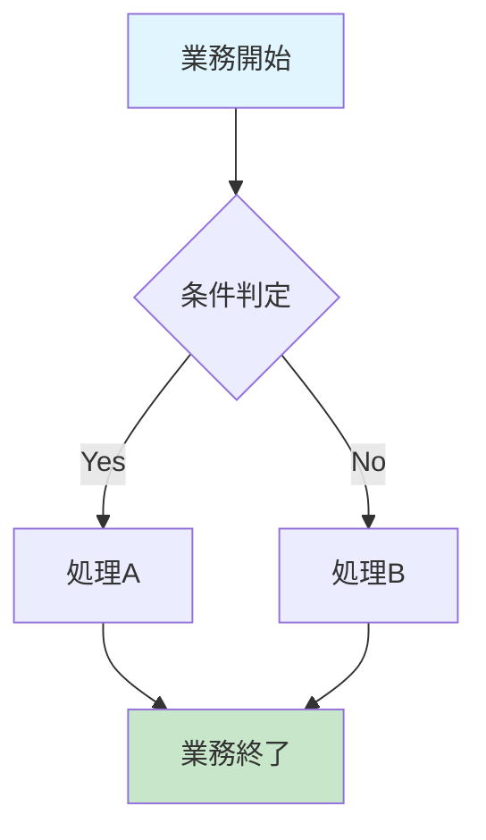
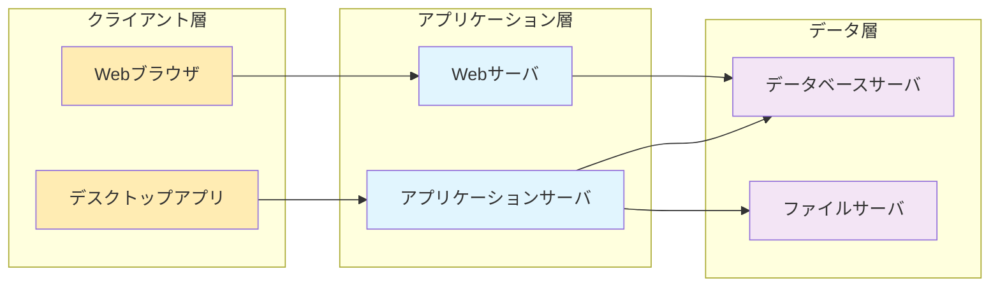
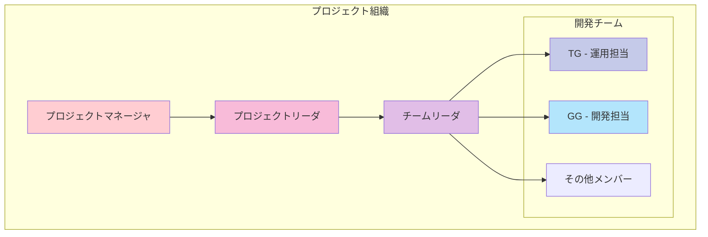

# 構成図シート

## データ構造

構成図シートは軽量なワークシート（980 bytes）で、主に図形やフローチャート要素を含むビジュアル中心のシートです。

### シート特性

| 項目 | 内容 |
|------|------|
| ファイルサイズ | 980 bytes |
| データタイプ | 図形・グラフィック要素主体 |
| セル範囲 | A1（最小範囲） |
| 表示状態 | タブ選択状態 |

### XML構造分析

```xml
<worksheet xmlns="http://schemas.openxmlformats.org/spreadsheetml/2006/main"
           xmlns:r="http://schemas.openxmlformats.org/officeDocument/2006/relationships">
    <dimension ref="A1"/>
    <sheetViews>
        <sheetView tabSelected="1" workbookViewId="0"/>
    </sheetViews>
    <sheetFormatPr defaultRowHeight="13.2"/>
    <sheetData/>  <!-- 空のデータセクション -->
    <drawing r:id="rId1"/>  <!-- 図形要素参照 -->
</worksheet>
```

## 特徴的な要素

### 図形・描画要素
- **Drawing要素**: `<drawing r:id="rId1"/>`で図形オブジェクトを参照
- **関連ファイル**: `xl/drawings/drawing1.xml`に実際の図形定義
- **空のデータ**: `<sheetData/>`は空で、テキストデータは含まれない

### 推定される内容
構成図シートの名前と図形要素の存在から、以下の内容が推定されます：

#### 1. 業務フローチャート


#### 2. システム構成図


#### 3. 組織・役割構成図


## 業務的意味

### 構成図の役割

#### 1. プロジェクト管理ツール
- **役割分担**: チームメンバーの責任範囲明確化
- **業務フロー**: 作業手順の標準化
- **システム構成**: 技術アーキテクチャの可視化

#### 2. コミュニケーションツール
- **ステークホルダー説明**: 非技術者への説明資料
- **チーム内共有**: 共通理解のベースライン
- **引き継ぎ資料**: プロジェクト移管時の参照

#### 3. ドキュメント体系での位置づけ
- **TGシート**: 個人スキル詳細（運用・教育特化）
- **GGシート**: 個人スキル詳細（開発・技術特化）
- **構成図シート**: 全体像・関係性（統合ビュー）

### 活用シナリオ

#### プロジェクト企画フェーズ
1. **要員配置計画**: TG（運用）、GG（開発）の適材適所配置
2. **技術構成検討**: 両者のスキルを活かしたアーキテクチャ設計
3. **リスク分析**: 役割分担による課題の事前把握

#### プロジェクト実行フェーズ
1. **進捗管理**: 役割別の進捗追跡
2. **課題解決**: 構成図ベースでの課題切り分け
3. **品質管理**: 担当領域別の品質基準適用

#### プロジェクト完了フェーズ
1. **成果報告**: 構成図での成果可視化
2. **知見共有**: 次期プロジェクトへの教訓
3. **人材評価**: 個人貢献度の客観的評価

### Excel上での表現制約

#### 制約事項
- **図形の複雑さ**: Excelの図形機能の限界
- **更新性**: 手動更新による陳腐化リスク
- **共有性**: ファイル共有時の図形表示問題

#### 改善提案
- **Visio連携**: より高度な図表作成
- **Web化**: ブラウザベースでの閲覧・編集
- **自動更新**: データ連動型の動的図表