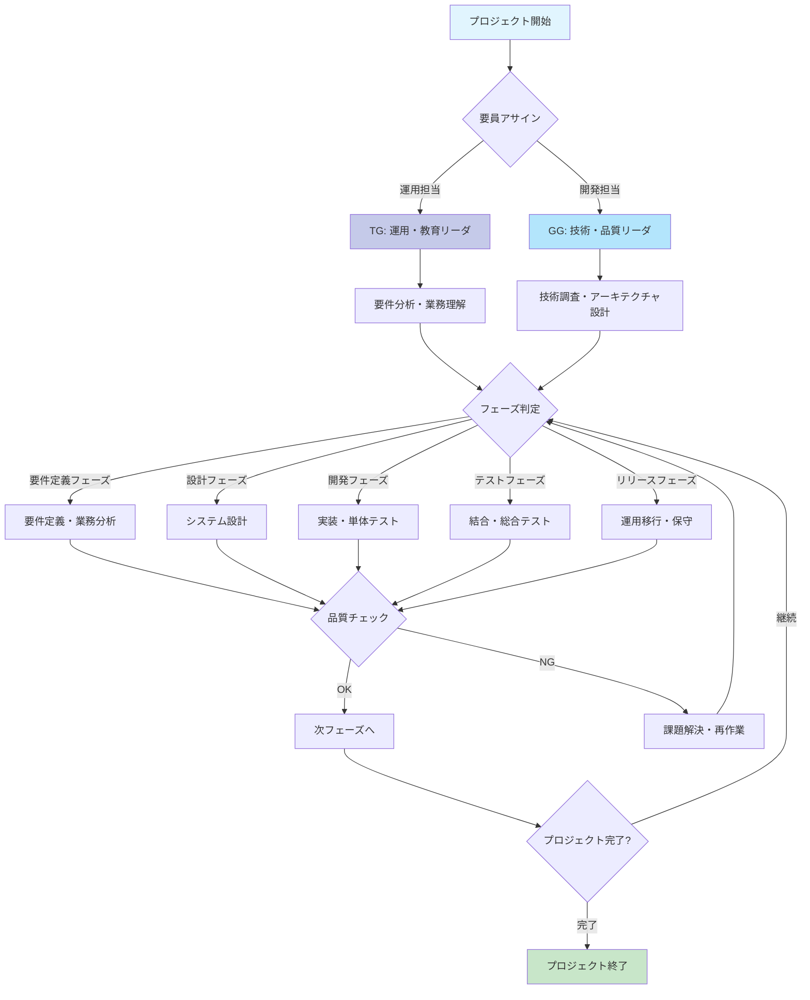
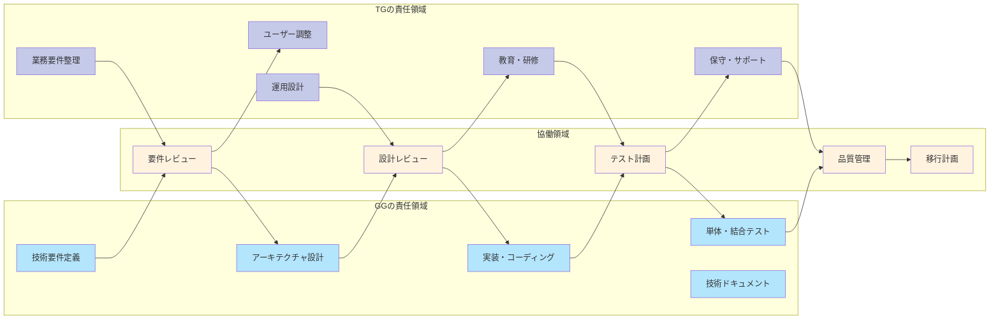
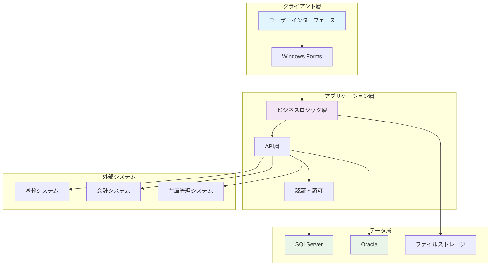
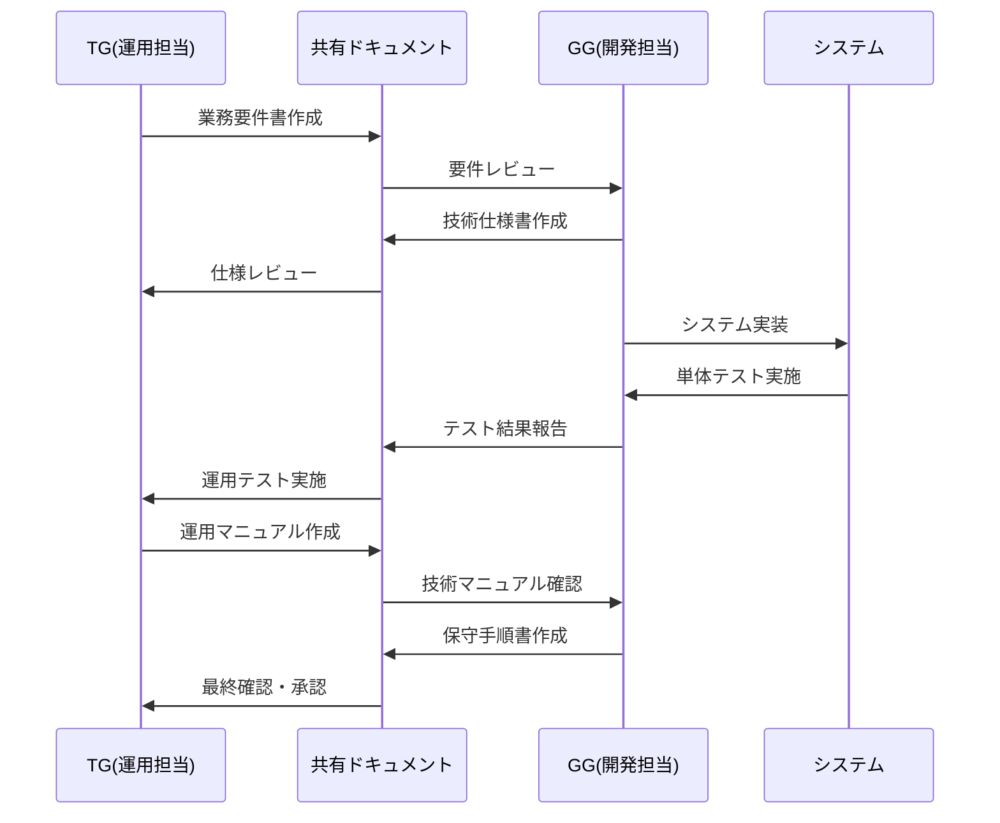
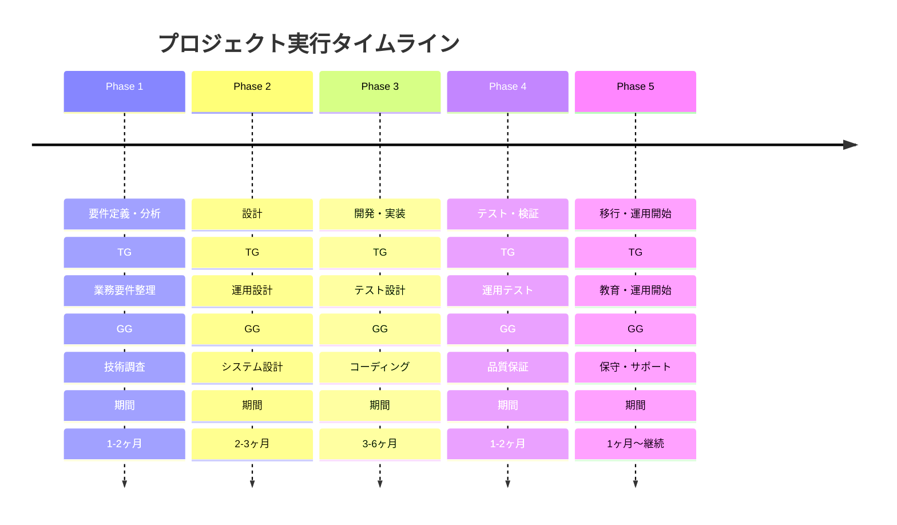
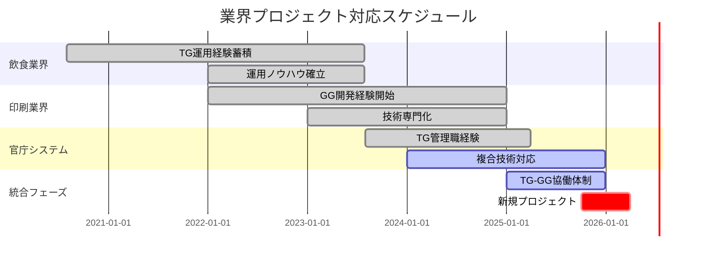
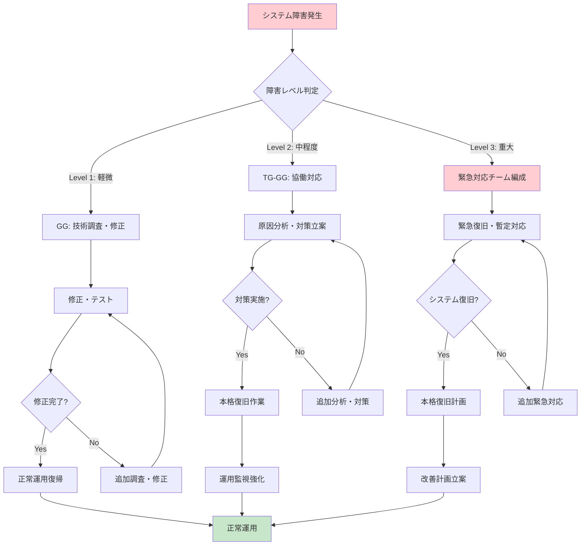
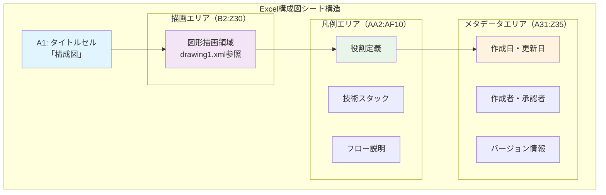
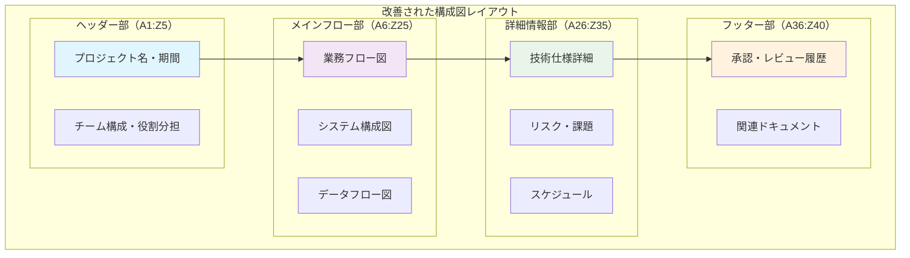

# 構成図シート - 詳細フローチャート分析

## 🔄 基本フローチャート

### プロジェクト実行フロー（改善版）

## 🎯 詳細プロセス分析

### TG-GG 協働プロセス

## 📈 データフロー図

### システム間連携フロー

### 情報フロー（TG-GG間）

## ⏱️ タイムライン処理フロー

### プロジェクトライフサイクル

### 業界別対応タイムライン

## 🔧 エラーハンドリングフロー

### システム障害対応フロー

### 品質管理フロー

```mermaid
flowchart LR
    subgraph "開発品質管理"
        DEV1[コード品質チェック]
        DEV2[単体テスト実施]
        DEV3[コードレビュー]
    end

    subgraph "統合品質管理"
        INT1[結合テスト設計]
        INT2[システムテスト実施]
        INT3[性能テスト実施]
    end

    subgraph "運用品質管理"
        OPS1[運用テスト実施]
        OPS2[ユーザー受入テスト]
        OPS3[運用監視設定]
    end

    DEV1 --> DEV2 --> DEV3
    DEV3 --> INT1
    INT1 --> INT2 --> INT3
    INT3 --> OPS1
    OPS1 --> OPS2 --> OPS3

    style DEV1 fill:#b3e5fc
    style DEV2 fill:#b3e5fc
    style DEV3 fill:#b3e5fc
    style INT1 fill:#fff3e0
    style INT2 fill:#fff3e0
    style INT3 fill:#fff3e0
    style OPS1 fill:#c5cae9
    style OPS2 fill:#c5cae9
    style OPS3 fill:#c5cae9
```

## 📋 配置情報詳細

### Excel座標系での配置説明

#### 構成図シートの構造

### 推奨レイアウト改善案

#### 新構成図レイアウト

## 🎨 視覚化改善提案

### インタラクティブ図表の実装
1. **Web化対応**: ExcelからHTMLベースの図表へ移行
2. **リアルタイム更新**: データ連動型の動的図表
3. **ドリルダウン機能**: 詳細情報への段階的アクセス
4. **モバイル対応**: レスポンシブデザインでの表示最適化

### コラボレーション機能
1. **共同編集**: 複数人での同時編集・コメント機能
2. **バージョン管理**: 変更履歴の自動追跡
3. **承認ワークフロー**: 段階的レビュー・承認プロセス
4. **通知機能**: 更新・コメント時の自動通知

### データ統合
1. **プロジェクト管理ツール連携**: Jira、Asana等との連携
2. **開発ツール連携**: GitHub、Azure DevOps等との統合
3. **BI連携**: Power BI、Tableau等での分析
4. **API提供**: 外部システムからのデータ取得・更新