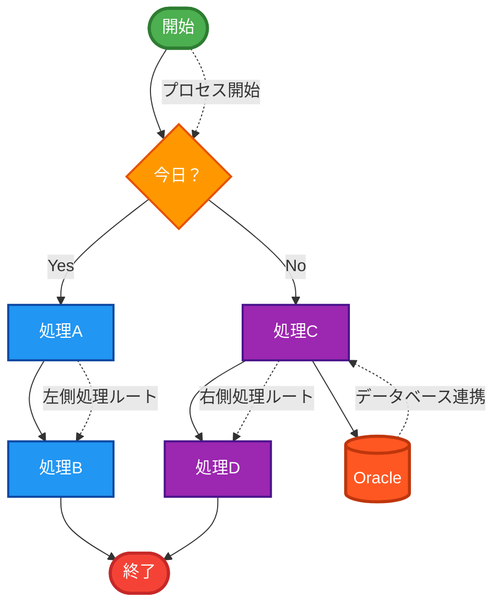
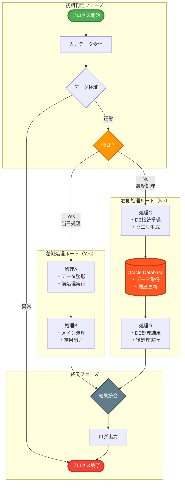
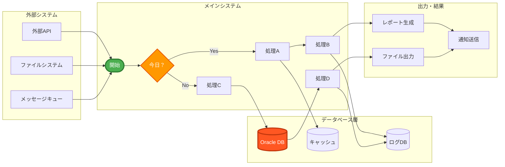
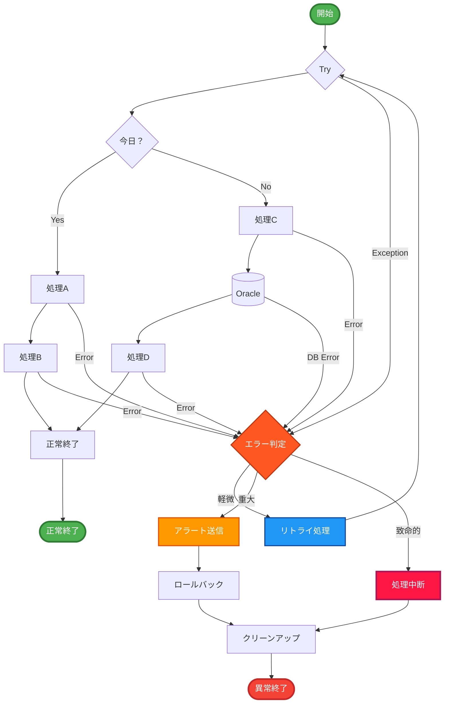
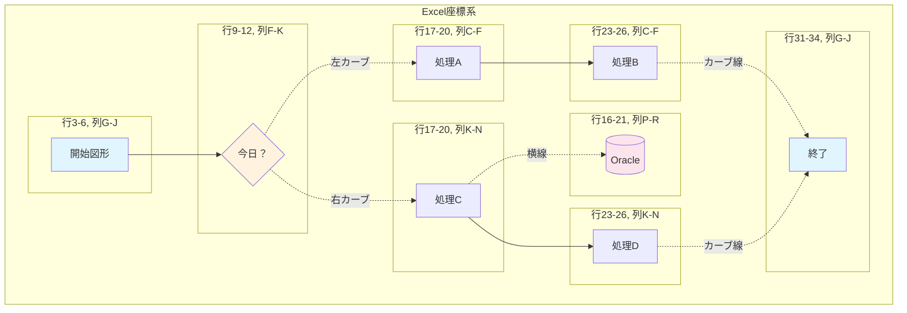

# 構成図シート - 詳細フローチャート分析

## 📊 概要

構成図シートには、業務プロセスを表現したフローチャートが含まれています。このドキュメントでは、そのフロー構造を詳細に分析し、複数のmermaid図形式で可視化します。

---

## 🔄 基本フローチャート

### メインプロセスフロー


---

## 🎯 詳細プロセス分析

### 1. 判断分岐の詳細化


---

## 📈 データフロー図

### システム間データ連携


---

## ⏱️ タイムライン処理フロー

### 時系列処理パターン
```mermaid
timeline
    title 処理実行タイムライン

    section 初期化フェーズ
        00:00 : システム起動
              : 初期設定読み込み
        00:01 : 入力データ検証
              : ログ初期化

    section 判定フェーズ
        00:02 : 日付判定実行
              : ルート選択
        00:03 : 処理ルート確定

    section 実行フェーズ（Yes）
        00:04 : 処理A開始
              : データ前処理
        00:06 : 処理B開始
              : メイン処理実行
        00:10 : 結果出力

    section 実行フェーズ（No）
        00:04 : 処理C開始
              : DB接続確立
        00:05 : Oracle処理
              : データ取得・更新
        00:08 : 処理D開始
              : 後処理実行
        00:10 : ファイル出力

    section 終了フェーズ
        00:11 : 結果統合
              : ログ出力
        00:12 : システム終了
```

---

## 🔧 エラーハンドリングフロー

### 例外処理とリカバリ


---

## 📋 配置情報詳細

### Excel上の図形配置


---

## 🎨 図形要素の説明

| 図形タイプ | 用途 | Excel配置 | 特徴 |
|-----------|------|-----------|------|
| **楕円形** | 開始・終了点 | G3:J6, G31:J34 | プロセスの起点・終点を示す |
| **ダイヤモンド** | 判断分岐 | F9:K12 | 条件分岐を表現 |
| **矩形** | 処理ブロック | C17:F20, C23:F26, K17:N20, K23:N26 | 各種処理ステップ |
| **円柱形** | データベース | P16:R21 | Oracle DBを表現 |
| **コネクタ** | フロー線 | 各図形間 | 処理の流れを示す矢印線 |

---

## 🔍 業務的解釈

### プロセスの意味
1. **「今日？」判定**: 当日処理か履歴処理かを判断
2. **処理A・B**: リアルタイム処理ルート（当日データ）
3. **処理C・D**: バッチ処理ルート（履歴データ、DB連携）
4. **Oracle連携**: データベースアクセスが必要な重要処理

### 実装パターン
- **条件分岐**: 日付ベースの処理ルート選択
- **並列処理**: 左右のルートは独立実行可能
- **データベース連携**: 右ルートでのみDB操作実行
- **統合終了**: 両ルートとも同一の終了点に収束