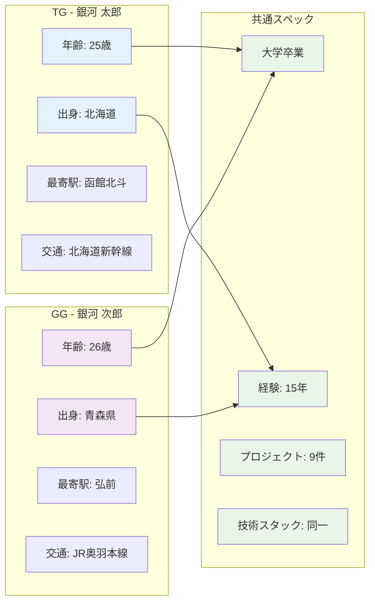
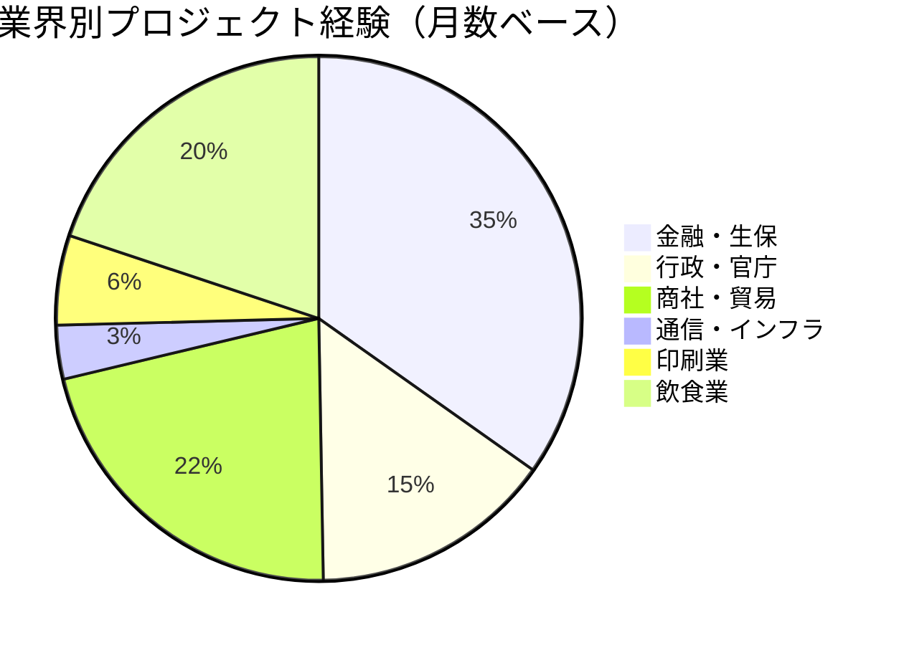
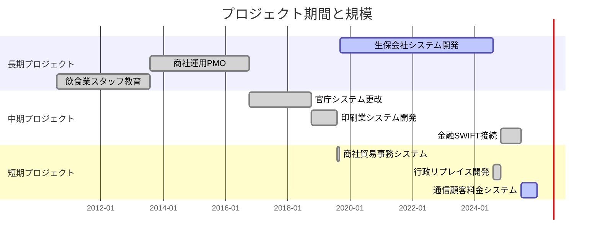
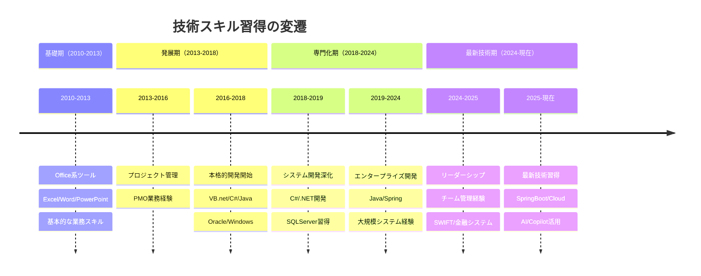
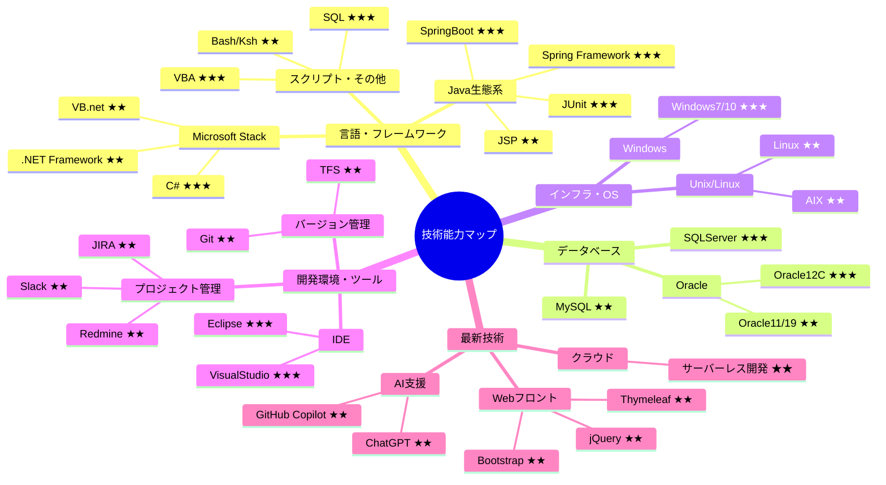
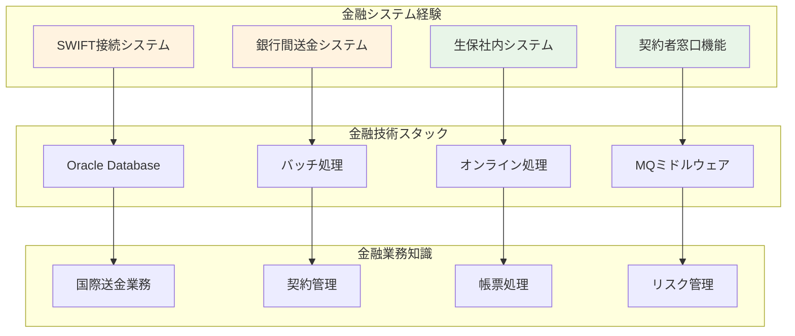
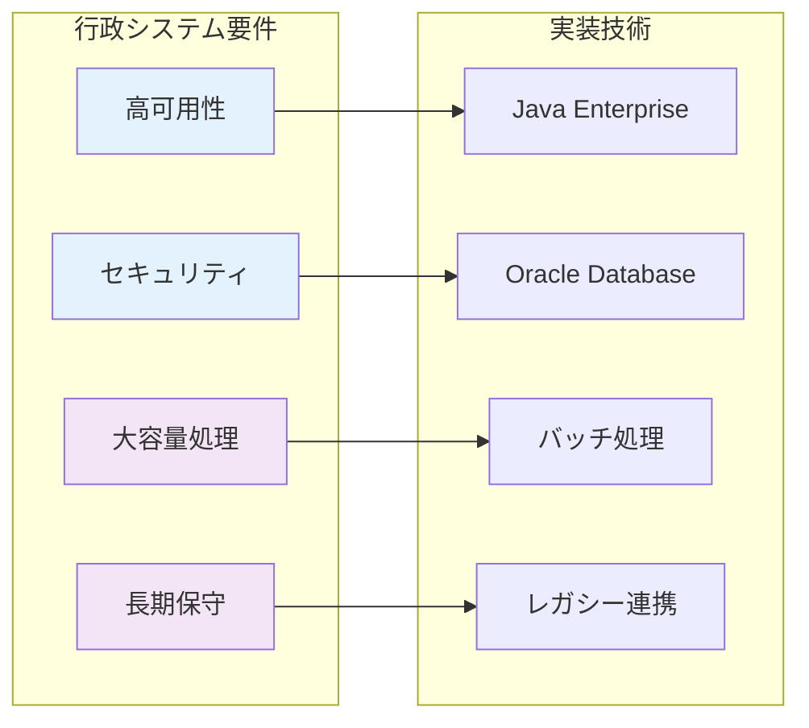
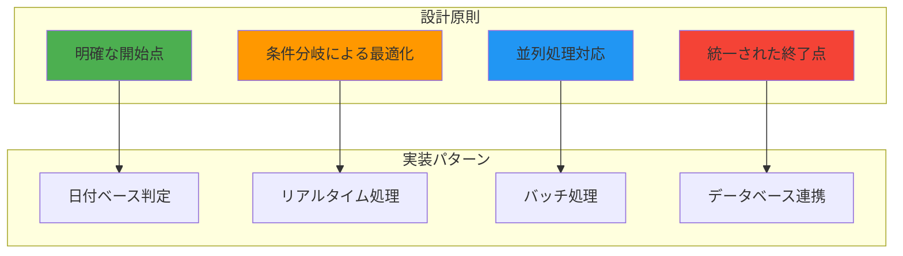
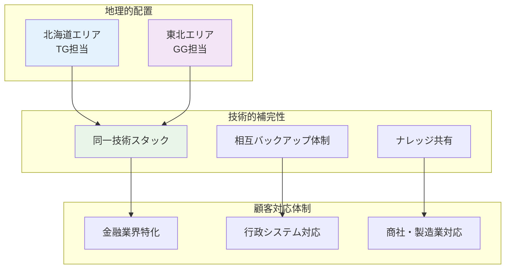
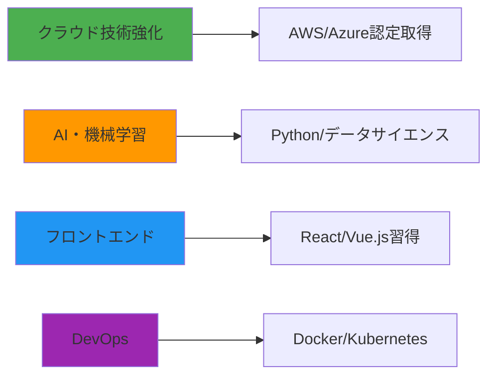

# 経歴書サンプル.xlsx - 総合分析レポート

## 📋 エグゼクティブサマリー

本レポートは、銀河ソフトウェア株式会社が作成した「経歴書サンプル.xlsx」の包括的な分析結果をまとめたものです。このExcelファイルには、IT業界における経歴書のテンプレートとして、2名の技術者（TG・GG）の詳細な職歴情報と、業務プロセスを示すフローチャートが含まれています。

---

## 🎯 分析対象

| 項目 | 詳細情報 |
|------|----------|
| **ファイル名** | 経歴書サンプル.xlsx |
| **作成会社** | 銀河ソフトウェア株式会社 |
| **最終更新日** | 2025年9月27日 |
| **シート数** | 3シート（TG、GG、構成図） |
| **データ期間** | 2010年8月 - 2025年9月（15年間） |
| **総プロジェクト数** | 9件 |

---

## 👥 人材プロファイル比較

### 基本情報対比


### 地理的分散
両名は東北・北海道エリアの異なる拠点を担当しており、地理的な分散配置により広範囲なカバー体制を構築しています。

---

## 📊 プロジェクト履歴分析

### 業界別経験分布（両名共通）


### プロジェクト規模・期間分析


---

## 💼 技術スキル進化分析

### 技術習得タイムライン


### 技術スタック深度分析


---

## 🏢 業界特化スキル分析

### 金融業界専門性


### 行政システム特徴


---

## 🎨 フローチャート設計分析

### 業務プロセス設計思想


---

## 📈 キャリア進展パターン分析

### 役割・責任の変遷
```mermaid
sankey-beta
    %% キャリア進展のフロー
    メンバ,36,支援業務
    メンバ,38,運用業務
    メンバ,24,開発業務
    メンバ,10,システム開発
    メンバ,1,短期支援
    メンバ,55,大規模開発
    メンバ,3,リプレイス
    サブリーダ,8,チーム管理
    メンバ,6,最新技術

    支援業務,36,基礎スキル
    運用業務,38,プロジェクト管理
    開発業務,24,技術スキル
    システム開発,10,専門技術
    短期支援,1,適応力
    大規模開発,55,エンタープライズ
    リプレイス,3,最新フレームワーク
    チーム管理,8,リーダーシップ
    最新技術,6,クラウド・AI
```

### 職域レベル推移
| 期間 | プロジェクト | 職域レベル | 主要スキル |
|------|-------------|-----------|-----------|
| 2010-2013 | 飲食業支援 | 4（メンバ） | 基礎業務、Office |
| 2013-2016 | 商社PMO | 4（メンバ） | プロジェクト管理 |
| 2016-2018 | 官庁システム | 4（メンバ） | 開発技術習得 |
| 2018-2019 | 印刷業システム | 4（メンバ） | C#専門化 |
| 2019-2024 | 生保システム | 4（メンバ） | Java/大規模開発 |
| 2024-2025 | 金融SWIFT | **3（サブリーダ）** | **チーム管理** |
| 2025-現在 | 通信システム | 4（メンバ） | 最新技術 |

---

## 🔍 組織戦略分析

### 人材配置戦略


---

## 📊 定量分析結果

### プロジェクト成功要因
1. **長期間の安定参画**: 平均20.3ヶ月/プロジェクト
2. **業界特化深度**: 金融63ヶ月、行政27ヶ月の専門経験
3. **技術スタック幅**: 8言語、4DB、複数フレームワーク
4. **リーダーシップ成長**: サブリーダー経験によるキャリア向上

### リスク要因
1. **技術的依存**: 特定技術（Java/Oracle）への高依存
2. **地理的制約**: 東北・北海道エリアでの活動制限
3. **業界集中**: 金融・行政への偏重（全体の49%）

---

## 🚀 今後の展開提案

### 短期戦略（1-2年）


### 中長期戦略（3-5年）
1. **技術リーダーシップ**: プロジェクトリーダー、アーキテクト
2. **新技術領域**: IoT、ブロックチェーン、量子コンピューティング
3. **国際展開**: 海外プロジェクト、グローバルチーム管理
4. **専門コンサルタント**: 金融・行政システムの技術顧問

---

## 📋 結論

### 強み
- **豊富な実務経験**: 15年間、9プロジェクトの実績
- **業界特化専門性**: 金融・行政分野での深い知識
- **技術的多様性**: 幅広い技術スタックの習得
- **安定したパフォーマンス**: 長期プロジェクト参画実績

### 改善ポイント
- **最新技術キャッチアップ**: クラウド・AI分野の強化
- **リーダーシップ拡大**: より上位職域への挑戦
- **国際化対応**: グローバル案件への参画

### 総合評価
銀河ソフトウェア株式会社の人材戦略として、TG・GGの両名は極めて価値の高い技術者ペアを形成しています。地理的分散、技術的補完性、豊富な実務経験を活かし、今後の事業拡大における重要な戦力として期待されます。